# 7장. 고급 매핑

## 상속 관계 매핑

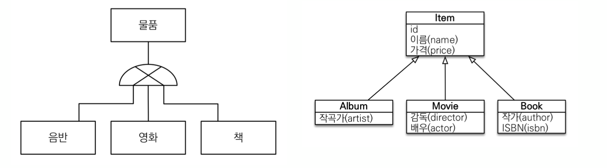

- RDB에는 객체지향 언어에서 다루는 상속이라는 개념 없음
- 대신 슈터타입 서브타입 관계라는 모델링 기법을 사용 -> 상속과 '유사'
- 슈퍼타입 서브타입 논리 모델을 실제 물리 모델인 테이블로 구현 시 3가지 방법 선택
  1. 각각의 테이블로 변환(조인 전략)
    - 모두 테이블로 만들고 조회 시 조인 사용
  2. 통합 테이블로 변환(단일 테이블 전략)
    - 테이블을 하나만 사용해서 통합
  3. 서브타입 테이블로 변환(구현 클래스마다 테이블 전략)
    - 서브 타입마다 하나의 테이블을 만듦

### 조인 전략
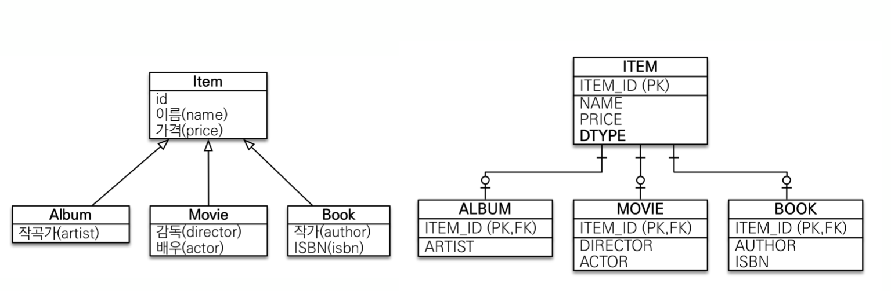
- 엔티티 각각 모두 테이블로 만들고, **자식 테이블이 부모 테이블의 기본 키를 받아 기본 키 + 외래 키**로 사용
- 이로 인해 조회할 때 조인을 자주 사용
- 주의할 점은 객체는 타입으로 구분 가능하나 테이블은 타입 개념이 없음
- 따라서 타입을 구분하는 컬럼 추가해야 함(예제에선 `DTYPE` 사용)
- (join 패키지 참고)
#### 매핑 정보

| 매핑 정보                                           | 설명                                                                          |
|:------------------------------------------------|:----------------------------------------------------------------------------|
| @Inheritance(strategy = InheritanceType.JOINED) | 상속 매핑은 부모 클래스에 해당 에너테이션으로 매핑 전략을 지정해야 함                                     |
| @DiscriminatorColumn(name = "DTYPE")            | 부모 클래스에 구분 컬럼을 지정, 이 컬럼으로 저장된 자식 테이블 구분 가능하며 Default가 `DTYPE`이므로 name 생략 가능 |
| @DicriminatorValue("M")                         | 엔티티 저장 시 구분 컬럼에 입력할 값을 지정(ex. Movie는 M 저장)                                  |
| @PrimaryKeyJoinColumn(name = "NEW_ID")          | 자식 테이블의 기본 키 컬럼 명 변경 시 사용                                                   |

#### 특징
- 장점
  - 테이블이 정규화됨
  - 외래 키 참조 무결성 제약조건 활용 가능
  - 효율적인 저장공간 사용
- 단점
  - 조회 시 조인이 많으므로 성능 저하
  - 조회 쿼리가 복잡
  - 테이블 등록 시 INSERT 문 2번 수행
- 특징
  - JPA 표준 명세는 구분 컬럼을 사용하도록 하나 하이버네이트 및 몇 구현체는 구분 컬럼(@DiscriminatorColumn) 없이도 동작

### 단일 테이블 전략
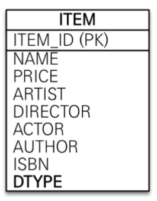
- 이름 그대로 테이블 하나만 사용하고 구분 컬럼`DTYPE`으로 어떤 자식 데이터가 저장되었는지 구분
- 조회할 때 조인을 사용하지 않아 일반적으로 가장 빠름
- 사용 시 주의할 점은 자식 엔티티가 매핑한 컬럼은 모두 null을 허용해야 함
  - ex1. `Book` 엔티티 저장 시 `author`와 `isbn` 컬럼만 사용하고 나머진 모두 `null`
  - ex2. `Movie` 엔티티 저장 시 `director`와 `actor` 컬럼만 사용하고 나머진 모두 `null`
- (singletable 패키지 참고)

#### 특징
- 장점
  - 조인이 필요 없어 조회 성능이 빠름
  - 조회 쿼리가 단순
- 단점
  - 자식 엔티티가 매핑한 컬럼은 모두 null 허용해야 함
  - 단일 테이블에 모든 것을 저장하므로 테이블이 커짐 -> 상황에 따라 조회 성능이 오히려 느림
- 특징
  - 구분 컬럼은 반드시 사용해야 함 -> `@DiscriminatorColumn` 필수
  - `@DiscriminatorValue` 미지정 시 기본으로 엔티티 이름 사용

### 구현 클래스마다 테이블 전략
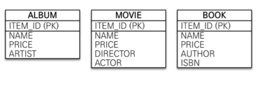
- 자식 엔티티마다 테이블을 만듦 -> 자식 테이블 각각에 필요한 컬럼이 모두 존재

- (tableperclass 패키지 참고)
#### 특징
- 장점
  - 서브 타입을 구분해서 처리시 효과적
  - `not null` 제약조건 사용 가능
- 단점
  - 여러 자식 테이블을 함께 조회할 때 성능이 느림 -> SQL에 UNION을 사용해야 함
  - 자식 테이블을 통합해서 쿼리하기 어려움
- 특징
  - 구분 컬럼을 사용하지 않음
  - **DB 설계자와 ORM 전문가 둘 다 추천하지 않는 전략** => `조인 전략`이나 `단일 테이블 전략` 고려

### @MappedSuperclass
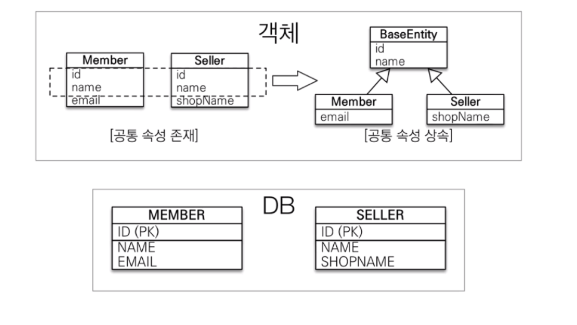
- 부모 클래스는 테이블과 매핑하지 않고, 이를 상속 받는 자식 클래스에게 매핑 정보만 제공하고 싶을 때 사용
- 비유하자면 추상 클래스, @Entity는 실제 테이블과 매핑되나, @MappedSuperclass는 실제 테이블과 매핑되지 않음
  > 💡`TABLE_PER_CLASS` 전략도 마찬가지로 부모 클래스가 실제 테이블과 매핑되지 않음
- (mappedsuperclass 패키지 참고)
- `persistence.xml`에 부모 클래스 추가할 필요 없음
- 부모로 부터 물려받은 매핑 정보를 재정의하려면 `@AttributeOverrides` 또는 `@AttributeOverride` 사용
  ```java
  @Entity
  @AttributeOverrides({
    @AttributeOverride(name = "id", column = @Column(name = "MEMBER_ID")),
    @AttributeOverride(name = "name", column = @Column(name = "MEMBER_NAME")) 
  })
  public class Member extends BaseEntity { ... }
  ```
- 연관관계를 재정의하려면 `@AssociationOverrides` 또는 `@AssociationOverride` 사용

#### 특징
- 테이블과 매핑 되지 않고 자식 클래스에 엔티티의 매핑 정보를 상속하기 위해 사용
- `@MappedSuperclass`로 지정한 클래스는 엔티티가 아니므로 `em.find()`나 `JPQL`에서 사용불가
- 이 클래스를 직접 생성해 사용할 일 없으므로 추상 클래스로 만드는 것을 권장
- 정리하자면, `@MappedSuperclass`는 테이블과 관계가 없고, 단순히 엔티티가 공통으로 사용하는 매핑 정보를 모아주는 역할
  - ORM에서 이야기하는 진정한 상속 매핑은 객체 상속을 DB의 슈퍼타입 서브타입 관계와 매핑하는 것

>💡엔티티`@Entity`는 엔티티`@Entity` 또는 `@MappedSuperclass`로 지정한 클래스만 상속 가능

## 복합 키와 식별 관계 매핑

### 식별 관계 vs. 비식별 관계

- DB 테이블 사이의 관계는 외래 키가 기본 키에 포함되는지 여부에 따라 `식별 관계`와 `비식별 관계`로 구분

#### 식별 관계
- 부모 테이블의 기본 키를 내려 받아서 자식 테이블의 **기본 키 + 외래 키**로 사용하는 관계

#### 비식별 관계
- 부모 테이블의 기본 키를 받아서 자식 테이블의 **외래 키**로만 사용하는 관계
- 비식별 관계는 외래 키에 null 허용 여부에 따라 **필수적 비식별 관계**와 **선택적 비식별 관계**로 나뉨
  - 필수적 비식별 관계: 외래 키에 null 허용하지 않음 -> 연관관계 필수적으로 맺어야 함
  - 선택적 비식별 관계: 외래 키에 null 허용 -> 연관관계 맺음을 선택적으로 가능
- DB 테이블 설계 시 식별 관계나 비식별 관계 중 하나를 선택해야 함
  - 최근 비식별 관계를 주로 사용하고, 필요한 곳에만 식별 관계를 사용하느 추세
  - JPA는 비식별 관계와 식별 관계 모두 지원

### 복합 키: 비식별 관계 매핑
- JPA는 영속성 컨텍스트에 엔티티 보관 시, 엔티티의 식별자를 키로 사용
- 그리고 식별자 구분을 위해 `equals`와 `hashCode`를 사용해 동등성을 비교
- 식별자 필드가 하나일 땐 보통 자바의 기본 타입을 사용하므로 문제가 없음
- 그러나 식별자 필드가 2개 이상이면 별도의 식별자 클래스를 만들고, 그곳에 `equals`와 `hashCode` 구현해야 함
  ```java
  @Entity
  public class Hello {
    @Id
    private String id1;
  
    @Id                 // 사용불가! 실행 시점에 매핑 예외 발생
                        // 별도의 식별자 클래스를 만들어야 함
    private String id1;
  }
  ```
- JPA는 복합 키 지원을 위해 `@IdClass`와 `@EmbeddedId` 2가지 방법 제공
  - `@IdClass` -> RDB에 가까운 방법 
  - `@EmbeddedId` -> 객체지향에 가까운 방법

#### @IdClass
- @IdClass 사용 시 식별자 클래스는 다음 조건을 만족해야 함
  - `Serializable` 인터페이스 구현(참고: https://www.inflearn.com/questions/16570/버그-문의드려봅니다)
  - `equals`, `hashCode` 구현(참고: https://modimodi.tistory.com/14)
  - 기본 생성자가 있어야 함
  - 식별자 클래스는 `public`이어야 함
- (composite.idclass.nonid 패키지 참고)
- (JpaMain.idClassSaveAndFind 예제 참고, 저장 및 조회 방식)

#### @EmbeddedId
- @IdClass 보다 객체지향적인 복합 키 방식
- (composite.embeddid.nonid 패키지 참고)
- 저장 및 조회 방식은 @IdClass 방식과 동일

#### 복합 키와 equals(), hashCode()
- 복합 키는 `equals()`와 `hashCode()`를 필수로 구현해야 함 
- 자바는 동일성과 동등성이 존재하기 때문
- 영속성 컨텍스트는 엔티티의 식별자를 키로 사용해서 엔티티를 관리함
- 그리고 식별자를 비교할 때 `equals()`와 `hashCode()`를 사용함
- 따라서 동등성이 지켜지지 않으면 예상과 다른 엔티티가 조회되거나 엔티티를 찾을 수 없는 문제 발생 -> 영속성 컨텍스트가 엔티티를 관리하는데 심각한 문제 발생
- 보통 `equals()`와 `hashCode()`를 구현할 때 모든 필드를 사용

#### @IdClass vs. @EmbeddedId
- 각각 장단점이 있으므로 취향에 맞게 사용
- `@EmbeddedId`가 `@IdClass` 보다 객체지향적이고 중복도 없음
- 하지만 특정 상황에 JPQL이 조금 더 길어짐
  ```java
  em.createQuery("select p.id.id1, p.id.id2 from Parent p");    // @EmbeddedId
  em.createQuery("select p.id1, p.id2 from Parent p");          // @IdClass
  ```
  
### 복합 키: 식별 관계 매핑
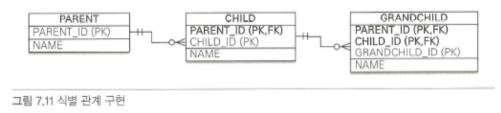
- 식별 관계에서 자식 테이블은 부모 테이블의 기본 키를 포함해서 복합 키를 구성해야 함 => `@IdClass`, `@EmbeddedId` 사용
- (composite.*.id 패키지 개별 확인 및 `@EnbeddedId`와 `@MapsId` 확인)

### 비식별 관계로 구현
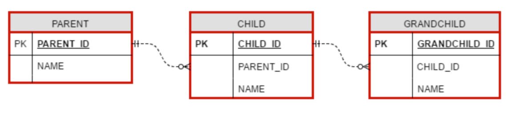
- 식별관계 테이블을 위 그림과 같이 비식별 관계로 변경할 수 있음
- (nonid 패키지 참고)
- 복합 키를 사용한 코드와 비교하면 매핑도 쉽고 코드도 단순, 무엇보다 식별자 클래스를 따로 만들 필요 없음

### 일대일 식별 관계

- 자식 테이블의 기본 키 값으로 부모 테이블의 기본 키 값만 상요
- 그래서 부모 테이블의 기본 키가 복합 키가 아니면, 자식 테이블의 기본 키는 복합키로 구성하지 않아도 됨
- (onetoone 패키지 확인)
- (JpaMain.oneToOneSave에서 저장 방식 확인)

### 식별, 비식별 관계의 장단점
- DB 설계 관점에선 **비식별 관계**를 선호
  - 식별 관계는 부모 테이블의 기본 키를 자식 테이블로 전파
    - 이로 인해 자식 테이블의 기본 키 컬럼이 점점 늘어남
    - 결국 조인 시 SQL이 복잡해지고 기본 키 인덱스가 불필요하게 커짐
  - 식별 관계는 2개 이상 컬럼을 합해서 복합 기본 키를 만들어야 하는 경우가 많음
  - 식별 관계 사용 시 기본 키로 비즈니스 의미가 있는 자연 키 컬럼을 조합하는 경우가 많음
    - 반면 비식별 관계의 기본 키는 비즈니스와 전혀 관계 없는 대리 키를 주로 사용
    - 비즈니스 요구사항은 시간이 지날 수록 변하는데, 이때 식별 관계의 자연 키 컬럼들이 자식, 손자까지 전파되면 변경이 어려움
  - 식별 관계는 부모 테이블의 기본 키를 자식 테이블이 기본 키로 사용해 테이블 구조가 유연하지 못함
- 객체 관계 매핑의 관점에서도 **비식별 관계**를 선호
  - 일대일 관계를 제외하고 식별 관계는 2개 이상의 컬럼을 묶은 복합 기본 키를 사용
    - JPA에서 복합 키는 별도의 복합 키 클래스를 만들어야 함
    - 따라서 컬럼 하나인 기본 키를 매핑하는 것보다 노력이 많이 듦
  - 비식별 관계의 기본 키는 주로 대리 키를 사용 -> JPA는 `@GeneratedValue`처럼 대리 키 생성에 편리한 방법을 제공
- 그래도 식별 관계가 가진 장점도 존재
  - 기본 키 인덱스 활용하기 좋음
  - 기본 키 컬럼을 자식, 손자 테이블이 가지고 있으므로 특정 상황에 조인 없이 하위 테이블만으로 검색 가능
    ```sql
    /*
    두 경우 모두 CHILD 테이블의 기본 키 인덱슬르 PARENT_ID+CHILD_ID로 구성하면
    별도의 인덱스를 생성할 필요 없이 기본 키 인덱스만 사용해도 됨
    */

    /*부모 아이디가 A인 모든 자식 조회*/
    SELECT * FROM CHILD WHERE PARENT_ID = 'A'
    /*부모 아이디가 A고 자식 아이딩가 B인 자식 조회*/
    SELECT * FROM CHILD WHERE PARENT_ID = 'A' AND CHILD_ID = 'B'
    ```
- 결국 ORM 신규 프로젝트 진행 시 추천하는 방법은 될 수 있으면 **비식별 관계를 사용하고 기본 키는 Long 타입의 대리 키를 사용**하는 것
  - `@GeneratedValue`를 통해 간편하게 대리 키 생성 가능
  - `Long`의 경우 약 920경 수치까지 커버하므로 안전
  - 그리고 선택적 비식별 관계보단 **필수적 비식별 관계**를 사용하는 것이 좋음
    - 선택적 비식별 관계는 NULL을 허용해 OUTER JOIN을 사용
    - 필수적 비식별 관계는 NOT NULL로 항상 관계 있는 것을 보장해 INNER JOIN만 사용해도 됨

## 조인 테이블
- DB 테이블의 연관관계를 설계하는 방법은 2가지
- 조인 컬럼 사용(외래 키)
  - 테이블 간에 관계는 주로 조인 컬럼이라 부르는 외래 키 컬럼을 사용해 관리
- 조인 테이블 사용(테이블 사용)
  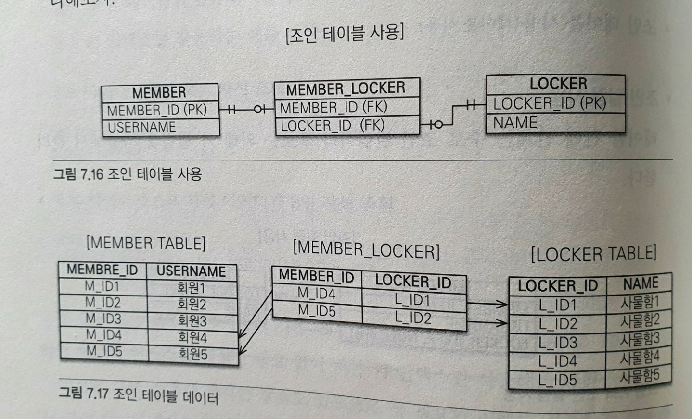
  - 조인 컬럼 사용하는 대신 조인 테이블을 사용해서 연관관계를 관리
  - 연관관계를 관리하는 조인테이블`MEMBER_LOCKER`를 추가, 두 테이블의 외래 키를 가지고 연관관계를 관리
  - 조인 테이블의 가장 큰 단점은 테이블 하나 추가해야 함
    - 관리해야 하는 테이블이 증가
    - 연관된 두 테이블 조인 시 조인 테이블까지 추가로 조인해야 함
  - 따라서 기본은 조인 컬럼을 사용, 필요 시 조인 테이블 사용
  - 객체와 테이블 매핑할 때 조인 컬럼은 `@JoinColumn`으로, 조인 테이블은 `@JoinTable`로 매핑
  - 조인 테이블은 주로 다대다 관계를 일대다, 다대일 관계로 풀어내기 위해 사용
    - 하지만 일대일, 일대다, 다대일 관게에서도 사용

### 일대일 조인 테이블
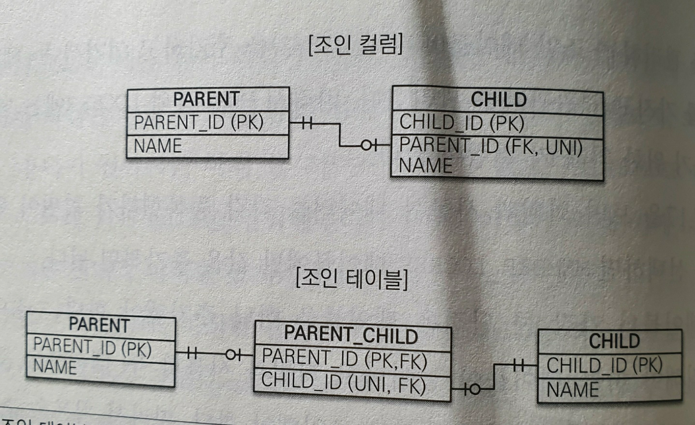
- 일대일 관계를 만들려면 조인 테이블의 외래 키 컬럼 각각에 총 2개의 유니크 제약조건을 걸어야 함
  - PARENT_ID는 기본 키이므로 유니크 제약조건이 걸려있음
- (jointable.onetoone 참고)
- `@JoinTable` 속성

  | 속성                 | 설명                   |
  |--------------------|----------------------|
  | name               | 매핑할 조인 테이블 이름        |
  | joinColumns        | 현재 엔티티를 참조하는 외래 키    |
  | inverseJoinColumns | 반대 방향 엔티티를 참조하는 외래 키 |

### 일대다 조인 테이블

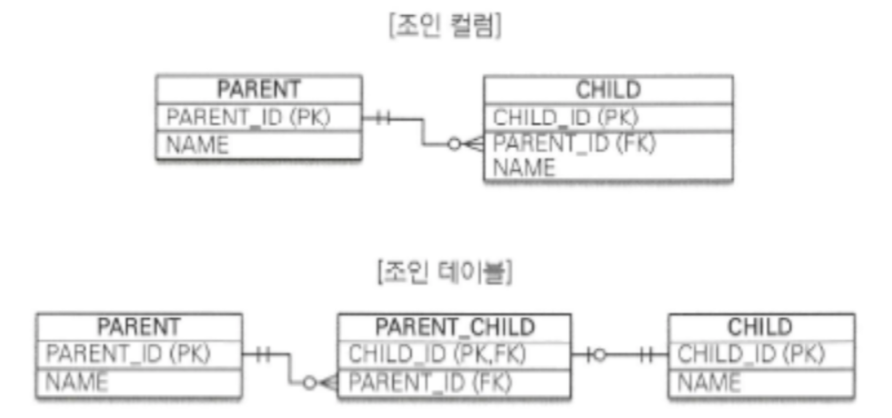
- 조인 테이블의 컬럼 중 다(N)와 관련된 컬럼인 CHILD_ID에 유니크 제약 조건을 걸어야 함
  - `CHILD_ID`는 기본 키이므로 유니크 제약 조건이 이미 있음
- (jointable.onetomany 패키지 참고)

### 다대일 조인 테이블
- 일대다에서 방향만 반대이므로 조인 테이블 모양은 일대다에서 설명한 그림과 같음
- (jointable.manytoone 패키지 참고)

### 다대다 조인 테이블
- 다대다 관계를 만들려면 조인 테이블의 두 컬럼을 합해서 하나의 복합 유니크 제약 조건을 걸어야 함
  - `PARENT_ID`, `CHILD_ID`는 복합 기본 키이므로 유니크 제약 조건이 걸려 있음
- (jointable.manytomany 패키지 참고)

## 엔티티 하나에 여러 테이블 매핑
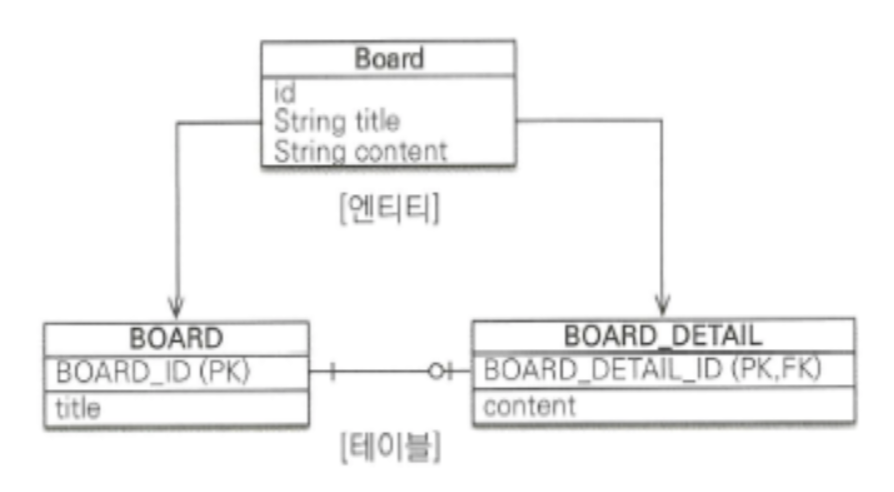
- `@SecondaryTable`을 사용하면 하나의 엔티티에 여러 테이블 매핑이 가능 -> 잘 사용하진 않음
- (varioustable 패키지 패키지 참고)
- `@SecondaryTable` 속성

  | 속성                 | 설명                     |
    |--------------------|------------------------|
  | name               | 매핑할 다른 테이블 이름          |
  | pkJoinColumns      | 매핑할 다른 테이블의 기본 키 컬럼 속성 |

- 더 많은 테이블에 매핑하려면 `@SecondaryTables`를 사용하면 됨
  ```java
  @SecondaryTables({
        @SecondaryTable(name-"BOARD_DETAIL"),
        @SecondaryTable(name-"BOARD_FILE")
  })
  ```
- `@SecondaryTable`을 사용해 두 테이블을 하나의 엔티티에 매핑하는 방법보단, 테이블당 엔티티를 각각 만들어 일대일 매핑하는 것을 권장
- 해당 방법은 항상 두 테이블을 조회하므로 최적화하기 어렵기 때문
- 반면에 일대일 매핑은 원하는 부분만 조회할 수 있고, 필요 시 둘을 함께 조회하면 됨