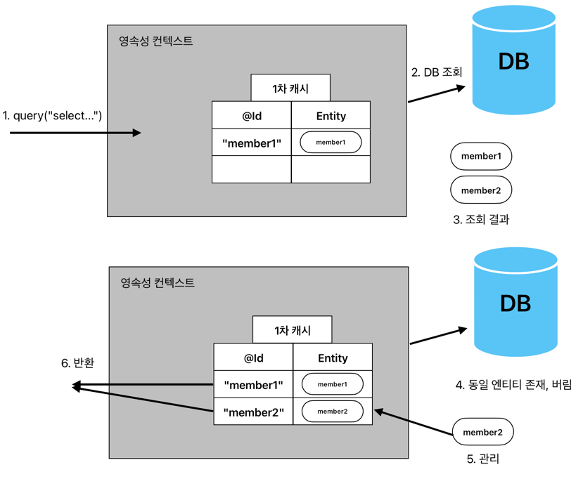

# 10장. 객체지향 쿼리 언어

## 객체지향 쿼리(JPQL)

- 테이블이 아닌 객체를 대상으로 검색하는 쿼리
- SQL을 추상화해서 특정 DB SQL에 의존하지 않음
- SQL이 DB 테이블을 대상으로 하는 데이터 중심 쿼리라면, JPQL은 엔티티 객체를 대상으로 하는 쿼리
- JPA은 JPQL을 분석 후 적절한 SQL을 만들어 DB 조회
- JPA가 공식 지원하는 검색 방법
  1. `JPQL`
  2. `Criteria` 쿼리: JPQL을 편하게 작성하도록 도와주는 API, 빌더 클래스 모음
  3. `Native` 쿼리: JPA에서 JPQL 대신 직접 SQL 사용
  4. `QeuryDSL`: Criteria 쿼리처럼 JPQL을 편하게 작성하도록 도아주는 빌더 클래스 모음 -> 비표준 오픈소스 프레임워크
  5. `JDBC` 직접 사용 및 `MyBatis` 같은 SQL 매퍼 프레임워크 사용
- `Criteria`나 `QueryDSL`은 `JPQL`을 편하게 작성하도록 도와주는 빌더 클래스일 뿐이므로 `JPQL`을 이해해야 나머지도 이해할 수 있음

### JPQL(Java Persistence Query Language)
```java
@Entity
public class Member {
    private String name;
    ...
}

// 쿼리 생성
String jpql = "select m from Member as m where m.name = 'choid'";
List<Member> members = em.createQuery(jpql, Member.class).getResultList();
```
```java
// 실행된 대략적 SQL, 하이버네이트 구현체에서 생성한 것은 좀 더 복잡함
select
    member.id,
    member.name,
    member.team_id
from
    Member member
where
    member.name='kim'
```

- 엔티티 객체를 조회하는 객체지향 쿼리
- 문법은 SQL과 유사, ANSI 표준 SQL이 제공하는 기능을 유사하게 지원
- SQL 추상화로 특정 DB에 의존하지 않음 -> 방언`Dialect`만 변경하면 JPQL 변경 없이 DB 변경 가능

### Criteria 쿼리
```java
// Criteria 사용 준비
CriteriaBuilder cb = new em.getCriteriaBuilder();
CriteriaQuery<Member> query = cb.createQuery(Member.class);

// 루트 클래스(조회를 시작할 클래스)
Root<Member> m = query.from(Member.class);

// 쿼리 생성
CriteriaQuery<Member> cq = query.select(m).where(cb.equal(m.get("name"), "kim"));
List<Member> members = em.createQuery(cq).getResultList();
```
- `JPQL`을 생성하는 빌더 클래스
- 문자열로 `JPQL` 작성 시 해당 쿼리가 잘못되었는지 여부는 런타임 시점에 알 수 있음
- 반면에 `Criteria`는 문자가 아닌 코드로 `JPQL`을 작성하기 때문에 컴파일 시점에 오류를 발견할 수 있음
- 위 예제 `m.get("name")`를 보면 필드 명을 문자로 작성했는데, 이부분도 메타 모델`Meta Model`을 통해 코드로 작성 가능
  >💡메타 모델`Meta Model`
  > - Java에선 어노테이션 프로세서 기능을 사용하면 어노테이션을 분석해서 클래스 생성 가능
  > - JPA는 이 기능을 활용해, 엔티티 클래스로부터 `Criteria` 전용 클래스(ex. `Member` -> `Member_`)를 생성하는데, 이를 메타 모델이라 함
  > ```java
  > // 메타 모델 사용 전/후
  > m.get("name") => m.get(Member_.name)
  > ```

- `Criteria`가 가진 장점은 많으나, 이를 모두 상쇄할 정도로 복잡하고 장황함
- 사용하기 불편하고 `Criteria`로 작성한 코드도 한눈에 들어오지 않는 단점이 존재 -> 주관적...?

### QueryDSL
```java
// 준비
JPAQuery query = new JPAQeury(em);
QMember member = QMember.member;

// 쿼리, 결과 조회
List<Member> members = query.from(member).where(member.name.equals("kim")).list(member);
```
- `Criteria`와 동일하게 `JPQL` 빌더 역할
- 하지만 코드 기반이면서 단순하고 사용하기 쉬움
- JPA 표준은 아님 => 오픈 소스 프로젝트
  - JDO, MongoDB, Java Collection, Hibernate Search도 거의 같은 문법으로 지원
- 위 예제를 보면 `Q`가 붙은 클래스가 있는데, 이를 `Q-Class`라고 함
  - `JPAAnnotationProcessor`가 컴파일 시점에 `@Entity`와 `@Embeddable`과 같은 어노테이션을 찾음
  - 해당 내용을 분석해서 `Q-Class`를 생성함 -> 최대한 엔티티 클래스와 비슷한 패키지 구조를 유지하려 함
  - 참고로 `Criteria`도 `QueryDSL`과 비슷하게 Static Meta Class를 만들어서 사용
  - see: [QueryDsl Q클래스를 사용하는 이유
    ](https://velog.io/@sigint_107/QueryDsl-Q%ED%81%B4%EB%9E%98%EC%8A%A4%EB%A5%BC-%EC%82%AC%EC%9A%A9%ED%95%98%EB%8A%94-%EC%9D%B4%EC%9C%A0)

### Native SQL
```java
String sql = "SELECT ID, AGE, TEAM_ID, NAME FROM MEMBER WHERE NAME = 'kim'";
List<Member> emembers = em.createNativeQuery(sql, Member.class).getResultList();
```
- JPA는 SQL을 직접 사용하도록 지원
- `JPQL`을 사용해도 가끔 특정 DB에 의존하는 기능을 사용해야할 때가 있음
  - Oracle -> `CONNECT BY`
  - MySQL -> 힌트(참고로 하이버네이트는 지원)
- 특정 DB에 의존하는 SQL을 작성해야하기 때문에 DB가 변경되면 `Native` SQL도 수정해야 함

### JDBC 직접 사용 및 MyBatis 같은 SQL 매퍼 프레임워크
```java
Session session = entityManager.unwrap(Session.class);
session.doWork(new Work() {
    
    @Override
    public void execute(Connection connection) throws SQLException {
        ...
    }
});
```
- JPA는 `JDBC` 커넥션을 획득하는 API를 제공하지 않음
- 따라서 JPA 구현체가 제공하는 방식을 사용해야 함
- 어떤 방식이든 모두 JPA를 우회해서 DB에 접근함
- 문제는 JPA를 우회하는 SQL에 대해서는 JPA가 인식을 전혀 못함, 최악의 경우 영속성 컨텍스트와 DB 불일치로 데이터 무결성 훼손 가능성 있음
- **이를 해결하기 위해 JPA를 우회해서 SQL 실행 직전에 영속성 컨텍스트를 수동으로 플러시해서 DB와 영속성 컨텍스트를 동기화 처리**
  - 참고로 스프링 프레임워크의 AOP를 적절히 활용해 JPA를 우회하여 DB에 접근하는 메서드를 호출할 때마다 영속성 컨텍스트를 플러시해 문제 해결도 가능
  - 
## [JPQL](README-JPQL.md)

## [Criteria](README-Criteria.md)

## [QueryDSL](README-QueryDSL.md)

## [Native SQL](README-NativeSQL.md)

## 객체지향 쿼리 심화

### 벌크 연산
- (JPQLEx::bulkCalc 참고)

#### 벌크 연산 주의점
- 벌크 연산은 영속성 컨텍스트를 무시하고 DB에 직접 쿼리
- 그렇기 대문에 영속성 컨텍스트에 있는 데이터와 DB에 있는 데이터가 다를 수 있음

#### 벌크 연산 문제 해결

1. `em.refresh()`
  - DB에서 데이터를 다시 조회하는 기능
  - 벌크 연산 수행 직후에 정확한 데이터를 받기 위해 사용
2. 벌크 연산 먼저 실행
  - 가장 실용적인 해결책
  - JPA & JDBC 함께 사용 시에도 유용
3. 벌크 연산 수행 후 영속성 컨텍스트 초기화
  - 영속성 컨텍스트에 남아 있는 엔티티를 제거
  - 그렇지 않으면 엔티티 조회 시 영속성 컨텍스트에 남아 있는 엔티티를 조회할 수 있음 -> 벌크 연산 미적용
  - 영속성 컨텍스트를 초기화하면 이후 엔티티 조회 시 벌크 연산이 적용된 DB에서 엔티티를 조회

### 영속성 컨텍스트와 JPQL

#### 쿼리 후 영속 상태인 것과 아닌 것
- `JPQL` 조회 대상은 엔티티, 임베디드 타입, 값 타입 같이 다양한 종류가 있음
- 엔티티 조회하면 영속성 컨텍스트에서 관리되나, 엔티티가 아닌 것은 관리되지 않음
  ```sql
  select m from Member m                    /* 엔티티 조회(관리 O) */
  select o.address from Order o             /* 임베디드 타입 조회(관리 X) */
  select m.id, m.username from Member m     /* 필드 조회(관리 X) */
  ```

#### JPQL로 조회한 엔티티와 영속성 컨텍스트
- `JPQL`로 DB에서 조회한 엔티티가 영속성 컨텍스트에 이미 있으면 `JPQL`로 DB에서 조회한 결과를 버리고 대신에 영속성 컨텍스트에 있던 엔티티를 반환


1. `JPQL`을 사용해서 조회 요청
2. JPQL은 SQL로 변환되어 DB를 조회
3. 조회한 결과와 영속성 컨텍스트를 비교
4. 식별자 값을 기준으로 이미 영속성 컨텍스트에 있는 것은 버리고, 기존에 있던 엔티티가 반환 대상이 됨
5. 식별자 값을 기준으로 이미 영속성 컨텍스트에 없는 것은 추가
6. 쿼리 결과를 반환, 여기서 `member1`은 쿼리 결과가 아닌 영속성 컨텍스트에 있던 엔티티
   - 여기서 기존 엔티티를 반환하는 것은 새로운 엔티티로 대체할 경우 문제가 있어서 그럼
     1. 새로운 엔티티를 영속성 컨텍스트에 하나 더 추가 => 기본 키 값을 기준으로 엔티티를 관리하기 때문에 기본 키 값을 가진 엔티티를 등록할 수 없음 
     2. 기존 엔티티를 새로 검색한 엔티티로 대체 => 영속성 컨텍스트에 수정 중인 데이터가 사라질 수 있음 
     
- **영속성 컨텍스트는 영속 상태인 엔티티의 동일성을 보장** => `em.find()`나 `JPQL`이나 영속성 컨텍스트가 같으면 동일한 엔티티를 반환

#### find() vs. JPQL
- `em.find()`는 `영속성 컨텍스트 -> DB` 순으로 조회해서 성능상 이점 존재 => 1차 캐시
- `JPQL`은 항상 DB에 SQL을 실행해서 결과를 조회
  - 대신 결과를 반환 받는 방식은 [JPQL로 조회한 엔티티와 영속성 컨텍스트](####-JPQL로-조회한-엔티티와-영속성-컨텍스트)처럼 동작

### JPQL과 플러시 모드

- em.flush() 메서드로 플러시 호출 가능
- 하지만 플러시 모드에 따라 커밋 직전 또는 쿼리 실행 직전에 자동으로 호출이 가능
  ```java
  em.setFlushMode(FlushModeType.AUTO);  // 기본값: 커밋 또는 쿼리 실행 시 플러시
  em.setFlushMod(FlushModeType.COMMIT); // 커밋 시에만 플러시
  ```
- 기본으로 동작 시 `JPQL` 수행 전에 플러시가 동작하나 `COMMIT` 모드로 돌릴 시 쿼리 시 플러시를 수행하지 않음
  - 이 때는 직접 `em.flush()`를 호출하거나, `setFlushMode`를 사용하면 됨
    ```java
    em.createQuery("select ...", Product.class)
      .setFlushMode(FlushModeType.AUTO) // AUTO로 작동, 쿼리에서 설정하는 플러시 모드는 EntityManger 설정보다 우선권을 가짐
    ```
- 플러시 모드를 COMMIT으로 해서 성능 최적화가 가능
  - 쿼리 시 발생하는 플러시 횟수를 줄이는 방식
    ```java
    등록()
    쿼리()
    등록()
    쿼리()
    등록()
    쿼리()
    커밋()
    
    // AUTO: 4번 플러시
    // COMMIT: 커밋 시에만 한번 플러시
    ```
- `JDBC`를 직접 사용해서 하는 경우 SQL 실행 시 플러시 모드가 동작하지 않음
- 이 경우 `JDBC`를 쿼리를 실행하기 직전에 em.flush()를 호출해서 영속성 컨텍스트의 내용을 DB에 동기화하는 것이 안전