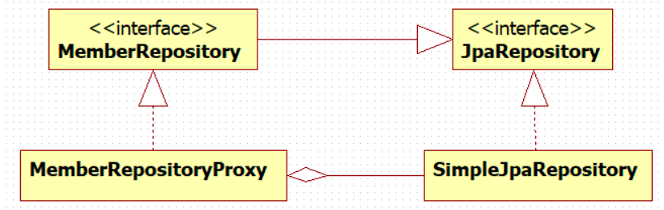
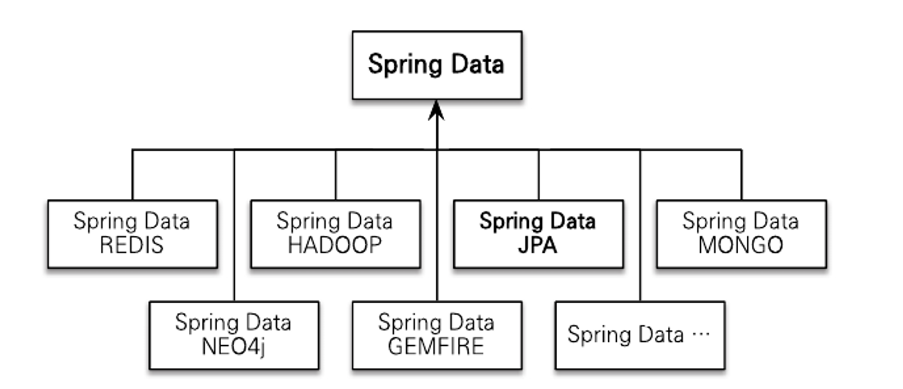
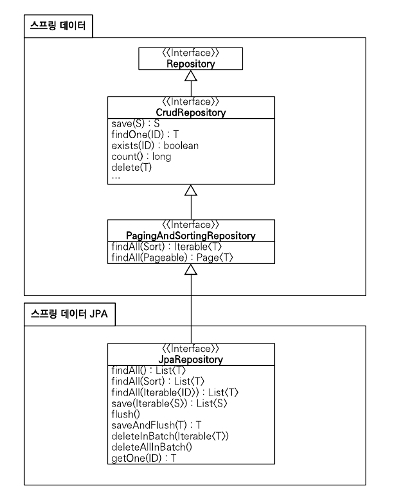

# 스프링 데이터 JPA

- 스프링 데이터 JPA는 스프링 프레임워크에서 JPA를 편리하게 사용할 수 있도록 지원하는 프로젝트
- 이 프로젝트는 Data Access Layer 개발 시 지루하게 반복되는 CURD 문제를 해결
- 우선 CRUD 처리를 위한 공통 인터페이스를 제공
  - 개발 시 인터페이스만 작성하면 실행 시점에 스프링 데이터 JPA가 구현 객체를 동적으로 생성해 주입해줌
- **Data Access Layer 개발 시 구현 클래스 없이 인터페이스만 작성해도 개발 완료 가능**
  ```java
  public interface MemberRepository extends Jparepository<Member /* 엔티티 */, Long /* 엔티티 식별자 */> {
    Member findByUsername(String username);
  }
  ```
  - 일반적인 CRUD 메서드는 JpaRepository에서 제공
  - 직접 작성한, 공통으로 처리할 수 없는 메서드는 메서드 이름을 분석해 JPQL을 실행
    ```sql
    /* 위 같은 경우 */
    select m from Member m where username=:username
    ```
## 스프링 데이터 JPA 동작 방식

- `Repository` 실제 객체는 `Proxy`가 주입됨
- 그리고 해당 `Proxy`는 `SimpleJpaRepository`를 타겟으로 가지고 있음
- `Proxy` 객체는 Reflection 기능을 통해 만듦
  - 클래스나 메서드의 메타 정보를 동적으로 획득, 그리고 코드를 동적으로 호출 가능
  - 이를 통해 정보를 동적으로 변경 -> 결과적으로 동적인 객체 생성, 동적 메서드 호출 기능 등을 사용 가능
- 이를 기반으로 Dynamic Proxy에서 리플렉션을 사용, 이를 활용해 동적으로 메서드와 클래스를 `.class` 바이트 코드로 만들어 줌
  ```java
  // 스프링 데이터 JPA 구조 단순화
  public interface Repository {

    void save(String itemId);
  }
  
  @Slf4j
  public class SimpleRepository implements Repository {

      @Override
      public void save(String itemId) {
          log.info("Save Item. itemId = {}", itemId);
      }
  }
  
  public interface CustomRepository extends Repository {
  }
  
  // 구현된 코드에서 프록시를 만들기 위해 InvocationHandler 제작
  @Slf4j
  public class RepositoryHandler implements InvocationHandler {
  
      private final Repository target;
  
      public RepositoryHandler(Repository target) {
          this.target = target;
      }
  
      /**
      * proxy: 프록시 자신
      * method: 호출한 메서드
      * args: 메서드를 호출할 때 전달한 인수
      */
      @Override
      public Object invoke(Object proxy, Method method, Object[] args) throws Throwable {
          if ("save".equals(method.getName())) {
              log.info("save() in proxy");
              return method.invoke(target, args);
          }
          return method.invoke(target, args);
      }
  }
  ```
- see: [Spring Data JPA 는 어떻게 interface 만으로도 동작할까? (feat. reflection, proxy)](https://pingpongdev.tistory.com/25)

## 스프링 데이터 프로젝트

- 스프링 데이터 JPA는 스프링 데이터 프로젝트의 하위 프로젝트 중 하나
- JPA, MongoDB, Neo4J, Redis, Hadoop, Gemfire 같은 다양한 데이터 저장소에 대한 접근을 추상화, 개발자 편의를 제공하고 반복하는 데이터 접근 코드를 줄여줌

## 공통 인터페이스 기능

```java
public interface JpaRepository<T, ID extends Serializable> extends PagingAndSortingRepository<T, ID> {
    ...
}

// JpaRepository를 사용하는 인터페이스
public interface MemberRepository extends JpaRepository<Member, Long> {
}
```
- `JpaRepository<Member, Long>` 부분을 보면 지네릭에 회원 엔티티와 식별자 타입을 지정 -> 이렇게 사용
- 위 그림은 `JpaRepository` 인터페이스의 계층 구조
  - 윗 부분에 스프링 데이터 모듈이 있고, 그 안에 `Repository`, `CrudRepository`, `PagingAndSortingRepository`가 있음 => 스프링 데이터 프로젝트 공통 인터페이스
  - `JpaRepository`는 여기에 추가로 JPA에 특화된 기능을 제공
- 주요 메서드
  - `save(S)`: 새로운 엔티티는 저장하고 이미 있는 엔티티는 수정
  - `delete(T)`: 엔티티 하나를 삭제, 내부에서 `EntityManager.remove()` 호출
  - `findOne(ID)`: 엔티티 하나 조회, 내부에서 `EntityManager.find()` 호출
  - `getOne(ID)`: 엔티티를 프록시로 조회, 내부에서 `EntityManager.getRefence()` 호출
  - `findAll(...)`: 모든 엔티티 조회, `정렬`이나 `페이징` 조건을 파라미터로 제공
- `save(S)`는 엔티티에 식별자가 없으면(null일 경우) 새로운 엔티티로 판단해서 `EntityManger.persist()`를 호출
- 식별자가 있으면 이미 있는 엔티티로 판단해서 `EntityMananger.merge()` 호출
- 필요하다면 JPA 기능을 확장해 신규 엔티티 판단 전략을 변경 할 수 있음

## 쿼리 메서드 기능
- 대표적으로 메서드 이름만으로 쿼리를 생성하는 기능이 있음
- 인터페이스에 메서드만 선언하면 해당 메서드의 이름으로 적절한 `JPQL` 쿼리를 생성해서 실행
  1. 메서드 이름으로 쿼리 생성
  2. 메서드 이름으로 JPA `NamedQuery` 호출
  3. `@Query` 어노테이션으로 Repository 인터페이스에 쿼리 직접 정의

```java
// 이메일과 이름 기반 회원 조회 예시
public interface MemberRepository extends Repository<Member, Long> {
    List<Member> findByEmailAndName(String email, String name);
}
```

- 인터페이스에 정의한 메서드를 실행하면 스프링 데이터 JPA는 메서드 이름을 분석해서 JPQL을 생성하고 실행

```sql
/* 실행 결과 */
select m from Member m where m.email = ?1 and m.name = ?2
```

- 물론 정해진 규칙에 따라서 메서드 이름을 지어야 함

| 키워드                | 예                                                         | JPQL 예                                                           |
|:-------------------|:----------------------------------------------------------|:-----------------------------------------------------------------|
| And                | findByLastnameAndFirstname                                | ... where x.lastname = ?1 and x.firstname = ?2                   |
| Or                 | findByLastnameOrFirstname                                 | ... where x.lastname = ?1 or x.firstname = ?2                    |
| Is,Equals          | findByFirstname, findByFirstnameIs, findByFirstnameEquals | ... where x.firstname = ?1                                       |
| Between            | findByStartDateBetween                                    | ... where x.startDate between 1? and ?2                          |
| LessThan           | findByAgeLessThan                                         | ... where x.age < ?!                                             |
| LessThanEqual      | findByAgeLessThanEqual                                    | ... where x.age <= ?1                                            |
| GreaterThan        | findByAgeGreaterThan                                      | ... where x.age > ?1                                             |
| GreaterThanEqual   | findByAgeGreaterThanEqual                                 | ... where x.age >= ?1                                            |
| After              | findByStartDateAfter                                      | ... where x.startDate > ?1                                       |
| Before             | findByStartDateBefore                                     | ... where x.startDate < ?1                                       |
| IsNull             | findByAgeIsNull                                           | ... where x.age is null                                          |
| IsNotNull, NotNull | findByAge(Is)NotNull                                      | ... where x.age not null                                         |
| Like               | findByFirstnameLike                                       | ... where x.firstname like ?1                                    |
| NotLike            | findByFirstnameNotLike                                    | ... where x.firstname not like ?1                                |
| StartingWith       | findByFirstnameStartingWith                               | ... where x.firstname like ?1 (parameter bound with appended %)  |
| EndingWith         | findByFirstnameEndingWith                                 | ... where x.firstname like ?1 (parameter bound with prepended %) |
| Containing         | findByFirstnameContaining                                 | ... where x.firstname like ?1 (parameter bound wrapped in %)     |
| OrderBy            | findByAgeOrderByLasnameDesc                               | ... where x.age = ?1 order by x.lastname desc                    |
| Not                | findByLastnameNot                                         | ... where x.lastname <> ?1                                       |
| In                 | findByAgeIn(Collection ages)                              | ... where x.age in ?1                                            |
| NotIn              | findByAgeNotIn(Collection age)                            | ... where x.age not in ?1                                        |
| TRUE               | findByActiveTrue()                                        | ... where x.active = true                                        |
| FALSE              | findByActiveFalse()                                       | ... where x.active = false                                       |
| IgnoreCase         | findByFirstnameIgnoreCase                                 | ... where UPPER(x.firstname) = UPPER(?1)                         |

### JPA NamedQuery
```java
@Entity
@NamedQuery(
    name="Member.findByUsername",
    query="select m from Member m where m.username=:username"
)
public class Member {
  ...
}

// orm.xml
<named-query name="Member.findByUsername">
    <query><CDATA[
        select m
        from Member m
        where m.username = :username
    ] />
    <query>
</named-query>

// 스프링 데이터 JPA 호출
public interface MemberRepository extends JpaRepository<Member, Long> {
    List<Member> findByUsername(@Param("username") String username);
}
```
- 스프링 데이터 JPA는 메서드 이름으로 JPA NamedQuery 호출 기능을 제공
- 선언한 `{도메인 클래스}.{메서드 이름}`으로 찾아서 실행
- 만약 실행할 Named Query가 없으면 메서드 이름으로 쿼리 생성 전략을 사용 -> 전략 변경 가능

### @Query, 리포지토리 메서드에 쿼리 정의
```java
// 이름 없는 Named Query라 할 수 있음
// JPA Named Query처럼 어플리케이션 실행 시점에 문법 오류 발견 가능
public interface MemberRepository extends JpaRepository<Member, Long> {

    @Query("select m from Member m where m.username = ?1")
    List<Member> findByUsername(String username);
}

// Native SQL을 사용하려면 @Query 옵션에 nativeQuery = true 설정
// JPQL은 위치 기반 파라미터를 1부터 시작하나, Native SQL의 경우 0부터 시작
public interface MemberRepository extends JpaRepository<Member, Long> {
    @Query(value = "SELECT * FROM MEMBER WHERE USERNAME =?0", nativeQuery = true)
    List<Member> findByUsername(String username);
}
```

### 파라미터 바인딩
```java
public interface MemberRepository extends JpaRepository<Member, Long> {

    @Query("select m from Member m where m.username = :name")
    List<Member> findByUsername(@Param("name") String username);
}
```
- 스프링 데이터 JPA는 위치 기반 파라미터 바인딩과 이름 기반 파라미터 바인딩 모두 지원 -> 기본 값은 위치 기반
- 코드 가독성과 유지보수를 위해 이름 기반 파라미터 바인딩 추천

### 벌크성 수정 쿼리
```java
@Modifying
@Query("update Product p set p.price = p.price * 1.1 where p.stockAmount < :stockAmount")
int bulkPriceUp(@Param("stockAmount") String stockAmount);
```
- 스프링 데이터 JPA에서 벌크성 수정, 삭제 쿼리는 `@Modifying` 어노테이션을 사용하면 됨
- 벌크성 쿼리를 실행하고 나서 영속성 컨텍스트를 초기화하고 싶다면 `@Modifying(clearAutomatically = true)` 처리 -> 기본 값은 false

### 반환 타입
- 스프링 데이터 JPA는 유연한 반환 타입 지원
- 결과가 한 건 이상이면 컬렉션 인터페이스를 사용하고, 단 건이면 반환 타입을 지정
  ```java
  List<Member> findByName(String name); // 컬렉션
  Member findByEmail(String email);     // 단건
  ```
- 만약 조회 결과가 없다면 컬렉션은 빈 컬렉션, 단건은 null을 반환
- 그리고 단건을 기대하고 반환 타입을 지정해쓴데 결과가 2건 이상 조회 시 `NoUniqueResultException` 예외 발생
- 참고로 단건으로 지정한 메서드 호출 시 스프링 데이터 JPA는 내부에서 JPQL의 `Query.getSingleResult()` 메서드 호출
  - 이 메서드 호출 시 조회 결과가 없으면 `NoResultException`이 발생했는데, 개발하는 입장에서 다루기 불편하여 예외를 무시하고 null 반환하게 함

### 페이징과 정렬
- 쿼리 메서드에 페이징과 정렬 기능을 사용할 수 있도록 2가지 특별한 파라미터 제공
  1. `Sort`: 정렬 기능
  2. `Pageable`: 페이징 기능(내부에 Sort 포함)


```java
// count 쿼리 사용
Page<Member> findByName(String name, Pageable pageable);

// count 쿼리 미사용
List<Member> findByName(String name, Pageable pageable);

List<Member> findByName(String name, Sort sort);
```
- 반환 타입으로 `Page`를 사용하면 스프링 데이터 JPA는 페이징 기능을 제공하기 위해 검색된 전체 데이터 건수를 조회하는 `count` 쿼리를 추가로 호출

#### 예제
```java
// 검색 조건: 이름이 김으로 시작하는 회원
// 정렬 조건: 이름으로 내림차순
// 페이징 조건: 첫 번째 페이지, 페이지당 보여줄 데이터는 10건
public interface MemberRepository extends Repository<Member, Long> {
    Page<Member> findByNameStartingWith(String name, Pageable pageable);
}

// 페이징 조건, 정렬 조건 설정
PageRequest pageRequest = new PageRequest(0, 10, new Sort(Direction.DESC, "name"));
Page<Member> result = memberrepository.findByNameStartingWith("김", pageRequest);

List<Member> members = result.getContent(); // 조회된 데이터
int totalPages = result.getTotalPages();    // 전체 페이지 수
boolean hasNextPage = result.hasNextPage(); // 다음 페이지 존재 여부
```

### 힌트
- JPA 쿼리 힌트를 사용하려면 `@QueryHints` 어노테이션을 사용하면 됨 -> SQL 힌트가 아니라 JPA 구현체에게 제공하는 힌트
```java
@QueryHints(value = { @QueryHint(name = "org.hibernate.readOnly", value = "true")}, forCounting = true)
Page<Member> findByName(String name, Pageable pageable);
``` 
- `forConting` 속성은 반환 타입으로 Page 인터페이스를 적용하면, 추가로 호출하는 페이징을 위한 count 쿼리에도 쿼리 힌트를 적용할지를 설정하는 옵션 -> 기본 값 "true"

### Lock
```java
@Lock(LockeModeType.PESSIMITIC_WRITE)
List<Member> findByName(String name);
```
- 쿼리 시 락을 걸려면 @Lock 어노테이션을 사용하면 됨

## 명세
- 도메인 주도 설계`Domain Driven Design`는 명세`Specification`라는 개념을 소개하는데, 스프링 데이터 JPA는 JPA Criteria로 이 개념을 사용할 수 있도록 지원
- 명세를 이해하기 위한 핵심 단어는 술어`Predicate` => 단순 참, 거짓으로 평가됨
- 스프링 데이터 JPA는 이를 `Spectification` 클래스로 정의함
  - 컴포지트 패턴으로 구성 -> 여러 `Specification` 조합 가능

```java
public interface OrderRepository extends JpaRepository<Order, Long>, JpaSpecificationExecutor<Order> {
    
}

import static jpabook.jpashop.doamin.spec.OrderSpec.*;

public List<Order> findOrders(String name) {
    List<Order> result = orderRepository.findAll(
        where(memberName(name)).and(isOrderStatus())      
    ); 
    return result;
}

// OrderSpec.java
public class OrderSpec {
    public static Specification<Order> memberName(final String memberName) {
        return new Specification<Order>() {
            public Predicate toPredicate(Root<Order>root, CriteriaQuery<?> query, CriteriaBuilder builder) {
                if(StringUtils.isEmpty(memberName)) {
                    return null;
                }
                
                Join<Order, Member> m = root.join("member", JointType.INNER);   // 회원과 조인
              return builder.equal(m.get("name"), memberName);
            }
        };
    }

  public static Specification<Order> isOrderStatus() {
    return new Specification<Order>() {
      public Predicate toPredicate(Root<Order>root, CriteriaQuery<?> query, CriteriaBuilder builder) {
        return builder.equal(root.get("status"), OrderStatus.ORDER);
      }
    };
  }
}
```
- 명세 기능을 사용하려면 `JpaSpecificationExecutor` 인터페이스를 상속 받으면 됨
- `Specifications`는 명세들을 조립할 수 있도록 보조 => `and()`, `or()`, `not()` 제공

## 사용자 정의 리포지토리 구현

- 스프링 데이터 JPA로 Repository 개발 시 인터페이스만 정의하고 구현체는 만들지 않음
- 그러나 다양한 이유로 메서드를 직접 구현해야할 때도 있음
- 그렇다고 Repository 직접 구현 시 공통 인터페이스가 제공하는 기능까지 모두 구현해야 함
- 스프링 데이터 JPA는 이런 문제를 우회해서 필요한 메서드만 구현할 수 있는 방법을 제공

```java
// 이름 자유롭게 지정 가능
public interface CustomRepo {
    List<Member> findMemberCustom();
}

// {Repository 인터페이스 이름}Impl 클래스 선언
// 이러면 스프링 데이터 JPA가 사용자 정의 구현 클래스로 인식
public class MemberRepositoryImpl implements CustomRepo {
    @Override
    public List<Member> findMemberCustom() {
        // 구현
    }
}

// 마지막으로 Repository 인터페이스에서 사용자 정의 인터페이스를 상속 받으면 됨
public interface MemberRepository extends JpaRepository<Member, Long>, CustomRepo {
}
```

## Web 확장
### 설정
```java
@Configuration
@EnableWebMvc
@EnableSpringDataWebSupport
public class WebAppConfig {
  ...
}
```
- 스프링 데이터가 제공하는 Web 확장 기능 활성화를 위해 Configuration 클래스에 `@EnableSpringDataWebSupport` 선언
- 설정이 완료되면 도메인 클래스 컨버터와 페이징 정렬을 위한 `HandlerMethodArgumentResolver`가 스프링 빈으로 등록됨

### 도메인 클래스 컨버터 기능
- 도메인 클래서 컨버터는 HTTP 파라미터로 넘어온 엔티티의 아이디로 엔티티 객체를 찾아서 바인딩해줌

```java
@Controller
public class MemberController {

  /**
   * Member meber 부분을 보면 HTTP 요청으로 회원 아이디(id)를 받으나,
   * 도메인 클래스 컨버터가 중간에 동작해서 아이디를 회원 엔티티 객체로 변환해서 넘겨줌 => 컨트롤러 단순하게 사용 가능
   * 
   * 참고로 도메인 클래스 컨버터는 해당 엔티티와 관련된 Repository를 사용해서 엔티티를 찾음
   */
  @RequestMapping("member/memberUpdateForm")
    public String memberUpdateForm(@RequestParam("id") /*Long id*/ Member member, Model model) {
        // Member member = memberRepository.findOne(id)
        model.addAttribute("member", member);
        return "mbmer/memberSaveForm";
    }
}
```

> 💡도메인 클래스 컨버터를 통해 넘어온 회원 엔티티
> - 컨트롤러에서 직접 수정해도 실제 DB에 반영되지 않음
> - 이는 순전히 영속성 컨텍스트 동작 방식과 관련이 있음

### 페이징과 정렬 기능

- 스프링 데이터가 제공하는 페이징과 정렬 기능을 편리하게 사용할 수 있도록 `HandlerMethodArgumentResolver`를 제공
  - 페이징 기능: `PageableHandlerMethodArgumentResolver`
  - 정렬 기능: `SortHandlerMethodResolver`

```java
/**
 * 파라미터로 Pageable을 받음
 * Pageable은 다음 요청 파라미터 정보로 만들어짐
 *  page: 현재 페이지, 0부터 시작
 *  size: 한 페이지에 노출할 데이터 건수
 *  sort: 정렬 조건을 정의 -> 정렬 속성, 정렬 방향을 변경하고 싶으면 sort 파라미터 추가
 */
@RequestMapping(value = "/memebers", method = RequestMethod.GET)
public String list(Pageable pageable, Model model) {
    Page<Member> page = memberService.findMembers(pageable);
    model.addAttribute("members", page.getContent());
    return "memmber/memberList";
}
```

#### 접두사
```java
public String list(
    @Qualifier("member") Pageable memberPageable,
    @Qualifier("member") Pageable orderPageable, ...       
)
// ex. /members?member_page=0&order_page=1
```
- 사용해야할 페이징 정보가 둘 이상이면 접두사를 사용해서 구분
- 접두사는 스프링 프레임워크가 제공하는 `@Qualifier` 어노테이션을 사용함
- 그리고 `{접두사 명}_`로 구분

#### 기본값
```java
@RequestMapping(value = "/memebers_page", method = RequestMethod.GET)
public String list(@PageableDefault(size =12, sort = "name", direction = Sort.Direction.DESC) Pageable pageable) {
    ...
}
```
- `Pageable`의 기본 값은 `page=0, size=20`
- 만약 기본 값 변경을 원하면 `@PageableDefault` 어노테이션을 사용하면 됨

## 스프링 데이터 JPA가 사용하는 구현체
```java

/**
 * 스프링 데이터 JPA가 제공하는 공통 인터페이스
 */
@Repository                                         // JPA 예외를 스프링이 추상화한 예외로 변환
@Transactional(readOnly = true)                     // 데이터를 조회하는 메서드에는 readOnly가 기본적으로 적용
                                                    // 데이터를 변경하지 않는 트랙잭션에서 사용 시 '플러시를 생략'해서 성능의 이점을 얻음 
public class SimpleJpaRepository<T, ID extends Serializable> 
    implements JpaRepository<T, ID>, JpaSpecificationExecutor<T> {
    
    @Transactional                                  // JPA의 모든 변경은 트랜잭션 안에서 이뤄져야 함
                                                    // 스프링 데이터 JPA가 제공하는 공통 엔터페이스를 사용하면 데이터를 변경하는 메서드에
                                                    // @Transactional이 적용 되어야 함
                                                    // 따라서 서비스 계층에서 트랜잭션을 시작하지 않으면 Repository에서 시작
                                                    // 서비스에서 실행했으면 Repository도 해당 트랜잭션을 전파받아 그대로 사용
    public <S extends T> S save(S entity) {
        if(entityInformation.isNew(entity)) {       // 새로운 엔티티 판단 전략은 기본적으로 엔티티 식별자
                                                    // 필요에 따라 엔티티 클래스에 Persistable 인터페이스를 구현해서 판단 로직 변경 가능
            em.persist(entity);
            return entity;
        } else {
            return em.merge(entity);
        }
    }
}

public interface Persistable<ID extends Serializable> extends Serializable {
    ID getId();
    boolean isNew();
}
```

## 스프링 데이터 JPA와 QueryDSL 통합

### QueryDslPredicateExecutor 
```java
public interface ItemRepository
    extends JpaRepository<Item, Long>, QueryDslPredicateExecutor<Item> {
    
}

// 예제
QItem item = QItem.item;
Iterable<Item> result = itemRepository.findAll(
  item.name.contains("장난감").and(item.price.between(10000,20000))      
);
```
- `QueryDslPredicateExecutor` 인터페이스를 보면 QueryDSL을 검색조건으로 사용하면서 스프링 데이터 JPA가 제공하는 페이징과 정렬 기능도 함꼐 사용 가능

### QueryDslRepositorySupport
```java
/**
 * 스프링 데이터 JPA가 제공하는 공통 인터페이스는 직접 구현 불가하므로,
 * 아래의 사용자 정의 Repository 제작
 */
public interface CustomOrderRepository {
  public List<Order> search(OrderSearch orderSearch); 
}

/**
 * QueryDslRepositorySupport를 사용해서 QeuryDSL로 구현한 예제
 * 검색 조건에 따라 도적으로 쿼리를 생성
 * 참고로 생성자에서 QueryDslRepositorySupport에 엔티티 클래스 정보를 넘겨줘야 함
 */
public class OrderRepositoryImpl extends QueryDslRepositorySupport 
    implements CustomOrderRepository {
    
    public OrderRepositoryImpl() {
      super(Order.class);
    }
    
    @Override
    public List<Order> search(OrderSearch orderSearch) {
        QOrder order = QOrder.order;
        QMember member = QMember.member;
        
        JPQLQuery query = from(order);
        if(StringUtils.hasText(orderSearch.getMemberName())) {
            query.leftJoin(order.member, member)
                    .where(member.name.contains(orderSearch.getMemberName()));
        }
        
        if(orderSearch.getOrderStatus() != null) {
            query.where(order.status.eq(orderSearch.getMemberName()));
        }
        
        return query.list(order);
    }
}
```
