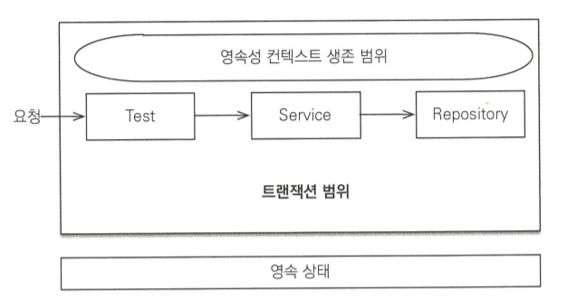
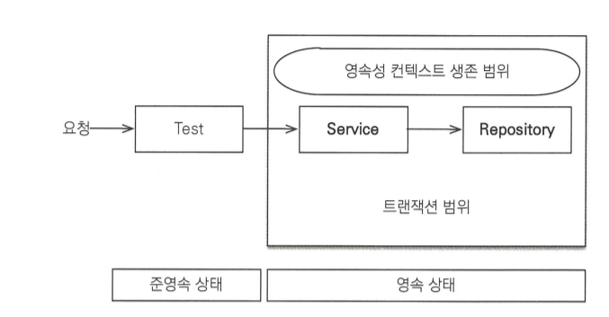
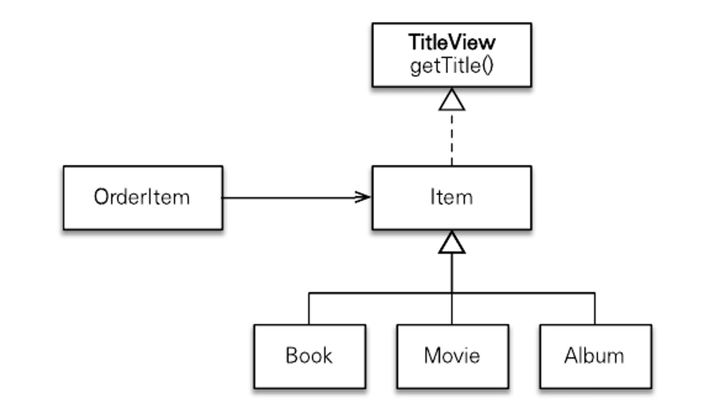
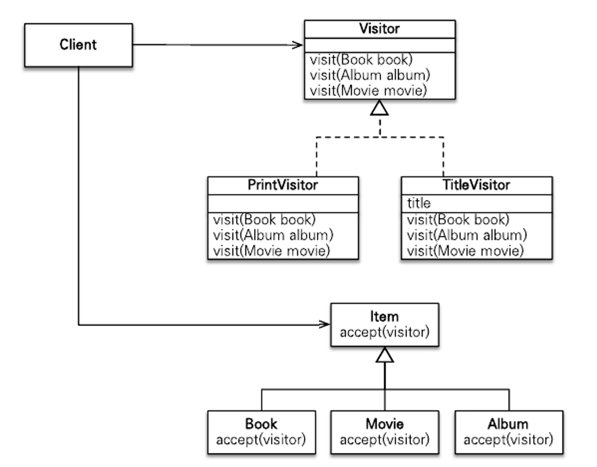
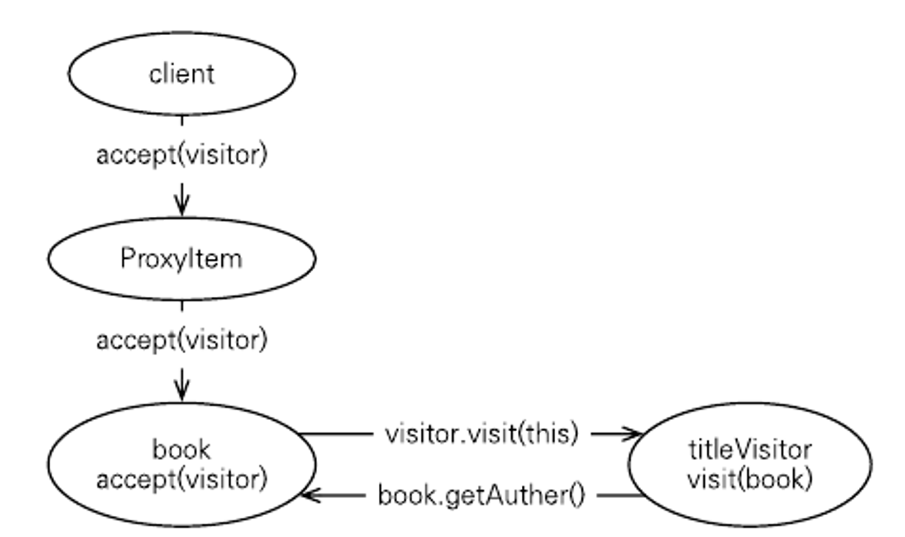

# 고급 주제와 성능 최적화

## 예외 처리

### JPA 표준 예외 정리

- JPA의 표준 예외들은 `javax.persistence.PersistenceException`의 자식 클래스
- 이 예외 클래스는 `RuntimeException`의 자식 클래스 => JPA 예외는 모두 uncheck
- JPA 표준 예외는 크게 2가지로 나뉨

1. 트랜잭션 롤백을 표시하는 예외
   - 심각한 예외이므로 복구해선 안됨
   - 해당 예외가 발생하면 트랜잭션을 강제로 커밋해도 트랜잭션이 커밋되지 않고 대신에 `RollbackException` 예외가 발생
   
   | 트랜잭션을 표시하는 예외                | 설명                                                                                     |
   |:---------------------------------------------------------------------------------------|:---|
   | EntityExistsException        | EntityManager.persist() 호출 시 이미 같은 엔티티가 있으면 발생                                         |
   | EntityNotFoundException| EntityManager.getReference()를 호출 했는데 실제 사용 시 엔티티가 존재하지 않으면 발생, refresh(), lock()에서도 발생 |
   | OptimisticLockException      | 낙관적 락 충돌 시 발생                                                                          |
   | PessimisticLockException     | 비관적 락 충돌 시 발생                                                                          |
   | RollbackException            | EntityTransaction.commit() 실패 시 발생,롤백이 표시되어 있는 트랜잭션 커밋 시에도 발생                          |
   | TransactionRequiredException | 트랜잭션이 필요할 때 트랜잭션이 없으면 발생, 트랜잭션 없이 엔티티를 변경할 때 주로 발생                                     |
   
2. 트랜잭션 롤백을 표시하지 않는 예외
   - 심각한 예외가 아니라 개발자가 트랜잭션을 커밋할지 롤백할지를 결정

   | 트랜잭션을 표시하지 않는 예외             | 설명                                                                                     |
   |:---------------------------------------------------------------------------------------|:---|
   | NoResultException |Query.getSingleResult() 호출 시 결과가 하나도 없을 때 발생|
   | NonUniqueResultException      | Query.getSingleResult() 호출 시 결과가 둘 이상일 때 발생|
   | LockTimeoutException|비관적 락에서 시관 초과시 발생 |
   | QueryTimeoutException|쿼리 실행 시간 초과 시 발생|

### 스프링 프레임워크의 JPA 예외 변환
- 서비스 계층에서 JPA의 예외를 직접 사용 시 JPA에 의존하게 됨
- 이런 문제를 해결하기 위해 스프링 프레임워크는 데이터 접근 계층에 대한 예외를 추상화해서 개발자에게 제공

| JPA 예외                       | 스프링 변환 예외                                                        |
|:-----------------------------|:-----------------------------------------------------------------|
| PersistenceException         | org.springframework.orm.jpa.JPASystemException                   |
| NoResultException      | org.springframework.dao.EmptyResultDataAccessException           |
| NonUniqueResultException     | org.springframework.dao.IncorrectResultSizeDataAccessException   |
| LockTimeoutException         | org.springframework.dao.CannotAcquireLockException               |
| QueryTimeoutException        | org.springframework.dao.QueryTimeoutException                    |
| EntityExistsException        | org.springframework.dao.DataIntegrityViolationException          |
| EntityNotFoundException| org.springframework.orm.jpa.JpaObjectRetrievalFailureException   |
| OptimisticLockException      | org.springframework.orm.jpa.JpaOptimisticLockingFailureException |
| PessimisticLockException     | org.springframework.dao.PessimisticLockingFailureException       |
| RollbackException            | org.springframework.dao.InvalidDataAccessApiUsageException       |
| TransactionRequiredException | org.springframework.transaction.TransactionSystemException       |

- 추가로, JPA 표준 명세상 발생할 수 있는 두 예외도 추상화해서 제공

| JPA 예외                   | 스프링 변환 예외                                                  |
|:-------------------------|:-----------------------------------------------------------|
| IllegalStateException    | org.springframework.dao.InvalidDataAccessApiUsageException |
| IllegalArgumentException | org.springframework.dao.InvalidDataAccessApiUsageException |

### 스프링 프레임워크에 JPA 예외 변환기 적용
- JPA 예외를 스프링 프레임워크가 제공하는 추상화된 예외로 변경하려면 `PersistenceTranslationPostProcessor`를 스프링 빈으로 등록하면 됨
- 이는 `@Repository` 어노테이션을 사용한 곳에 예외 변환 AOP를 적용해서 JPA 예외를 스프링 프레임워크가 추상화한 예외로 변환

#### 사용 예
```xml
<bean class="org.springframework.dao.annotation.PersistenceExceptionTranslationPostProcessor" />
```
또는 이렇게 사용
```java
@Bean
public void PersistenceExceptionTranslationPostProcessor exceptionTranslation() {
    return new PersistenceExceptionTranslationPostProcessor();
}
```
```java
@Repository
public class Repository {
    
    @PersistenceContext EntityManager em;

    /**
     * 사용 예시 1
     * findMember() 메서드는 엔티티를 조회하려고 getSingleResult() 메서드 사용
     * 이 메서드는 조회된 결과가 없으면 NoResultException이 발생
     * 이 예외가 findMember() 메서드를 빠져 나갈 때 PersistenceExceptionTranslationPostProcessor에서 등록한 AOP 인터셉터가 동작
     * 해당 예외를 EmptyResultDataAccessException 예외로 변환해서 반환 => 스프링 프레임워크가 추상화한 예외를 받음
    */
    public Member findMember() {
        // 조회된 데이터가 없음
        return em.createQuery("select m from Member m", Member.class).getSingleResult(); 
    }

    /**
     * 사용 예시 2
     * 만약 예외를 변환하지 않고 그대로 반환하고 싶으면 throws 절에 그대 반환할 JPA 예외나 JPA 예외의 부모 클래스를 직접 명시
     * 참고로 Exception을 선언하면 모든 예외의 부모이므로 예외를 변환하지 않음
     */
    public Member findMember() throws NoResultException {
        return em.createQuery("select m from Member m", Member.class).getSingleResult();
    }
}
```

### 트랜잭션 롤백 시 주의사항
- 트랜잭션을 롤백하는 것은 DB의 반영사항만 롤백하는 것, 수정한 Java 객체까지 원상태로 복구해주진 않음
- 엔티티를 조회해서 수정하는 중에 문제가 있어 트랜잭션을 롤백하면 DB의 데이터는 원상복구되나 객체는 수정된 상태로 영속성 컨텍스트에 남아 있음
- 따라서 트랜잭션이 롤백된 영속성 컨텍스트를 그대로 사용하는 것은 위험
- 새로운 영속성 컨텍스트를 생성해서 사용하거나 `EntityManager.clear()`를 호출해 영속성 컨텍스트를 초기화한 다음에 사용해야 함
- 기본전략인 트랜잭션당 영속성 컨텍스트 전략은 문제가 발생하면 트랜잭션 AOP 종료 시점에 트랜잭션을 롤백하면서 영속성 컨텍스트도 함께 종료하므로 문제 발생하지 않음
- 그러나 OSIV처럼 영속성 컨텍스트의 범위를 트랜잭션 범위보다 넓게 사용해 여러 트랜잭션이 하나의 영속성 컨텍스트를 사용할 때 발생함
- 이 경우 트랜잭션을 롤백해서 영속성 컨텍스트에 이상이 발생해도 다른 트랜잭션에서 해당 영속성 컨텍스트를 그대로 사용하는 문제가 있음
- 스프링 프레임워크는 영속성 컨텍스트의 범위를 트랜잭션의 범위보다 넓게 설정하면 트랜잭션 롤백 시 영속성 컨텍스트를 초기화`EntityManger.clear()`해서 영속성 컨텍스트 오용하는 문제를 예방

>💡 자세한 내용은 `org.springframework.orm.jpa.JpaTransactionManager.doRollback()` 메서드 참고

## 엔티티 비교
- 영속성 컨텍스트 내부에는 엔티티 인스턴스 보관을 위해 1차 캐시가 존재
- 이 1차 캐시는 영속성 컨텍스트와 생명주기를 같이 함
- 영속성 컨텍스트를 통해 데이터를 저장하거나 조회하면 1차 캐시에 엔티티가 저장
- 이 덕분에 변경 감지 기능도 동작하고, 이름 그대로 1차 캐시로 사용되어서 DB를 통하지 않고 데이터를 바로 조회 가능

```java
Member member1 = em.find(Member.class, 1L);
Member member2 = em.find(Member.class, 1L);
member1 == member2;                         // true
```
- 같은 영속성 컨텍스트에서 엔티티를 조회하면 **동등성과 동일성 모두 충족하는 엔티티 인스턴스**를 반환함

### 영속성 컨텍스트가 같을 때 엔티티 비교


- 테스트는 트랜잭션 안에서 시작하므로 테스트의 범위와 트랜잭션의 범위는 같음
- 테스트 클래스에 @Transactional 선언이 되어있으면 트랜잭션 먼저 시작 후 메서드 실행
- 이 경우 3가지 조건 모두 만족
  1. 동일성: `==` 비교가 같음
  2. 동등성: `equals()` 비교가 같음
  3. DB 동등성: `@Id` 선언된 DB 식별자가 같음

>💡테스트 클래스에 `@Transactional`을 적용하면 테스트가 끝날 때 트랜잭션을 커밋하지 않고 트랜잭션을 강제로 롤백함. 그래야 DB에 영향을 주지 않고 테스트를 반복해서 할 수 있기 때문. 문제는 롤백 시 영속성 컨텍스트를 플러시하지 않음. 그렇기에 플러시 시점에 어떤 SQL이 실행되는지 콘솔 로그에 남지 않음. 콘솔을 통해 보고 싶으면 `em.flush()`를 강제로 호출.

### 영속성 컨텍스트가 다를 때 엔티티 비교

- 테스트에 `@Transactional`이 없고 서비스에만 적용 시 트랜잭션 범위와 영속성 컨텍스트 범위
- 이 경우 아래처럼 테스트를 작성하면 영속성 컨텍스트가 달라 동일성 비교에 실패
  ```java
  @Transactional
  public class Service {
    @Autowired Repository repository;
    
    public Long logic(Entity entity) {
        repository.save(entity);
        return entity.getId(); 
    }
  }
  
  @Transactional
  public class Repository {
    @PersistenceContext EntityManager em;
  
    public void save(Entity entity) {
        em.persist(entity);
    }
  
    public Entity find(Long id) {
        return em.find(Entity.class, id);  
    }   
  }
  
  public class Test {
    @Autowired Service service;
    @Autowired Repository repository;
  
    @Test
    void test() {
        Entity entity = new Entity();
        Long id = service.logic(entity);
        Entity findEntity =  repository.find(id);
        // 둘은 다른 주소 값을 가진 인스턴스
        //  동일성: false
        //  동등성: equals()가 따로 구현되었다는 전제 하에 true
        //  DB 동등성: @Id 식별자 같음 
        System.out.println(entity == findEntity);   // false
    }
  }
  ```

## 프록시 심화 주제
- 프록시는 원본 엔티티를 상속 받아 만들어짐
- 따라서 엔티티를 사용하는 클라이언트는 엔팉티가 프록시인지 아니면 원본인지 구분하지 않고 사용 가능
- 문제는 프록시를 사용하는 방식의 기술적 한계로 인해 예상 못한 문제가 발생

### 영속성 컨텍스트와 프록시
```java
/**
 * 프록시 조회랑 find() 조회 시 둘은 서로 같은 인스턴스
  */
em.getReference(Entity.class, "entity1");       // Entity_$$_jvst843_0
em.find(Entity.class, "entity1");               // Entity_$$_jvst843_0
```
- 프록시로 조회해도 영속성 컨텍스트는 영속 엔티티의 동일성을 보장
- 영속성 컨텍스트는 프록시로 조회된 엔티티에 대해서 같은 엔티티를 찾는 요청이 오면 원본 엔티티가 아닌 처음 조회된 프록시를 반환
- 끝에 `_$$_jvst843_0`가 붙어있으므로 프록시로 조회된 것을 확인할 수 있음

```java

/**
 * 반대로 조회하면 원본 엔티티를 이미 DB에서 조회했으므로 프록시를 반환할 이유가 없음.
 * 따라서 이땐 원본을 반환
  */
em.find(Entity.class, "entity1");               // Entity
em.getReference(Entity.class, "entity1");       // Entity
```

### 프록시 타입 비교
```java
Entity refEntity = em.getReference(Entity.class, 1L);
Entity.class == refEntity.getClass();           // false
refEntity instanceof Entity.class               // true
```
- 프록시는 원본 엔티티를 상속 받아서 만들어지므로 프록시로 조회한 엔티티 타입을 비교라 때는 `==`를 쓰면 안되고, `instanceof`를 사용해야 함

### 프록시 동등성 비교
- 엔티티 동등성 비교 시 비즈니스 키를 사용해서 equals() 메서드를 오버라이딩하고 비교하면 됨
- 그러나 비교 대상이 프록시면 문제가 발생할 수 있음
  ```java
  @Override
  public boolean equals(Object obj) {
    if(this == obj) return true;
    if(obj == null) return false;
    //if(this.getClass() != obj.getClass()) return false;       // 프록시는 원본을 상속 받은 자식 타입
                                                                // 따라서 이 경우 ==이 아닌 instanceof를 사용해야 함
    if(!(obj instanceof Entity)) return false;                  // 이렇게 비교해줘야 함
    
    Entity entity = (Entity)entity;
    /*
    if(field != null                                            // 이부분도 문제 발생 
        ? !field.equals(entity.field)                           // 프록시는 실제 데이터를 가지고 있지 않음
        : entity.field != null) {                               // 따라서 entity.field는 null이 반환되고 equals()는 false를 반환
        return false;                                           // field 멤버 변수를 직접 접근해서 발생한 문제
    }                                                           // 프록시의 데이터를 조회할 때는 Getter를 사용해야 함
    */
    
    if(field != null
        ? !field.equals(entity.getField())
        : entity.getField() != null) {
        return false;
    }  
  
    return true;
  }
  ```
1. 프록시 타입 비교는 `==` 대신 `instanceof` 사용
2. 프록시 멤버변수에 직접 접근하면 안되고 접근자 메서드를 사용해야 함

### 상속관계와 프록시
- 프록시를 부모 타입으로 조회하면 문제가 발생함

```java
public class Book extends Item { ... }

Book book = new Book();
em.persist(book);

em.flush();
em.clear();

Item proxyItem = em.getReference(Item.class, book.getId());
System.out.println("proxyItem = " + proxyItem.getClass());  // proxyItem = class Item_$$_jvstXXX 

if(proxyItem instanceof Book) {
    System.out.println("is-kind-of Book");
    Book book = (Book)proxyItem;                            // 강제로 타입을 다운 캐스팅해도 ClassCastException 예외 발생
    ...
}

assertFalse(proxyItem.getClass() == Book.class);            // 프록시 타입이므로 false
assertFalse(proxyItem instanceof Book);                     // Item 엔티티를 대상으로 조회했으므로 Item 타입을 기반으로 만들어져 졌고 Book 타입과 관계가 없음
assertTrue(proxyItem instanceof Item);
```

1. `instanceof` 연산을 사용할 수 없음
2. 하위 타입으로 다운캐스팅 할 수 없음

- 상속 관계에서 발생하는 프록시 문제는 아래와 같음

#### JPQL로 대상 직접 조회

```java
Book jpqlBook = em.createQuery("select b from Book b where b.id=:bookId", Book.class)
        .setParameter("bookId", item.getId())
        .getSingleResult();
```

#### 프록시 벗기기
- 하이버네이트가 제공하는 기능 사용

```java
// 하이버네이트가 제공하는 프록시에서 원본 엔티티를 찾는 기능을 사용하는 메서드
public static<T> T unProxy(Object entity) {
    if(entity instanceof HibernateProxy) {
        entity = ((HibernateProxy)entity) 
            .getHibernateLazyInitilizer()
            .getImplementation();
    }    
    return (T)entity;
}

...

Item item = orderItem.getItem();
Item unProxyItem = unProxy(item);

/*
    실제로 보면 두 객체는 동일성을 보장하지 못함
    영속성 컨텍스트는 한번 프록시로 노출한 엔티티는 계속 프록시로 노출함
    이 방법은 프록시에서 원본 엔티티를 직접 꺼내기 때문에 프록시와 원본 엔티티의 동일성 비교가 실패한다는 문제점이 있음
    
    이 방법 사용 시 원본 엔티티가 꼭 필요한 곳에서 잠깐 사용하고 다른 곳에서 사용되지 않도록 하는 것이 중요
    참고로 원본 엔티티 값을 직접 변경해도 변경 감지 기능은 동작        
 */
assertTrue(item != unProxyItem);
```

#### 기능을 위한 별도의 인터페이스 제공

```java
public interface TitleView {
    String getTitle();
}

public class Book extends Item implements FieldView {
    @Override
    public String getTitle() {
        return "Book Title" + getField();
    }
}

public class Movie extends Item implements FieldView {
    @Override
    public String getTitle() {
        return "Movie Title" + getField();
    }
}
```
- 공통 인터페이스를 만들고 자식 클래스들은 인터페이스의 `getTitle()` 메서드를 각각 구현
- 이를 통해 구현체에 따라 각각 다른 결과가 호출됨

#### 비지터 패턴 사용

- Visitor와 Visitor를 받아들이는 대상 클래스로 구성됨
- 여기서 `Item`이 `accept(visitor)` 메서드를 사용해서 Visitor를 받아들임
- 그리고 `Item`은 단순히 Visitor를 받아들이기만 하고 실제 로직은 Visitor가 처리

```java
public interface Visitor {
    void visit(Book book);
    void visit(Album album);
    void visit(Movie movie);
}

public class PrintVisitor implements Visitor {

    @Override
    public void visit(Book book) {
        // 넘어오는 book은 원본 엔티티임.
        // 출력 로직
    }

    @Override
    public void visit(Album album) {...}

    @Override
    public void visit(Movie movie) {...}
}

public class TitleVisitor implements Visitor {

    private String title;

    public String getTitle() {
        return title;
    }

    @Override
    public void visit(Book book) {
        // 넘어오는 book은 원본 엔티티임.
        title = [book과 관련된 정보 출력];
    }

    @Override
    public void visit(Album album) {...}

    @Override
    public void visit(Movie movie) {...}
}

@Entity
@Inheritance(strategy = InheritanceType.SINGLE_TABLE)
@DiscriminatorColumn(name = "DTYPE")
public abstract class Item {

    // 필드

    public abstract void accept(Visitor visitor);
}

@Entity
@DiscriminatorColumn(name = "B")
public class Book extends Item {

    // 필드

    @Override
    public void accept(Visitor visitor) {
        visitor.visit(this); // this는 프록시가 아닌 원본이다.
    }
}

...

// 비지터 패턴 실행
public void visitorPattern() {
    Item item = new Book();
    item.accept(new PrintVisitor());        // 결과: book.class = Book 
}
```

##### 동작 과정

1. `item.accept()` 메서드를 호출하면서 파라미터로 `PrinterVisitor`를 넘겨줌
2. item은 프록시이므로 먼저 프록시`ProxyItem`가 `accept()` 메서드를 받고 원본 엔티티의 `accept()`를 실행
3. `this`가 `Book` 타입이므로 `visit(Book book)` 메서드가 실행됨

##### 비지터 패턴 장단점

###### 장점
- 프록시에 대한 걱정 없이 안전하게 원본 엔티티에 접근 가능
- `instanceof`와 타입 캐스팅 없이 코드를 구현할 수 있음
- 알고리즘과 객체 구조를 분리해서 구조를 수정하지 않고 새로운 동작 추가 가능

###### 단점
- 너무 복잡하고 더블 디스패치를 사용하기 때문에 이해하기 어려움
  - 디스패치: 어떤 메서드를 결정하고 실행하는 과정
  - `동작과정 3번`에서 타입이 결정을 위해 디스패치를 2번 한다는 의미
- 객체 구조가 변경되면 모든 Visitor를 수정해야 함

## 성능 최적화

### N+1 문제
```java
@Entity
public class Member {

    @Id
    @GeneratedValue
    private Long id;

    @OneToMany(mappedBy = "member", fetch = FetchType.EAGER)        // 일대다 즉시로딩
    private List<Order> orders = new ArrayList<>();

    ...
}

@Entity
@Table("name = ORDERS")
@public class Order {

    @Id
    @GeneratedValue
    private Long id;

    @ManyToOne
    private Member member;
}
```
#### 즉시 로딩과 N+1

- 특정 회원 하나를 `em.find()`로 조회하면 즉시 로딩으로 설정한 주문 정보도 함께 조회함
- 이때는 한번의 SQL로 회원과 주문 정보를 함꼐 조회
- 문제는 JPQL
  ```java
  /*
    JPQL을 실행하면 JPA는 이를 분석해서 SQL를 생성
    이때는 즉시 로딩과 지연 로딩에 대해 전혀 신경쓰지 않고 JPQL만 사용해서 SQL을 생성하므로 'SELECT * FROM MEMBER'가 실행됨
    이를 통해 Member 엔티티를 먼저 조회, 문제는 Member 엔티티와 연관된 Order 컬렉션이 즉시 로딩으로 설정되어 있음
    JPA는 Order 컬렉션을 즉시 로딩하기 위해 다음 SQL을 추가로 실행
        SELECT * FROM ORDERS WHERE MEMBER MEMBER_ID=?
    조회된 Member가 하나라면 2번의 SQL이 실행되나, 조회된 Member가 다수면 그 개수만큼 추가 SQL이 실행됨
        SELECT * FROM MEMBER;                           조회된 Member가 다수
        SELECT * FROM ORDERS WHERE MEMBER MEMBER_ID=1   그 개수만큰 추가 조회
        SELECT * FROM ORDERS WHERE MEMBER MEMBER_ID=2
        ... 
  */
  List<Member> members = em.createQuery("select m from Mmeber m", Member.class).getResultList();
  ```
  - 이처럼 처음 실행한 SQL의 결과 수만큼 추가로 SQL을 실행하는 것을 `N+1 문제`라 함
  - 즉시로딩은 JPQL을 실행할 때 N+1 문제가 발생할 수 있음

#### 지연 로딩과 N+1
```java
@OneToMany(mappedBy = "member", fetch = FetchType.LAZY)
private List<Order> orders = new ArrayList<>();
```
- 지연 로딩을 설정하면 JPQL에서는 N+1 문제가 발생하진 않음
- 이후 비즈니스 로직에서 Order 컬렉션을 사용할 때 지연 로딩이 발생
- 그러나 조회한 모든 Member의 Order 컬렉션을 사용한다면 결과적으로 SQL이 실행됨 => 결국 N+1문제를 늦추기만 한 것
- 아래와 같은 방법으로 N+1 문제를 피할 수 있음

##### 페치 조인 사용
```java
// jPQL
select m from Member m join fetch m.orders
```
```mysql-sql
/* 결과 */
SELECT M.*, O.* FROM MEMBER M
INNER JOIN ORDERS O ON M.ID=O.MEMBER_ID
```
- 이 경우 일대다 조인을 했으므로 결과가 늘어나 중복된 결과가 나타날 수 있음
- 따라서 JPQL의 `DISTINCT`를 사용해서 중복을 제거하는 것이 좋음

##### 하이버네이트 @BatchSize
```java
@Entity
public class Member {

    @Id
    @GeneratedValue
    private Long id;

    @org.hibernate.annotations.BatchSize(size = 5)
    @OneToMany(mappedBy = "member", fetch = FetchType.EAGER)
    private List<Order> orders = new ArrayList<>();

    ...
}
```
- 즉시 로딩으로 설정하면 조회 시점에 10건의 데이터를 모두 조회한다면, SQL이 2번 실행됨
- 지연 로딩으로 설정하면 지연 로딩된 엔티티를 최초 사용하는 시점에 다음 SQL을 실행해서 5건의 데이터를 미리 로딩해둠
  ```mysql-sql
  SELECT * FROM ORDERS
  WHERE MEMBER_ID IN(
    ?, ?, ?, ?, ?
  )
  ```

##### 하이버네이트 @Fetch(FetchMode.SUBSELECT)
```java
@Entity
public class Member {

    @Id
    @GeneratedValue
    private Long id;

    @org.hibernate.annotations.Fetch(FetchMode.SUBSELECT)
    @OneToMany(mappedBy = "member", fetch = FetchType.EAGER)
    private List<Order> orders = new ArrayList<>();

    ...
}
```
- 연관된 데이터를 조회할 때 서브 쿼리를 사용해서 N+1 문제를 해결
```java
// JPQL 실행
select m from Member m where m.id > 10
```
```mysql-sql
/*
즉시 로딩 설정 시 조회 시점에,
지연 로딩 설정 시 지연 로딩된 엔티티를 사용하는 시점에 다음 SQL이 실행됨
*/
SELECT O FROM ORDERS O
    WHERE O.MEMBER_ID IN (
        SELECT
            M.ID
        FROM 
            MEMBER M
        WHERE M.ID > 19
    )
```

#### N+1 정리
- 즉시 로딩을 사용하지 말고 지연 로딩만 사용하는 것을 추천
- 즉시 로딩 전략은 N+1 문제와 비즈니스 로직에 따라 필요하지 않은 엔티티를 로딩해야 하는 상황이 자주 발생함
- 그리고 즉시 로딩은 성능 최적화가 어려움, 예상하지 못한 SQL이 실행될 수 있음

### 읽기 전용 쿼리의 성능 최적화

- 엔티티가 영속성 컨텍스트에 관리되면 1차 캐시에서 변경 감지까지 얻을 수 있는 장점이 많음
- 그러나 영속성 컨텍스트는 변경 감지를 위해 스냅샷 인스턴스를 보관 => 더 많은 메모리를 사용함
- 그래서 엔티티를 읽기만 하고 다른 용도로 사용하지 않을 땐 읽기 전용으로 엔티티를 조회하여 메모리 사용량을 최적화할 수 있음
- 다음 JPQL 쿼리를 최적화를 시도
  ```mysql-sql
  select o from Order o
  ```

#### 스칼라 타입으로 조회
```java
select o.id, o.name, o.price from Order o
```
- 가장 확실한 방법
- 엔티티가 아닌 스칼라 타입으로 모든 필드를 조회

#### 읽기 전용 쿼리 힌트 사용
```java
TypedQuery<Order> query = em.createQuery("select o from Order o", Order.class);
query.setHind("org.hibernate.readOnly", true);
```
- 하이버네이트 전용 `org.hibernate.readOnly` 힌트를 사용하면 엔티티를 읽기 전용으로 조회
- 읽기 전용이므로 영속성 컨텍스트는 스냅샷을 보관하지 않음, 대신 스냅샷이 없으므로 엔티티 수정에도 DB 반영되지 않음

#### 읽기 전용 트랜잭션 사용
```java
@Transactional(readOnly = true)
```
- 스프링 프레임워크 사용 시 트랜잭션을 읽기 전용 모드로 설정
- `readOnly = true` 옵션을 주면 스프링 프레임워크가 하이버네이트 세션의 플러시 모드를 `MANUAL`로 설정
- 이렇게 하면 강제로 플러시를 호출하지 않는 한 플러시가 일어나지 않음 -> 트랜잭션을 커밋해도 영속성 컨텍스트를 플러시하지 않음
- 플러시할 때 일어나는 스냅샷 비교 같은 무거운 로직들을 수행하지 않아 성능 향상
- 물론 트랜잭션을 시작했으므로 `트랜잭션 시작, 로직 수행, 커밋` 과정은 이뤄짐

#### 트랜잭션 밖에서 읽기
```java
@Transactional(propagation = Propagation.NO_SUPPORTED)          // Spring
@TransactionAttribute(TransactionAttributeType.NOT_SUPPORTED)   // J2EE
```
- 트랜잭션 없이 데이터를 조회한다는 의미
- JPA에서 데이터 변경 시 트랜잭션은 필수 => 조회가 목적일 때만 사용
- 트랜잭션을 사용하지 않으면 플러시가 일어나지 않으므로 조회 성능이 향상됨
  - 기본적으로 플러시 모드는 AUTO로 설정되어 있음 => 트랜잭션을 커밋하거나 쿼리를 실행하면 플러시가 작동함
  - 트랜잭션 자체가 존재하지 않기 때문에 커밋할 일이 없음
  - 그리고 JPQL 쿼리도 트랜잭션 없이 실행하면 플러시를 호출하지 않음
  
### 배치 처리

- 수백만 건의 데이터를 배치 처리해야 하는 상황이 있을 때 영속성 컨텍스트를 적절한 단위로 초기화해야 함 => 메모리 부족 방지

#### JPA 등록 배치
```java
for(int i = 0; i < 10000; ++i) {
    em.persist(entity);
    if(i % 100 == 0) {
        em.flush();
        em.clear();
    }
}
```
- 수천 ~ 수만 건 이상의 엔티티를 한번에 등록할 때 주의할 점은 영속성 컨텍스트에 엔티티가 계속 쌓이지 않도록 일정 단위마다 영속성 켄텍스트의 엔티티를 DB에 플러시해야 함
- 이러한 작업을 하지 않으면 영속성 컨텍스트에 너무 많은 엔티티가 저장되면서 메모리 부족 오류가 발생

#### JPA 수정 배치
- 이 경우 2가지 방법을 주로 사용

##### JPA 페이징 배치 처리
```java
for(int i = 0; i < 10; ++i) {
    List<Product> resultList = em.createQuery("select p from Product p", Product.class)
        .setFirstResult(i * pageSize)
        .setMaxResult(pageSize)
        .getResultList();
    
    for(Product product : resultList) {
        product.setPrice(product.getPrice() + 100);    
    }
    em.flush();
    em.clear();
}
```
- 한번에 100건씩 페이징 쿼리로 조회하면서 가격 증가를 시키는 예
- 페이지 단위마다 영속성 컨텍스트를 플러시하고 초기화

##### 커서(하이버네이트 scroll 사용)
```java
Session session = em.unwrap(Session.class);

tx.begin();
ScrollableResults scroll = session.createQuery("select p from Product p")
        .setCacheMode(CacheMode.IGNORE)     // 2차 캐시 기능을 끎
        .scroll(ScrollMode.FORWARD_ONLY);

int count = 0;

while(scroll.next()) {
    Product p = (Product)scroll.get(0);
    p.setPrice(p.getPrice() + 100);
    
    if((++count % 100) == 0) {
        session.flush();        // 플러시
        session.clear();        // 영속성 컨텍스트 초기화
    }
}

tx.commit();
session.close();
```
- JPA는 JDBC 커서`Cursor`를 지원하지 않음
- 사용하기 위해선 하이버네이트 세션`Session`을 사용해야 함 -> `em.unwrap()` 메서드로 하이버네이트 세션을 먼저 구함
- `next()` 메서드를 호출해 엔티티를 하나씩 조회

##### 하이버네이트 무상태 세션 사용
```java
SessionFactory sessionFactory = entityMangerFactory.unwraP(SessionFactory.class);
StatelessSession session = sessionFactory.openStatelesSession();
Transaction tx = session.beginTransaction();
ScrollableResults scroll = session.createQuery("select p from Product p").scroll();

while(scroll.next()) {
    Product p = (Product)scroll.get(0);
    p.setPrice(p.getPrice() + 100);
    session.update(p);                      // 직접 update() 호출해야 함
}
```
- 이름 그대로 무상태로, 영속성 컨텍스틀르 만들지 않고 2차 캐시도 사용하지 않음
- 그리고 엔티티를 수정하려면 무상태 세션이 제공하는 `update()` 메서드를 직접 호출해야 함
- 하이버네이트 무상태 세션은 일반 하이버네이트 세션과 유사하나 **영속성 컨텍스트가 없음**
- 따라서 영속성 컨텍스트를 플러시하거나 초기화하지 않아도 됨, 대신 수정할 때 `update()` 메서드를 직접 호출해야 함

### SQL 쿼리 힌트 사용
```java
Session session = em.unwrap(Session.class);
List<Member> list = session.createQuery("select m from Member m")
        .addQueryHint("FULL (MEMBER)")      // SQL HINT 추가
        .list();
```
```sql
select
    /*+ FULL(MEMBER) */ m.id, m.name
from 
    Member m
```
- JPA는 DB SQL (DB 벤더가 제공하는)힌트 기능을 제공하지 않음
- 힌트를 사용하려면 하이버네이트를 직접 사용해야 함
- 다른 DB에서 SQL 힌트를 사용하려면 각 방언에서 `org.hibrernate.dialect.Dialect`에 있는 다음 메서드를 오버라이딩해서 기능을 구현해야 함
  ```java
  public String getQueryHintString(String query, List<STring> hints) {
    return query;
  }
  ```

### 트랜잭션을 지원하는 쓰기 지연과 성능 최적화
- 하이버네이트 사용 시 `hibernate.jdbc.batch_size` 속성 값을 설정하면 SQL 배치 전략을 적용할 수 있음
  - 가령 속성 값을 `50`으로 주면 `최대 50건`씩 모아서 SQL 배치를 실행함
- 하지만 SQL 배치는 같은 SQL일 때만 유효, 중간에 다른 처리가 들어가면 SQL 배치를 다시 시작함
  ```java
  /*
  1,2,3,4를 모아서 하나의 SQL 배치를 실행
  5를 한번 실행하고 6,7을 모아서 실행
  총 3번의 SQL 배치를 실행
  */
  em.persist(new Member); // 1
  em.persist(new Member); // 2
  em.persist(new Member); // 3
  em.persist(new Member); // 4
  em.persist(new Child()); // 5, 다른 연산
  em.persist(new Member); // 6
  em.persist(new Member); // 7
  ```

>⚠️`IDENTITY` 식별자 생성 전략은 쓰지 지연을 활용한 성능 최적화 사용 불가
>- 해당 전략은 엔티티를 DB에 저장해야 식별자를 구할 수 있음
>- em.persis()를 호출하는 즉시 INSERT SQL이 DB에 전달됨
>- 따라서 쓰기 지연을 활용한 성능 최적화를 할 수 없음

### 트랜잭션을 지원하는 쓰기 지연과 어플리케이션 확장
- 트랜잭션을 지원하는 쓰기 지연과 변경 감지 덕에 성능과 개발의 편의성 둘 다 잡을 수 있게됨
- 그리고 **DB 테이블 로우`Row`에 락`Lock`이 걸리는 시간이 최소화**하는 장점이 존재
- 이는 트랜잭션을 커밋해서 영속성 컨텍스트를 플러시하기 전까진 DB에 데이터를 등록, 수정, 삭제하지 않음
- 따라서 커밋 직전까지 DB 로우에 락을 걸지 않음

```java
update(member);     // UPDATE SQL
logicA();           // UPDATE SQL
logicB();           // UPDATE SQL
commit();
```
- JPA를 사용하지 않고 직접 SQL을 다루면 `update(member)` 호출 시 UPDATE SQL을 실행하면서 DB 테이블 로우에 락을 걺
  - 이 락은 `logicA()`, `logicB()`를 모두 수행하고 `commit()`을 호출할 때까지 유지됨
  - 트랜잭션 격리 수준에 따라 다르나 보통 많이 사용하는 `Read Commited` 격리 수준이나 그 이상에서는 DB에 현재 수정 중인 데이터`Row`를 수정하려는 다른 트랜잭션은 락이 풀릴 때까지 대기
- JPA는 커밋을 해야 플러시를 호출하고 DB에 수정 쿼리를 보냄
  - commit() 호출할 때 UPDATE SQL을 실행하고 DB 트랜잭션을 커밋함
  - 쿼리를 보내고 바로 트랜잭션을 커밋하기 때문에 DB에 락이 걸리는 시간을 최소화 함