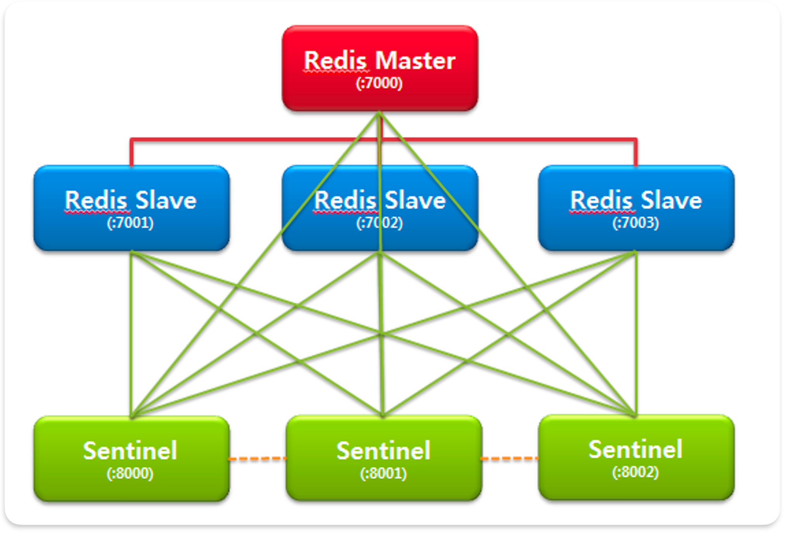

# Redis란?

## 요약
- Redis는 Key-value 구조 비정형 데이터 저장 및 관리하기 위한 비관계형 in-memory DBMS이다
- Redis는 single thread 환경으로 동작하므로 큰 데이터가 오면, 해당 데이터 처리가 끝날 때까지 다른 요청은 대기해야 한다
- 운영 모드로는 대표적으로 싱글 인스턴스로 동작하는 `Standardalone`, Sentinel 노드가 지속적으로 Master/Slave 노드를 모니터링하는 `Sentinel` 그리고 데이터를 샤딩해서 분산 관리 및 이를 master/slave로 관리하는 `Cluster` 모드가 존재한다
---

- <Key, Value> 구조의 비정형 데이터 저장 및 관리하기 위한 오픈 소스 비관계형 DBMS
  - DB, 캐시, 메시지 브로커로 사용됨
- In-memory 데이터 구조를 가진 저장소
- 메모리에서 데이터를 처리하기 때문에 속도가 빠름
- Single-threaded 방식
  - 한번에 하나의 명령만 처리 가능
  - 중간에 처리 시간이 긴 명령어가 들어오면 그 뒤에 명령어들은 모두 앞에 있는 명령어가 처리될 때까지 대기 필요
  - 그래도 `get`, `set` 명령어의 경우 100,000 TPS 이상 처리 => 초당 10만 건

## 활용 사례: Cache 서버
- DB는 데이터를 물리 디스크에 직접 쓰기 때문에 서버에 문제가 발생해도 데이터 손실되지 않음
- 그러나 매번 디스크에 접근해서 사용자가 많아질수록 부하가 많아져 느릴 수 밖에 없음
- 이를 대비해서 캐시 서버를 도입 => Redis가 이를 맡음
- 한번 읽어온 데이터를 임의의 메모리에 저장하여 다음에 읽을 땐 빠르게 결과를 받을 수 있도록 도움
- 같은 요청이 여러번 들어오는 경우 매번 DB를 거치치 않고 Cache 서버에서 첫 번째 요청 후 저장된 결과를 바로 내려줌
- **이를 통해 DB 부하를 줄이고 서비스 속도를 향상**

### Look Aside Cache 패턴
1. 클라이언트 데이터 요청
2. 웹 서버는 데이터가 존재하는지 Cache 서버 먼저 확인
   - 데이터가 있으면 DB에서 데이터 조회하지 않고, Cache 서버에 있는 결과 값을 클라이언트에게 바로 반환 => `Cache Hit`
   - 없으면 DB에 데이터를 조회, Cache 서버에 저장하고 결과 값을 클라이언트에게 반환 => `Cache Miss`

### Write Back 패턴
- Insert 쿼리를 한번 씩 500개 날리는 것보다 500개를 붙여서 한번에 날리는 것이 효율적이라는 원리
- 들어오는 데이터들이 저장되기 전에 메모리 공간에 머무르는데, 이때 서버에 발생하여 다운 시 데이터 손실 가능성 있음

#### 알고리즘
1. 웹서버는 모든 데이터를 Cache 서버에 저장
2. Cache 서버에 특정 시간 동안 데이터가 저장됨
3. Cache 서버에 있는 데이터를 DB에 저장
4. DB에 젖아된 Cache 서버의 데이터는 삭제

## 지원하는 자료구조
- `String`: 가장 일반적인 Key-value 구조
- `Sets`: String의 집합, 여러 개 값을 하나의 value에 넣을 수 있음 -> 게시물의 Tag에 주로 사용
- `Sorted Set`: 중복된 데이터를 담지 않는 Set 구조에 정렬을 적용한 구조 -> 랭킹 보드 서버
- `Lists`: Array 형식의 데이터 구조, 처음과 끝에 데이터를 넣고 빼는건 빠르나, 중간 삽입, 삭제는 어려움

## 운영 모드
- 단일 인스턴스만으로도 충분히 운영 가능
- 물리 머신이 가진 메모리 한계를 초과하는 데이터를 저장하고 싶거나, 장애`Failover`에 대한 처리를 통해 고가용성`High Availability, HA` 보장을 위해 운영 모드 선택 필요

### Standalone
- 기본 운영 모드, 단일 서버로 동작
- HA 지원 안됨

### Sentinel

- Master-slave 방식

#### 동작 방식
1. Sentinel 인스턴수 과반수 이상이 Master 장애 감지 시 Slave 중 하나를 Master로 승격, 기존 Master는 Slave로 강등
2. Slave가 여러 개 있을 경우 Slave가 새로운 Master로부터 데이터를 받을 수 있도록 재구성

#### Sentinel 노드
- 1차 복제만 Master 후보에 오를 수 있음 -> 복제 서버의 복제 서버는 불가능
- 1차 복제 서버 중 replica-priority 값이 가장 적은 서버가 Master로 선정
  - `0`으로 설정 시 승격 불가
  - 동일한 값이 있을 땐 엔진에서 선택
- 안정적 운영을 위해 최소 3개 이상의 Sentinel 노드 권장
  - 물리적으로 영향받지 않는 컴퓨터나 가상머신에 설치되는 것이 좋음
- 내부적으로 Redis의 `pub/sub` 기능을 사용해 정보를 주고 받음
- Sentinel+Redis 구조의 분산 시스템은 Redis가 비동기 복제를 사용 -> 장애 발생 동안 썼던 내용들이 유지됨을 보장
- Redis와 동일한 노드에 구성해도 되고 별도로 구성해도 됨
- 클라이언트는 주어진 서비스를 담당하는 현재 Redis Master의 주소를 요청하기 위해 Sentinel에 연결
  - 장애 조치 발생 시 Sentinel은 새 주소를 알려줌

#### Failover 감지
- 발생 시 pub/sub으로 클라이언트에게 알리거나, Shell Script로 이메일이나 SMS를 보낼 수 있음

##### 알고리즘
1. Subjectively Down(SDOWN), 주관적 다운
   - Sentinel에서 주기적으로 Master에게 보내는 PING과 INFO 명령의 응답이 3초`down-after-miliseconds` 동안 오지 않으면 주관적 다운으로 인지
   - Sentinel 한대에서 판단한 것이므로 이것만으로는 장애 조치 진행하지 않음
2. Objectively Down(ODOWN), 객관적 다운
   - 설정한 `quorum` 이상의 Sentinel에서 해당 Master가 다운되었다고 인지하면 장애 조치 진행
     - `quorum`: Redis 장애 발생 시 몇 개의 Sentinel 노드가 특정 Redis의 장애 발생을 감지해야 장애라 판단하는지 결정하는 기준 값, 보통 Redis 개수의 과반수 이상으로 설정

##### 장애 대응 시 주의사항
1. `get-master-addr-by-name`
   - Master/Slave 모두 다운 시 Sentinel에 접속해 Master 서버 정보를 요청하면 다운된 서버 정보를 반환
   - 따라서 INFO sentinel 명령어로 Master의 상태 확인 필요
2. Slave -> Master 승격 실패
   - `Slave 다운 -> Master 다운 -> 다운된 Slave 재시작` 시 승격이 안되는 문제가 있음
     - Slave의 `redis.conf`에 자신이 복제로 되어 있고, Sentinel도 복제로 인식하고 있기 때문
   - Slave가 시작하기 전에 `redis.conf`에서 `slaveof`를 삭제해서 해결
3. Failover Timeout 만큼 Write 연산 실패
   - 데이터 양에 따른 최적의 `Failover Timeout` 값을 찾고, `sentinel.conf`에 적용 필수

### Cluster

- 자동 장애 조치 가능
- 데이터를 분산 저장하는 샤딩`Sharding` 제공

>💡좌측의 클러스터 구성은 불가능, Redis Slave 노드는 하나만 연결 가능

#### 동작 방식
1. 해시 슬롯을 이용해 데이터 샤딩
   - 해시 슬롯: CRC-16 해시 함수를 이용해 Key를 정수로 변환, 해당 정수 값을 16,835로 모듈 연산한 값
   - Cluster는 총 16,384개 슬롯이 존재, 각 Master 노드에 자유롭게 할당
     - ex. Master  노드 3개
       - 1번 노드: 0 ~ 5460
       - 2번 노드: 5461 ~ 10922
       - 3번 노드: 10923 ~ 16383
2. Master 사망 시 Master와 Slave는 `Gossip Protocol`을 통해 Master 상태 파악, Slave 중 하나가 Master로 승격 => 무중단 서비스
   - `Gossip Protocol`: 각 Redis는 다른 Redis들과 직접 연결하여 상태 정보 통신
3. 기존 Master가 살아나면 새로운 Master의 Slave가 됨

#### Cluster
- Sentinel보다 발전된 형태
  - Multi-master, Multi-slave 구조
  - 최대 1,000대 노드까지 확장 가능
  - 모든 데이터는 Master 단위로 샤딩되고, Slave 단위로 복제됨
  - Master마다 최소 하나의 Slave를 두는 것을 추천 -> Slave가 없으면 Master 사망 시 데이터 유실 발생
- 노드 추가, 삭제 시 운영 중단 없이 슬롯 재구성 가능
- 장애 발생 시 승격할 때까지 문제가 발생한 Master로 할당된 슬롯의 키는 사용할 수 없음
- 키 이동 시, 일시적으로 해당 키에 락`Lock`을 걺
- 과반수 이상의 노드가 다운되면 Cluster가 깨짐
- 복제는 비동기 방식으로 이뤄짐 
  - Data 정합성 문제가 있음
  - 이 경우 Master가 된 데이터를 기준으로 정합성을 맞춤
- Cluster Redis는 2개의 port가 필요
  - 클라이언트를 위한 port, 노드 간 통신 버스 port
  - `Gossip Protocol`은 Redis 클라이언트가 이용하는 `port 번호 + 10000` 이용
- 클라이언트가 Redis에 데이터 요청할 떄 올바르지 않은 Master 노드에 요청 시
  - 클라이언트에게 해당 데이터가 저장된 위치를 알려줌
  - 클라이언트는 제대로된 주소로 다시 요청

### 메모리 전략

- Redis 서버 내 데이터가 메인 메모리 용량보다 많아지면 `Swap` 발생
  - `Swap`: 메인 메모리가 부족해서 Backing Store(디스크 메모리)를 가상 메모리로 전환시켜 메인 메모리처럼 사용하게 하는 기법
- `Swap` 설정 시,
  - 실제 메모리가 부족해도 시스템 다운 및 프로세스 멈춤 현상 방지
  - 디스크 공간을 메모리처럼 사용하게 되어 처리 속도가 떨어짐
- `Swap` 미설정 시,
  - Redis 서버가 `maxmemory` 양보다 더 많은 데이터를 사용 시, Out Of Memory 에러를 발생시킴
- **위처럼 메모리 이슈가 발생하기에, 설정을 통해 메모리 관리 전략을 수립해야 함**

#### 메모리 관리 전략
1. `maxmemory` configuration
  - 설정된 메모리 양까지 사용하도록 구성 -> `redis.conf`에서 설정
  - 런타임 중에 구성 시 `CONFIG SET` 명령을 통해 지정 가능
    ```shell
    # redis.conf
    maxmemory 100mb
    ```
    - `maxmemory 0` => 메모리 제한 없음(64-bit 시스템 기본 동작, 32-bit에선 3GB 제한)
    - `Swap` 영역하지 사용하지 않도록 Redis 설정에서 메모리 용량 제한 필요
2. `maxmemory-policy` configuration
  
  - Eviction에 대한 정책 -> **일반적으로 사용되는 전략은 LRU**
    - Eviction: 데이터를 최대치로 저장 시, 메모리에 새로운 데이터가 들어오면 기존 데이터는 제거되는 개념


- Redis엔 위의 두 설정 값이 존재하면 메모리 회수 프로세스는 클라이언트가 새로운 command를 수행할 때마다 트리거
  - `used_memory > maxmemory`
    - 트리거가 자주 발생, 서버 성능에 영향
    - Replicas 연결 시 Key 제거 작업으로 인해 Replica 노드와 동기화가 잦음 => Write 증폭 문제
  - `used_memory < maxmemory`
    - 해당 상태로 Redis 서버가 실행되도록 구성하는 것이 좋음

#### Approximated LRU Algorithm
- Redis LRU와 LFU Eviction 정책은 근사 값을 활용 -> 정확한 LRU 알고리즘은 아님
- 소수의 keys를 샘플링, 그중에 가장 오래된 접근 시간을 가진 Key를 Eviction
- Redis 3.0부터 더 좋은 Eviction 후보 풀을 얻기 위해 개선됨 -> LRU 알고리즘 동작에 더 근사
- `maxmemory-samples` 설정에서 지정한 수의 key로 샘플링하여 LRU 알고리즘의 근사치 계산
  - 샘플 수가 많을 수록 메모리가 많이 사용됨, 그러나 정밀도 상승

##### *고찰 - LRU vs. LFU*

- *Redis에서 LRU를 사용하라고 권장하고 있고, 실제로 버전 업하면서 LRU 쪽에 많은 정성을 들인 것 같음*
- *그렇다고해서 무조건 LRU를 쓰는 것이 맞을까?*

###### 사례1. 가장 많이 쓰이는 데이터가 잠깐 안쓰였을 때*
- ‘jisu’라는 데이터가 서비스 동안 가장 많이 쓰였다 가정*
- *그런데 갑자기 다른 데이터가 인기를 잠시 끌게 되면서 ‘jisu’라는 데이터를 일시적으로 쓰지 않음*
- *여기서 ‘다른 데이터’는 횟수는 적으나 개수는 많은 서로 다른 데이터*
- *그로 인해 메모리 임계치가 넘어가게 됨*
- *LRU 방식대로라면 ‘jisu’라는 데이터는 잠시 인기를 끌게된 데이터에게 밀려나 eviction 처리됨*
- ***서비스에 이런 케이스가 많다면 LFU를 쓰는게 맞지 않을까?***

###### 결론: 애초에 maxmemory까지 사용할 필요가 없음, expired time을 줘서 처리
- Expired Time이 없으면 maxmemory가 꽉찬 시점에 eviction이 발생 → 대량의 데이터가 처리됨 ⇒ 오버헤드 커짐
- 따라서 Redis 같은 캐시 서버를 관리할 때 expired time 지정에 대한 ‘기준’이 필요함 → 설계 관련 이야기
- 일반적으로 maxmemory가 도달할 때까지 쓰진 않음, 그 경우 문제있는 거라 판단해 수정함  

# Reference

[Redis란? 레디스의 기본적인 개념 (인메모리 데이터 구조 저장소)](https://wildeveloperetrain.tistory.com/21)

[Redis - Cluster & Sentinel 차이점 및 Redis에 대해](https://coding-start.tistory.com/128)

[Redis 운영 방식 : Cluster vs Sentinel 어떤 것을 선택해야 할까 ? 🤔](https://velog.io/@always/Redis-운영-방식-Cluster-vs-Sentinel-어떤-것을-선택해야-할까)

[[에스코어] 내부 동작 원리와 최적화 방안](https://s-core.co.kr/insight/view/redis-내부-동작-원리와-최적화-방안/)