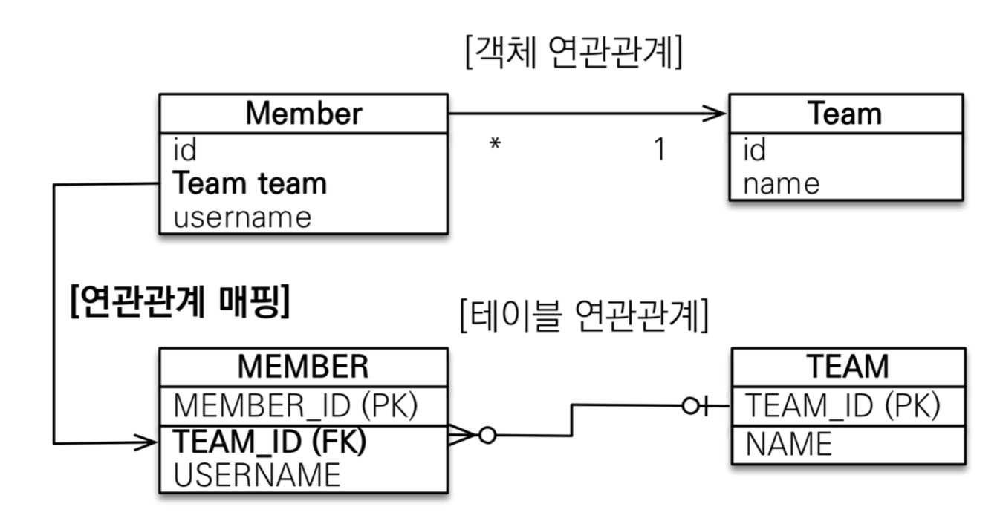
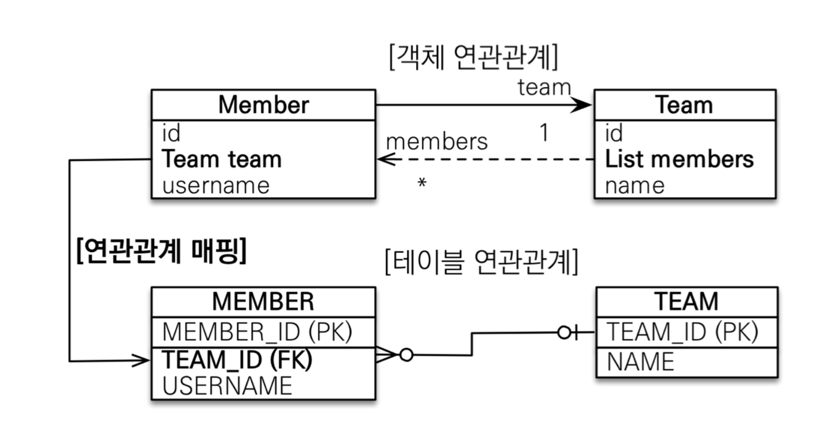
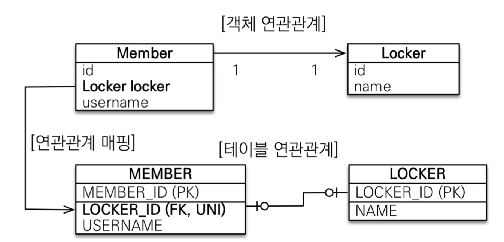
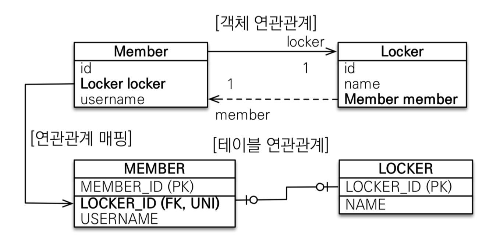
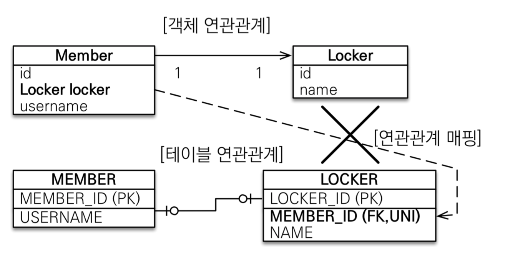
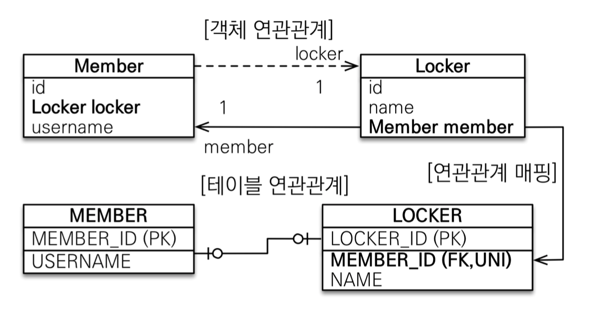
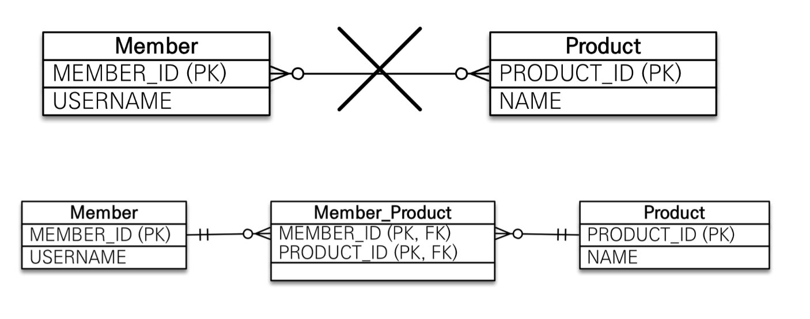
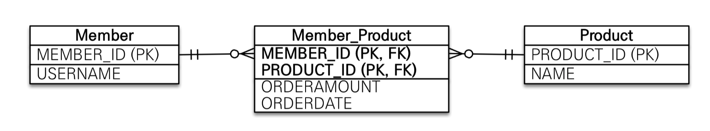

# 다대일 단방향

# 다대일 양방향

# 일대다 단방향

- 팀 엔티티의 Team.members로 회원 테이블의 TEAM_ID 외래 키 관리
- 보통 자신이 매핑한 테이블의 외래 키를 관리, 이 매핑은 반대쪽 테이블에 있는 외래 키 관리

# 일대다 양방향

# 주 테이블에 외래 키가 있는 일대일 관계

## 단방향

## 양방향

# 대상 테이블에 외래 키가 있는 일대일 관계

## 단방향

## 양방향

# 다대다

# 다대다 매핑 한계

- 연결 테이블에 다른 컬럼 추가하면 @ManyToMany 사용 불가
- 왜냐하면 다른 엔티티에는 추가한 컬럼들 매핑이 불가하기 때명
- 이를 위한 전략으로, 연결 테이블을 엔티티로 승격시키는 방법이 있음
  - 복합 기본 키
  - 새로운 기본 키 사용