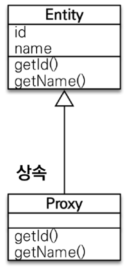
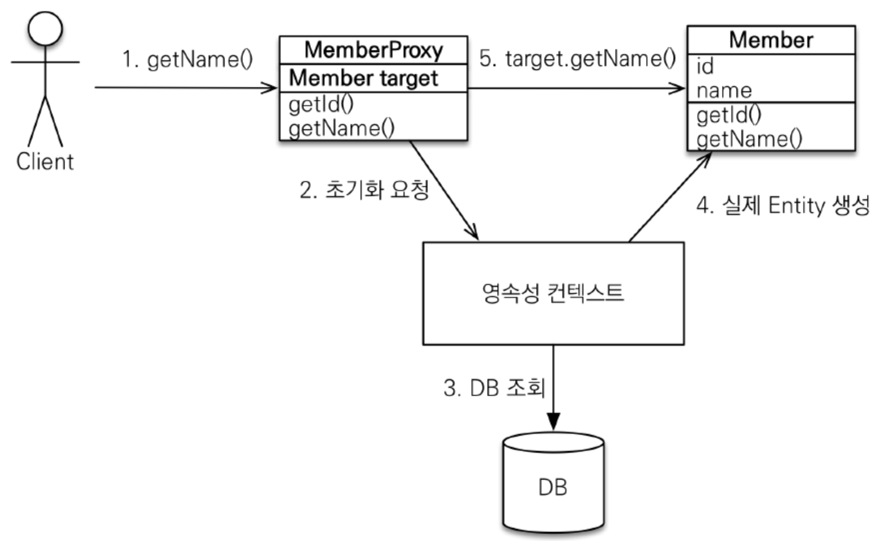
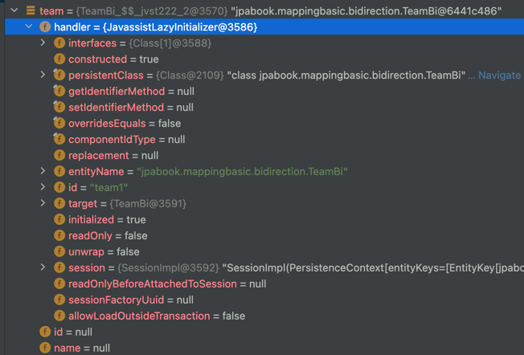
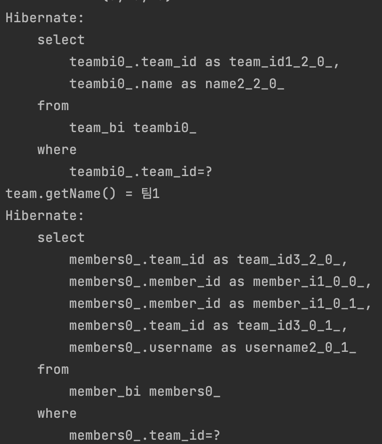
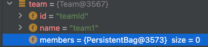

# 8장. 프록시와 연관관계 관리

## 프록시

- 엔티티 조회할 때 연관된 엔티티들이 항상 사용되는 것은 아님
- 그럼에도 연관된 엔티티들이 불러오는 문제가 있음
  - ex. Team 엔티티를 조회
    - `Team` 자체의 정보(이름, 구단주 등)만 조회 목적으로 DB에서 조회
    - 그런데 `Member` 같은 사용하지 않는 참조 정보(엔티티)도 같이 불러와 조회 시 부하 발생
- JPA는 이런 문제를 해결하기 위해 **엔티티가 실제로 사용될 때까지 DB 조회를 지연하는 방법**을 제공 => 지연 로딩`Lazy Loading`
  - `team.getMembers()`처럼 팀 엔티티 값을 실제로 사용하는 시점에 DB에서 팀 엔티티에 필요한 데이터를 조회
- 이 기능을 사용하려면 실제 엔티티 객체 대신에 DB 조회를 지연할 수 있는 가짜 객체가 필요 => **프록시 객체**

> 💡JPA 기준 명세는 지연 로딩 구현 방법을 JPA 구현체에 위임.
> 하이버네이트 구현체의 경우 지연 로딩 지원을 위해 프록시 사용 방법과 바이트 코드 수정하는 방법 2가지 제공.

### 프록시 기초

- JPA에서 식별자로 엔티티 하나 조회할 때는 `EntityManager.find()`를 사용 -> 영속성 컨텍스트에 엔티티가 없으면 DB 조회
- 해당 메서드를 사용하면 엔티티 사용 여부와 관계 없이 DB를 조회
- 엔티티를 실제로 사용하는 시점까지 DB 조회를 미루고 싶으면 `EntityManger.getReference()` 사용
  ```java
  // 메서드 호출 시 JPA는 DB 조회하지 않고 실제 엔티티 객체도 생성하지 않음
  // 대신 DB 접근을 위임한 프록시 객체를 반환
  Member member = em.getReferece(Member.class, "member1");
  ```

#### 프록시의 특징

- 프록시 클래스는 실제 클래스를 상속 받아서 만들어짐 -> 실제 클래스와 겉모양이 같음
- 사용자 입장에선 구분하지 않고 사용해도 됨
- 프록시 객체는 실제 객체에 대한 참조를 보관하고, 프록시 객체의 메서드를 호출하면 실제 객체의 메서드를 호출함

#### 프록시 객체의 초기화
- 프록시 객체는 실제 사용될 때 DB 조회해서 실제 엔티티 객체를 생성 => **프록시 객체의 초기화**
  ```java
  // MemberProxy 반환
  Member member = em.getReferece(Member.class, "member1");
  member.getName();     // 실제 사용되었을 때 DB 조회!
  ```



1. 프록시 객체의 `member.getName()` 호출해서 실제 데이터 조회
2. 프록시 객체는 실제 엔티티가 생성되어 있지 않으면 영속성 컨텍스트에 실제 엔티티 생성을 요청 => 초기화
3. 영속성 컨텍스트는 DB를 조회해서 실제 엔티티 객체를 생성
4. 프록시 객체는 생성된 실제 엔티티 객체의 참조를 `Member target` 멤버 변수에 보관
5. 프록시 객체는 실제 엔티티 객체의 `getName()`을 호출해서 결과를 반환

> 💡**실제 초기화**
> - 디버그에서 봤을 땐 프록시 객체가 초기화되었음을 확인
> - 책 내용대로 메서드를 호출했을 때, 해당 객체의 데이터가 초기화되는 것은 아닌 것을 알 수 있음
> - 대신 변수 초기화 시 변수에 데이터가 있음 확인
> - 변수 초기화를 따로 안해도 마찬가지로 정상 초기화되므로 어떻게 사용하든 상관 없음
>
> 
>
> 
> 
> - 또한 getMembers()가 호출되었을 때 DB 조회하는 것을 확인할 수 있음
> 
> 

#### 프록시 특징
- 프록시 객체는 처음 사용할 때 한 번만 초기화됨
- 프록시 객체를 초기화한다고 프록시 객체가 실제 엔티티로 바뀌는 것은 아님. 프록시 객체가 초기화되면 프록시 객체를 통해 실제 엔티티에 접근할 수 있음
- 프록시 객체는 원본 엔티티를 상속받은 객체, 따라서 타입 체크 시 주의 -> `==` 비교 대신 `instanceof`
- 영속성 컨텍스트에 찾는 엔티티가 이미 있으면 DB 조회할 필요가 없으므로 `em.getReference()`를 호출해도 프록시가 아닌 실제 엔티티를 반환함
  - 초기화는 영속성 컨텍스트의 도움을 받아야 가능, 따라서 영속성 컨텍스트의 도움을 받을 수 없는 준영속 상태의 프록시를 초기화하면 문제가 발생
    - JPA는 지연 로딩에 대한 내용을 구현체에 맡겼고, 해당 상황 발생 시 표준 명세에 정의하지 않았음
    - 하이버네이트의 경우 `org.hibernate.LazyInitializationException` 예외를 발생
      ```java
      // MemberProxy 반환
      Member member = em.getReferece(Member.class, "member1");
      transaction.commit();
      em.close();               // 영속성 컨텍스트 종료
      
      member.getName();         // 준영속 상태 초기화 시도 -> LayzInitializationException 발생
      ```

### 프록시와 식별자

- 엔티티를 프록시로 조회할 때 식별자`PK` 값을 파라미터로 전달하는데 프록시 객체는 이 식별자 값을 보관함 
  ```java
  Team team = em.getReference(Team.class, "team1"); // 식별자 보관
  team.getId();                                     // 초기화되지 않음
  ```
- 엔티티 접근 방식을 `@Access(AccessType.PROPERTY)`로 설정한 경우에만 초기화하지 않음
  - 접근 방식을 필드`@Access(AccessType.FIELD)`로 설정하면 JPA는 어떤 메서드가 단순 조회용 메서드인지 다른 필드까지 활용해서 비즈니스를 수행하는 메서드인지 알지 못함
  - 그래서 프록시 객체를 초기화
  ```java
  // 활용처, 연관관계 설정 시 유용
  Member member = em.find(Member.class, "member1");
  Team team = em.getReference(Team.class, "team1");     // SQL 실행할 필요 없이 연관관계만 설정
  member.setTeam(team);
  ```
  - 참고로 연관관곌르 설정할 때는 엔티티 접근 방식을 필드로 설정해도 프록시를 초기화하지 않음

### 프록시 확인
- JPA가 제공하는 `PersistenceUnitUtil.isLoaded(Object entity)` 메서드를 사용 시 프록스 인스턴스의 초기화 여부를 알 수 있음
  ```java
  boolean isLoad = em.getEntityMangerFactory().getPersistenceUnitUtil.isLoaded(entity);
  System.out.println("isLoad = " + isLoad);
  ```
- 조회한 엔티티가 진짜 엔티티인지 프록시로 조회한 것인지 확인하려면 클래스 명을 직접 호출해보면 됨
  ```java
  // 보통 클래스 명 뒤에 ..javassist..라 되어 있는데 이것으로 프록시인 것을 확인
  // 프록시를 생성하는 라이브러리에 따라 결과는 달라질 수 있음
  System.out.println("memberProxy: " + member.getClase().getName());
  ```

> 💡**프록시 강제 초기화**
> - 하이버네이트의 `initialize()` 메서드를 사용하면 프록시로 강제 초기화 가능
>   ```java
>   org.hibernate.Hibernate.initialize(orger.getMember());
>   ```
> - JPA 표준에는 프록시 강제 초기화 메서드가 없기 때문에, 강제 초기화하려면 프록시의 메서드를 직접 호출하면 됨
> - JPA 표준은 단지 초기화 여부만 확인 가능 

## 즉시 로딩과 지연 로딩

- JPA는 개발자가 연관된 엔티티 조회 시점을 선택할 수 있도록 2가지 방식을 제공
  - **즉시 로딩**: 엔티티 조회 시 연관된 엔티티도 함께 조회
  - **지연 로딩**: 연관된 엔티티를 실제로 사용할 때 조회

### 즉시 로딩

- 즉시 로딩`EAGER LOADING`을 사용하려면 다중성 에너테이션의 `fetch` 속성을 `FetchType.EAGER`로 지정
- (eager 패키지 참고)

### 지연 로딩

- 지연 로딩LAZY LOADING을 사용하려면 다중성 에너테이션의 `fetch` 속성을 `FetchType.LAZY`로 지정
- (lazy 패키지 참고)

### 정리

- 연관된 엔티티를 즉시 로딩하는 것이 좋은지, 실제 사용할 때까지 지연해서 로딩하는 것이 좋은지는 상황에 따라 다름
- 예를 들면 대부분의 비즈니스 로직에서 회원과 팀 엔티티를 같이 사용한다면 SQL 조인을 사용해서 한번에 조회하는 것이 효율적

## 기타 프록시 관련

### 프록시와 컬렉션 래퍼
- 하이버네이트는 엔티티를 영속 상태로 만들 때 엔티티에 컬렉션(List, Set, Map, etc)이 있으면, 컬렉션을 추적 및 관리 목적으로 원본 컬렉션을 하이버네이트가 제공하는 내장 컬렉션으로 변경
  - 이를 **컬렉션 래퍼**라 함
  - 출력 결과를 보면 **org.hibernate.collection.internal.PersistentBag**이 반환되는 것을 확인할 수 있음
  
    
  
### JPA 기본 fetch 전략

> `@ManyToOne`, `@OneToOne`: 즉시 로딩`EAGER LOADING`
> 
> `@OneToMany`, `@ManyToMany`: 지연 로딩`LAZY LOADING`
- 기본 fetch 전략은 연관된 엔티티가 하나면 즉시 로딩을, 컬렉션이면 지연 로딩을 사용
- 컬렉션 로딩은 비용이 많이 들고 잘못하면 너무 많은 데이터를 로딩할 수 있기 때문에 지연 로딩함
- 반면에 연관된 엔티티가 하나면 즉시 로딩해도 큰 문제가 발생하지 않음
- **추천 전략은 모든 연관관계에 지연 로딩을 사용하는 것**
  - 그리고 어느 정도 완료단계에 왔을 때 실제 사용하는 상황을 보고 필요한 곳에만 즉시 로딩을 사용하도록 최적화하면 됨
  - 또한 [참고 링크](https://tonylim.tistory.com/111)에선 가급적 지연 로딩만 사용하는 것이 좋다곤하나, `@~ToOne` 쪽에도 무조건 `LAZY`를 설정하는 것이 옳은 것인가 고민해볼 필요 있음
    - 조인 한번으로 처리되는 조회가 `SELECT`를 2번 처리해야하는 경우가 lazy 패키지에서 발견

### 컬렉션에 FetchType.EAGER 사용 시 주의점
1. 컬렉션을 하나 이상 즉시 로딩하는 것은 권장하지 않음
   - DB 테이블로 보면 이는 일대다 조인
   - 이는 결과 데이터가 다 쪽에 있는 수만큼 증가
   - 이는 하나의 엔티티에 서로 다른 컬렉션을 2개이상 조인이 발생
     - 컬렉션 A와 컬렉션 B의 결과를 찾기 위해 A * B 횟수를 조회하게 됨
       > 💡**N+1 문제**
       > 
       > 연관 관계에서 발생하는 이슈, 연관 관계가 설정된 엔티티를 조회 시 조회된 데이터 갯수`n`만큼 연관 관계의 조회 쿼리가 추가로 발생하여 데이터를 읽어옴
     - 너무 많은 데이터가 반환되면서 애플리케이션 성능 저하 발생
     - JPA에서 이런 결과를 메모리에 필터링해서 반환하나, 권장하지 않음
2. 컬렉션 즉시 로딩은 항상 외부 조인`OUTER JOIN`을 사용
   - 이 경우 다대일 관계를 가진 쪽에 외래 키에 not null 제약 조건을 걸어두면 필수 관계가 되어 내부 조인을 사용
   - 하지만 일대다를 가진 쪽에서 조회 시, 컬렉션(일대다)에 하나도 없는 엔티티를 내부 조인하면 조회할 수 없는 문제가 발생
   - 이는 DB 제약조건으로 막을 수는 없으므로 JPA는 일대다 관계를 즉시 로딩할 때 항상 외부 조인을 사용함

> **StrategyType.EAGER 정리**
> 
> `@ManyToOne`, `@OneToOne`
> - optional = false : 내부 조인
> - optional = true : 외부 조인
> 
> `@OneToMany`, `@ManyToMany`
> - optional = false : 외부 조인
> - optional = true : 외부 조인

## 영속성 전이: CASCADE

- 영속성 전이`Transitive Persistence`: 특정 엔티티를 영속 상태로 만들 때 연관된 엔티티도 함께 영속 상태로 만들 수 있음
- JPA는 `CASCADE` 옵션으로 이를 제공
- (transitive 패키지 참고)
- 영속성 전이는 연관관계를 매핑하는 것과는 관련이 없음 -> 단지 엔티티 영속화 시 연관된 엔티티도 같이 영속화하는 편리함을 제공할 뿐임

### CASCADE 종류

```java
public enum CascadeType {
    ALL,            // 모두 적용
    PERSIST,        // 영속
    MERGE,          // 병합
    REMOVE,         // 삭제
    REFRESH,        // Refresh
    DETACH          // Detach
}
```

- 참고로 `CascadeType.PERSIST`랑 `CascadeType.REMOVE`는 `em.persist()`, `em.remove()` 실행 시 바로 전이 발생하지 않음
- flush를 호출했을 때 전이가 발생함

## 고아 객체

- 고아 객체`Orphan Object`: 부모 엔티티와 연관 관계가 끊어진 자식 엔티티
- JPA는 고아 객체를 제거하는 기능을 제공
- 이를 사용해 **부모 엔티티의 컬렉션에서 자식 엔티티의 참조만 제거하면 자식 엔티티가 자동으로 삭제**할 수 있음
- (orphan 패키지 참고)
- 정리하면, **고아 객체 제거는 참조가 제거된 엔티티는 다른 곳에서 참조하지 않는 고아 객체로 보고 삭제하는 기능**
  - 따라서 해당 기능은 참조하는 곳이 하나일 때만 사용해야 함 -> 특정 엔티티가 개인 소유하는 엔티티에만 적용해야 함
  - 이러한 이유로 `orphanRemoval`은 `@OneToOne`, `@OneToMany`에만 사용 가능

## 영속성 전이 + 고아 객체의 생명 주기
- `CascadeType.ALL + orphanRemovel = true`를 동시에 사용하면,
  - 일반적으로 엔티티는 `EntityManager.persist()`를 통해 영속화, `EntityManager.remove()`를 통해 제거됨
  - 이는 엔티티 스스로 생명주기를 관리한다는 의미
  - 두 옵션을 활성화 시 부모 엔티티를 통해 자식 생명주기를 관리할 수 있게 됨
    ```java
    // 자식 저장하려면 부모에서 등록만 하면 됨
    Parent parent = em.find(Parent.class, parentId);
    parent.getChildren().add(child); 
    
    // 자식을 삭제하려면 부모에서 제거만 하면 됨
    Parent parent = em.find(Parent.class, parentId);
    parent.getChildren().remove(child); 
    ```
>💡영속성 전이는 DDD의 Aggregate Root 개념 구현 시 사용하면 편리함
> - Aggregate: 고유 비즈니 목적 수행을 위한 데이터 객체들의 집합
>   - ex. 주문 Aggregate => 주문, 주문한 고객(엔티티), 제공하는 상점(엔티티), 배달(엔티티), 결졔(엔티티)
> - Aggregate Root: Aggregate 전체를 일관적인 상태로 관리하는 책임을 지는 엔티티
>   - 여기서 강제하는 도메인 규칙을 적용하려면 외부에서 내부 객체를 직접 변경하면 안됨 => Root 엔티티 식별자를 통해서만 접근해야 함
>   - 가령 주문의 배달이나 결제 정보는 주문이라는 Root에 의해 관리해야 함, 영속성 전이를 활용하면 이를 연쇄적으로 관리가 가능
