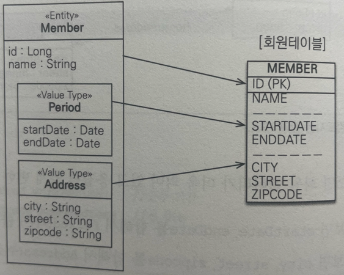
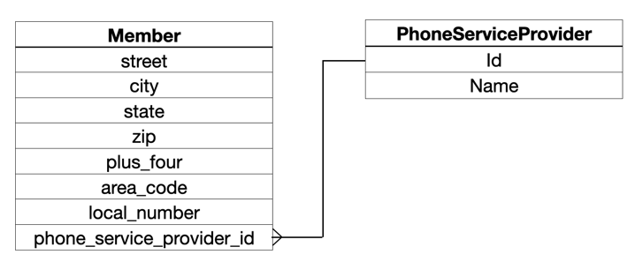

# 9장. 값 타입

- JPA 데이터 타입을 크게 분류하면 **값 타입**과 **엔티티 타입**으로 나눔
  - 값 타입: int, Integer, String 같은 단순히 값으로 사용하는 자바 기본 타입 또는 객체
- 엔티티 타입은 식별자를 통해 지속해서 추적 가능
  - ex. 회원의 키나 나이를 변경해도 식별자만 유지하면 같은 회원으로 인식 가능
- 값 타입은 식별자가 없고 숫자나 문자 같은 속성만 존재해 추적 불가
  - ex. 숫자 값 100을 200으로 변경하면 완전히 다른 값으로 대체됨
- 값 타입은 3가지로 나눌 수 있음
  1. Primitive Type
    - 자바 기본 타입 -> `int`, `double`
    - 래퍼 클래스 -> `Integer`, `Double`
    - `String`
  2. Embedded Type(복합 값 타입)
  3. Collection Value Type(컬렉션 값 타입)

## Primitive Type
```java
@Entity
public class Member {
    
    @id @GeneratedValue
    private Long id;
    
    private String name;
    private int age;
}
```
- 위 예제에선 `String`, `int`가 값 타입
- `name`, `age` 속성은 식별자 값도 없고 생명주기도 `Member` 엔티티에 의존 -> `Member` 엔티티 제거 시 `name`, `age` 값도 제거
- 그리고 값 타입은 공유되어선 안됨
  > 💡Java에서 `int`, `double` 같은 기본 타입은 절대 공유되지 않음. 예를 들어 `a=b` 코드는 **b 값을 복사해서 a에 입력함**. 
  > `Integer`처럼 래퍼 클래스나 `String` 같은 특수한 클래스도 존재함.
  > 이것들은 객체지만 Java에서 기본 타입처럼 사용할 수 있게 지원하므로 기본 값 타입으로 정의함.

## Embedded Type
- 새로운 값 타입을 직접 정의해서 사용 가능 => Embedded Type in JPA
- 중요한 건 직접 정의한 임베디드 타입도 `int`, `String`처럼 값 타입이라는 것

```java
@Entity
public class Member {
    
    @id @GeneratedValue
    private Long id;
    
    // 근무 기간
    @Temporal(TemporalType.DATE) private Date startDate;
    @Temporal(TemporalType.DATE) private Date endDate;
    
    // 개인정보
    private String name;
    private int age;
}
```
> `Member` 엔티티는 근무 시작일, 종료일, 이름, 나이를 가짐
- 여기서 근무 일과 개인정보는 서로 관련이 없음
- Member가 상세한 데이터를 그대로 가지는 것은 객체지향적이지 않으며, 응집력만 떨어뜨림
- 대신 아래처럼 관련된 정보만 묶을 수 있는 타입으로 처리하면 코드가 더 명확해질 것

```java
@Entity
public class Member {
    
    @id @GeneratedValue
    private Long id;
    
    @Embedded Period workPeriod;    // 근무 기간
    @Embedded Profile profile;      // 개인 정보
    
    // 개인정보
    private String name;
    private int age;
}

@Embeddable
public class Period {
    @Temporal(TemporalType.DATE) private Date startDate;
    @Temporal(TemporalType.DATE) private Date endDate;
  
    public boolean isWork(Date date) {
      // 값 타입을 위한 메서드 정의 가능
    }
}

@Embeddable
public class Period {
    
    @Column(name = "username")      // 매핑할 컬럼 정의 가능
    private String name;
    private int age;
}
```
> `Member` 엔티티는 근무 기간, 개인 정보를 가진다

- 새로 정의한 값 타입들은 재사용할 수 있고 응집도도 아주 높음
- 또한 `Period.isWork()`처럼 해당 값 타입만 사용하는 의미 있는 메서드도 만들 수 있음
- Embedded Type을 사용하려면 2가지 에너테이션이 필요(둘 중 하나는 생략해도 됨)
  - `@Embeddable`: 값 타입을 정의하는 곳을 표시
  - `@Embedded`: 값 타입을 사용하는 곳에 표시
- 또한 Embedded Type은 기본 생성자가 필수
- Embedded Type을 포함한 모든 값 타입은 엔티티의 생명주기에 의존하므로 엔티티와 Embedded Type의 관계를 UML로 표현하면 컴포지션`Composition` 관계가 됨
  > 💡하이버네이트는 Embedded Type을 컴포넌트`components`라 함

### 임베디드 타입과 테이블 매핑


- Embedded Type은 엔티티의 값일 뿐임 -> 값이 속한 엔티티 테이블에 매핑함
- 예제에서 Embedded Type 사용하지 전과 후 매핑하는 테이블은 같음
- 이를 사용함으로써 객체와 테이블은 아주 세밀하게`fine-grained` 매핑이 가능함
  - 잘 설계한 ORM 애플리케이션은 매핑한 테이블의 수보다 클래스 수가 더 많음
  - ORM 사용하지 않고 개발 시 테이블 컬럼과 객체 필드 대부분 1:1로 매핑함
  - 값 타입 클래스를 만들어 더 객체지향적으로 개발하고 싶어도 SQL을 직접 다루면 테이블 하나에 클래스 하나를 매핑하는 것도 어려운데, 테이블 하나에 여러 클래스를 매핑하는 것은 더 어려움
  > `엔티티는 테이블 명세서이다, 따라서 1:1 매핑해야 한다`라는 전제와 반하는 이야기 인듯 함<br>
  > 실제로 개발하면서 무엇이 최선인지 나만의 기준을 가져보자

### 임베디드 타입과 연관관계
- Embedded Type은 값 타입을 포함(특정 주인에 소속되고 논리적 개념상 공유 X) 및 엔티티 참조(공유가 가능) 가능


```java
@Entity
public class Member {
    @Embedded Address address;          // Embedded Type 포함
    @Embedded PhoneNumber phoneNumber;  // Embedded Type 포함
}

@Embeddable
public class Address {
    String street;
    String city;
    String state;
    @Embedded Zipcode zipcode;          // Embedded Type 포함
}

@Embeddable
public class Zipcode {
    String zip;
    String plusFour;
}

@Embeddable
public class PhoneNumber {
    String areaCode;
    String localNumber;
    @ManyToOne PhoneServiceProvider provider;   // 엔티티 참조
}

@Entity
public class PhoneServiceProvider {
    @Id String name;
}
```

### @AttributeOverride: 속성 재정의

- Embedded Type에 정의한 매핑정보를 재정의하려면 엔티티에 `@AttributeOverride`를 사용하면 됨

```java
@Embeddable
public class Address {
  String street;
  String city;
  String state;
  @Embedded Zipcode zipcode;
}

@Entity
public class Member {
    @Id @GeneratedValue
    private Long id;
    private String name;

    @Embedded Address homeAddress;      // 주소 Embedded Type 속성이 2개라 컬럼 명이 중복
  
    @Embedded
    @AttributeOverrides({               // @AttributeOverrides를 사용해서 매핑 정보를 재정의해야 함 
        @AttributeOverride(name = "city", column=@Column(name = "COMPANY_CITY")),
        @AttributeOverride(name = "street", column=@Column(name = "COMPANY_STREET")),
        @AttributeOverride(name = "zipcode", column=@Column(name = "COMPANY_ZIPCODE"))
    })        
    Address compnayAddress;   
}
```
- 에너테이션 과용으로 코드가 지저분해 보이나, 다행히도 한 엔티티에 같은 Embedded Type을 중복 사용하는 경우는 많지 않음

>💡`@AttributeOverrides`는 엔티티에 설정해야 함. Embedded Type이 Embedded Type을 가지고 있어도 엔티티데 설정해야 함

### Embedded Type과 null
- Embedded Type이 null이면 매핑한 컬럼 값은 모두 null이 됨

```java
member.setAddress(null);
em.persist(member);         // member.city, member.street, member.zipcode 모두 null
```

## 값 타입과 불변 객체

- Embedded Type 같은 값 타입을 여러 엔티티에서 공유하면 위험함

```java
member1.setAddress(new Address("OldCity"));
Address address = member1.getAddress();

address.setCity("newCity");
member2.setAddress(address);        // member1의 address 공유
```
- 위와 같은 코드 사용 시 `member2`의 주소 변경을 의도하고 수정하면, member1도 같이 수정되어 버림
- 이렇게 공유 참조로 인해 발생하는 버그는 찾기 어려움
- 이처럼 수정을 했는데 전혀 예상치 못한 곳에서 문제가 발생하는 것을 부작용`Side Effect`라 함

### 해결책

```java

member1.setAddress(new Address("OldCity"));
Address address = member1.getAddress();

Address newAddress = address.clone();   // 값을 복사해 새로운 Address 생성
newAddress.setCity("newCity");
member2.setAddress(newAddress);
```
- 동일한 상태를 가진 새로운 `Address` 인스턴스를 생성(여기선 `clone()`)해서 사용하면 됨
- 그리고 영속성 컨텍스트는 `member2`에 대해서만 UPDATE SQL을 실행함
- 공유 참조로 인한 문제의 원인은 Embedded Type처럼 직접 정의한 타입은 **객체 타입**이기 때문
- 하지만 해결 방법은 있으나 **여전히 복사하지 않고 원본의 참조 값을 직접 넘기는 것을 막을 수 없음** -> 객체 공유 참조 회피 불가
- 그래서 근본적인 해결책으로 객체 값을 수정하지 못하게 막는 것 => 속성 private, setter 제거 그리고 **불변 객체로 만들기**

### 불변 객체
- 객체를 불변하게 만들면 값을 수정할 수 없으므로 부작용을 원천 차단할 수 있음
- 따라서 **값 타입은 될 수 있으면 불변 객체로 설계해야 함**
- 불변 객체의 값은 조회할 수 있지만, 한번 만들면 절대 변경할 수 없음
- 불변 객체도 결국 객체니까 참조 값 공유를 피할 수 없으나, 인스턴스의 값을 수정할 수 없으므로 부작용이 발생하지 않음

```java
@Embeddable
public class Address {
    private String city;
    
    protected Address() {}
  
    // Getter는 노출함
    public String getCity() { return this.city; }
  
    // Setter 제거, 불변하게 만듦으로서 수정 불가
    //public void setCity(String city) { this.city = city; }
}
```
- 정리하자면, **불변이라는 작은 제약으로 부작용이라는 큰 재앙을 막을 수 있음**

## 값 타입 비교

- Java에서 제공하는 객체 비교는 2가지
  1. 동일성 비교: 인스턴스 참조 값 비교, `==`
  2. 동등성 비교: 인스턴스 값을 비교, `equals()`
- 값 타입은 인스턴스가 달라도 내부 값이 같으면 같은 것으로 봐야 함 => 동등성 비교
  - 추후 컬렉션(`HashSet`, `HashMap`) 사용을 위해서라도 `equals()`랑 `hashcode()` 재정의 필수

## 값 타입 컬렉션

- 값 타입을 하나 이상 저장하려면 컬렉션에 보관하고 `@ElementCollections`, `@CollectionTable`을 사용하면 됨
- (collection 패키지 참고)

### 값 타입 컬렉션 제약사항
- 엔티티는 식별자가 있어서 엔티티 값을 변경해도 식별자로 DB에 저장된 원본 데이터를 쉽게 찾아 변경 가능
- 하지만 값 타입은 다름, 식별자 개념이 없어 값 변경 시 원본 데이터 찾기가 어려움
- 여기서 값 타입 컬렉션에 보관된 값 타입들은 별도의 테이블에 보관됨
- 이로 인해 보관된 값 타입 값이 변경되면 DB의 원본 데이터를 찾기 어려움
- 이런 문제 때문에 **JPA 구현체는 값 타입 컬렉션에 변경사항 발생 시, 값 타입 컬렉션에 있는 값을 다시 저장**
  ```sql
  // MEMBER_ID 100인 컬렉션에 저장된 값 변경, 삭제 -> 추가 작업을 거침
  DELETE FROM ADDRESS WHERE MEMBER_ID = 100
  INSERT INTO ADDRESS (MEMBER_ID, CITY, STREET, ZIPCODE) VALUES(100, ...)
  ```
- 따라서 실무에선 값 타입 컬렉션에 매핑된 테이블이 많다면 **일대다 관계 처리하는 것이 좋음**
  - 이를 통해 DB 기본 키 제약 조건으로 인한 컬럼에 nul 입력 불가 문제도 해결 가능하며, 중복된 값 처리도 가능
  - 여기에 추가로 영속성 전이 + 고아 객체 제거 기능을 적용하면 값 타입 컬렉션처럼 사용 가능
  ```java
  @Entity
  public class AddressEntity {
    @Id @GeneratedValue
    private Long id;
  
    @Embedded Address address;
  }
  
  // 값 타입 컬렉션 -> 일대다 설정
  @OneToMany(cascade = CascadeType.ALL, orphanRemoval = true)
  @JoinColumn(name = "MEMEBER_ID")
  private List<AddressEntity> addressHistory = new ArrayList<>();
  ```
- 물론 JPA 구현체들은 값 타입 컬렉션 변경 시 최대한 테이블의 기본 키를 식별해 변경된 내용만 반영하려고 함
- 하지만 사용하는 컬렉션이나 여러 조건에 따라 기본 키 식별하지 못할 수 있음
- 따라서 값 타입 컬렉션 사용 시 모두 삭제하고 다시 저장하는 최악의 시나리오를 고려하면서 사용해야 함