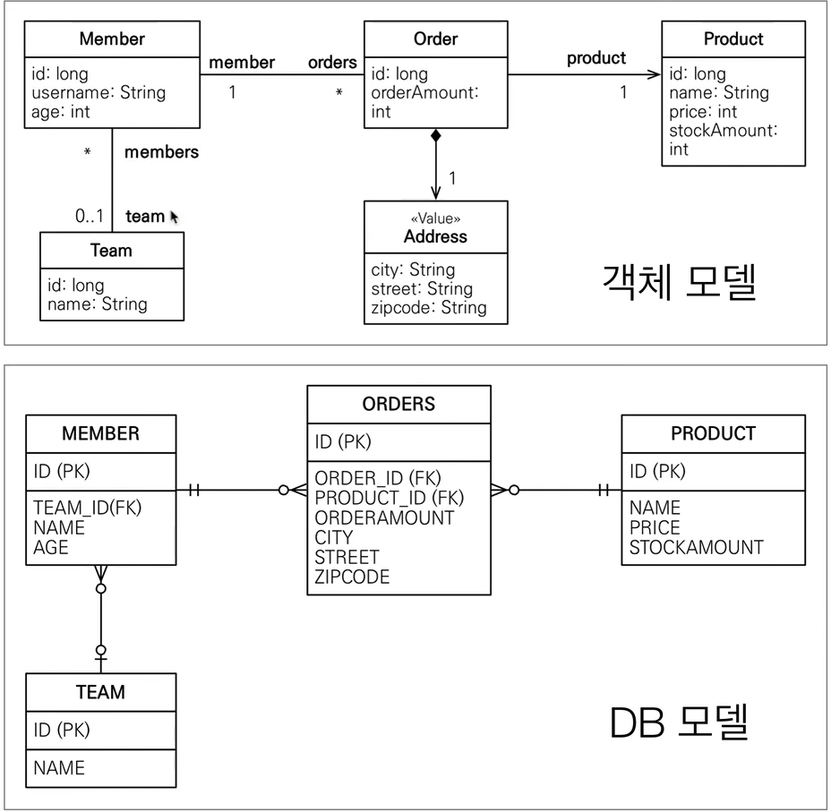
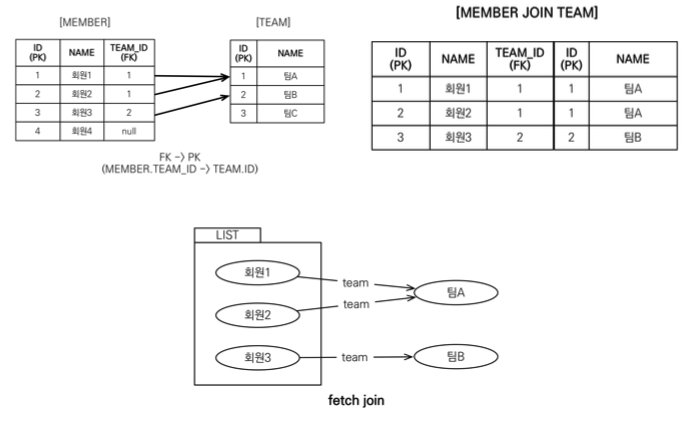
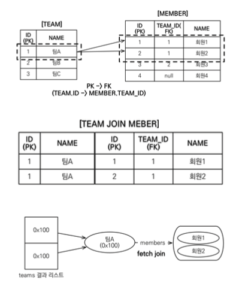

# JPQL



## 기본 문법과 쿼리 API
```sql
select_문 :: = select_절 from_절 [where_절] [groupby_절] [having_절] [orderby_절]
    
/* JPQL에서 UPDATE, DELETE 문은 벌크 연산이라 함 */
update_문 :: = update_절 [where_절]
delete_문 :: = delete_절 [where_절]
```

- SQL과 비슷하게 `SELECT`, `UPDATE`, `DELETE` 문 사용 가능
- 엔티티 저장 시 `EntityManger.persist()`를 사용하면 되므로 INSERT 문은 없음

### SELECT 문
```sql
SELECT m FROM Member as m where m.username = 'Hello'
```
- 대소문자 구분
  - ~~엔티티와 속성은 대소문자를 구분함~~**작동하는 것을 확인**
  - `SELECT`, `FROM` 같은 JPQL 키워드는 구분하지 않음
- 엔티티 이름
  - JPQL에서 사용하는 `Member`는 클래스 명 X, **엔티티 명**
  - `@Entity(name = ?)`으로 엔티티 이름을 바꿀 수 있으나 기본 값인 클래스 명으로 통일하는 것을 추천
- ~~별칭은 필수~~
  - ~~`Member as m`처럼 JPQL에 별칭은 필수로 사용해야 함~~
    ```sql
    SELECT username FROM Member m /* 정상 수행 */
    SELECT username FROM Member /* 정상 수행 */
    ```
#### TypeQuery, Query
- (typequery.TypeQuery `query()` 참고)

## 파라미터 바인딩
- JDBC는 위치 기준 파라미터 바인딩만 지원하나 `JPQL`은 이름 기준 파라미터 바인딩도 지원함
- (jpql.JPQLEx `parameter*()` 참고)
- `JPQL`을 수정해서 파라미터 바인딩 방식을 사용하지 않고 직접 문자를 더할 경우 SQL Injection 공격 받을 수 있음. 
- 또한 파라미터 바인딩 방식을 사용하면 파라미터 값이 달라도 같은 쿼리로 인식해서 JPA는 JPQL을 SQL로 파싱한 결과를 재사용해 결과적으로 성능 이점을 가져옴.
- 그리고 DB도 내부에서 실행한 SQL을 파싱해 사용하는데 같은 쿼리는 파싱한 결과를 재사용 가능
- **결과적으로 애플리케이션과 DB 모두 성능 향상을 가져오기에 `JPQL`에서 파라미터 바인딩은 필수**

## 프로젝션

- 프로젝션`Projection`은 `SELECT` 절에 조회할 대상을 지정하는 것 -> `[SELECT {프로젝션 대상} FROM]`으로 선택
- 프로젝션 대상
  1. 엔티티
  2. 임베디드 타입
  3. 스칼라 타입(숫자, 문자 등 기본 데이터 타입)

### 엔티티 프로젝션
```sql
SELECT m FROM Member m        
SELECT m.team FROM Member m 
```
- 원하는 객체를 바로 조회한 것
- 컬럼 하나하나 나열해서 조회해야 하는 SQL과 차이가 있음
- **이렇게 조회한 엔티티는 영속성 컨텍스트에서 관리됨**

### 임베디드 타입 프로젝션
```java
String query = "SELECT a FROM Address a";   // 잘못됨, 조회의 시작점으로 사용 불가

String query = "SELECT o.address FROM Order o";
List<Address> addresses = em.createQuery(query, Address.class).getResultList();
```
```sql
/* 실행 결과 */
SELECT
  orders.city,
  orders.street,
  orders.zipcode,
FROM
  orders
```
- 엔티티와 유사
- 대신 임베디드 타입은 조회의 시작점이 될 수 없다는 제약이 존재
- 임베디드 타입은 엔티티 타입이 아닌 값 타입, 직접 조회한 임베디드 타입은 영속성 컨텍스트에서 관리되지 않음

### 스칼라 타입 프로젝션

```java
List<String> usernames = em.createQuery("SELECT username FROM Member m", String.class).getResultList();
```
- 숫자, 문자, 날짜 같은 기본 데이터 타입들 조회
- 중복 데이터를 제거하려면 `DISTINCT` 사용
  ```java
  List<String> usernames = em.createQuery("SELECT DISTINCT username FROM Member m", String.class).getResultList();
  ```
- 통계 쿼리도 주로 스칼라 타입으로 조회
  ```java
  Double orderAmountAvg = em.createQuery(o.orderAmount) FROM Order o", Double.class).getSingleResult();
  ```

### NEW 명령어
- (jpql.JPQLEx `variousValueQuery()` 참고)

## 페이징 API

- 페이징`Paging`: DB의 대용량 데이터 처리 시 데이터를 효율적으로 로드하고 출력하기 위해 페이지 단위로 데이터를 분할해 가져오는 기능
- 페이징 처리용 SQL은 지루하고 반복적이며, DB마다 처리하는 SQL 문법이 다름
- JPA는 페이징을 두 API로 추상화함
  - `setFirstResult(int startPosition)`: 조회 시작 위치(0-base)
  - `setMaxResults(int amxResult)`: 조회할 데이터 수

```java
TypedQuery<Member> query = em.createQuery("SELECT m FROM Member m ORDER BY m.username DESC", Member.class);

// 11번째부터 시작해서 총 20건의 데이터를 조회 => 11~30번 데이터를 조회
query.setFirstResult(10);
query.setMaxResults(20);
query.getResultList();
```
- 결과적으로 JPA는 방언 덕분에 DB마다 다른 페이징 처리를 같은 API로 처리할 수 있음
  ```sql
  SELECT
    M
  FROM
    MEMEBER M
  /* HSQLDB(HSQLDialect) */
  ORDER BY
    M.NAME DESC OFFSET ? LIMIT ?
  /* MySQL(MySQL5InnoDBDialect) */
  ORDER BY
    M.NAME DESC LIMIT ?, ?
  /* PostgreSQL(PostgreSQL82Dialect) */
  ORDER BY
    M.NAME DESC LIMIT ? OFFSET ?
  
  
  /* Oracle10gDialect */
  SELECT *
  FROM
      ( SELECT ROW_.*, ROWNUM ROWNUM_
      FROM
        (SELECT
          M
        FROM 
          MEMBER M
        ORDER BY M.NAME
        ) ROW_
      WHERE ROWNUM <= ?
      )
  WHERE ROWNUM_ > ?
  
  
  /* SQLServer(SQLServer2008Dialect) */
  WITH query AS (
    SELECT
    inner_query.*,
    ROW_NUMBER() OVER (ORDER By CURRENT_TIMESTAMP) as __hibernate_row_nr__
    FROM 
        (select
            TOP(?) as m.id,
            m.age,
            m.team_id,
            m.name
        from Member m
        order by m.name DESC
        ) inner_query
  )
  SELECT *
  FROM query
  WHERE __hibernate_row_nr__ >= ? AND __hibernate_row_nr__ < ?
  ```
  - 페이징 SQL을 더 최적화를 원하면 JPA가 제공하는 페이징 APIrㅏ 아닌 Native SQL을 직접 사용해야 함
  
## 집합과 정렬

```sql
select
  COUNT(m),     /* 회원 수 */
  SUM(m.age),   /* 나이 합 */
  AVG(m.age),   /* 평균 나이 */
  MAX(m.age),   /* 최대 나이 */
  MIN(m.age),   /* 최소 나이 */
from
    MEMBER m
```

### 집합 함수
| 함수       | 설명                                                                                                      |
|----------|---------------------------------------------------------------------------------------------------------|
| COUNT    | 결과 수를 구함, 반환 타입: Long                                                                                   |
| MAX, MIN | 최대, 최소 값을 구함. 문자, 숫자, 날짜 등에 사용                                                                          |
| AVG      | 평균 값을 구함, 숫자 타입만 사용 가능, 반환 타입: Double                                                                   |
| SUM      | 합을 구함, 숫자 타입만 사용 가능, 반환 타입: 정수 합 Long, 소수 합: Double, BigInteger 합: BigInteger, BigDecimal 합: BigDecimal |
- 참고사항
  - NULL 값은 무시하므로 통계에 잡히지 않음
  - 만약 값이 없는데 `SUM`, `AVG`, `MAX`, `MIN` 함수 사용 시 NULL 값이 됨, `COUNT`는 0
  - `DISTINCT`를 집합 함수 안에 사용해서 중복된 값을 제거하고 나서 집합을 구할 수 있음
    - ex. `select COUNT(DISTINCT m.age) from Member m`
  - `DISTINCT`를 `COUNT`에서 사용 시 임베디드 타입 미지원

### GROUP BY, HAVING

- `GROUP BY`: 통계 데이터를 구할 때 특정 그룹끼리 묶어줌
  ```java
  // 팀 이름을 기준으로 그룹 별로 묶어 통계 데이터를 구함
  select t.name, COUNT(m.age), SUM(m.age), AVG(m.age), MAX(m.age), MIN(m.age)
  from Member m LEFT JOIN m.team t
  GROUP BY t.name
  ```
- `HAVING`: GROUP BY와 함게 싸용, 그룹화한 통계 데이터를 기준으로 필터링
  ```java
  // 방금 구한 그룹별 통계 데이터 중에 평균 나이가 10살 이상인 그룹 조회
  select t.name, COUNT(m.age), SUM(m.age), AVG(m.age), MAX(m.age), MIN(m.age)
  from Member m LEFT JOIN m.team t
  GROUP BY t.name
  HAVING AVG(m.age) >= 10
  ```
- 문법
  ```shell
  groupby_절 ::= GROUP BY {단일 값 경로 | 별칭}+
  having_절 ::= HAVING 조건식
  ```

### ORDER BY

- 결과 정렬 시 사용
  ```java
  // 나이 기준 내림차순 정렬, 같으면 이름 기준 오름차순 정렬
  select m from Member m order by m.age DESC, m.username ASC
  ```
- 문법
  ```shell
  orderby_절 ::= ORDER BY {상태 필드 경로 | 결과 변수[ASC(오름차순) | DESC(내림차순)}+
  ```

## JPQL 조인

- SQL과 기능은 같고 문법만 조건 다름
- (typequery.TypeQuery `join()` 참고, 내부/외부 조인 예제)

### 컬렉션 조인

- 일대다 관계나 다대다 관계처럼 컬렉션을 사용하는 곳에 조인하는 것을 말함
  - `[회원 -> 팀]`으로 조인은 다대일 조인이면서 단일 값 연관 필드`m.team`를 사용
  - `[팀 -> 회원]`은 반대로 일대다 조인이면서 컬렉션 값 연관 필드`m.members`를 사용

```java
// 팀과 팀이 보유한 회원 목록을 컬렉션 값 연관 필드로 외부 조인
// 컬렉션 조인 시 JOIN 대신에 IN 사용이 가능하나, 기능상 동일하고 EJB의 유물이므로 사용성이 없으므로 그냥 JOIN 사용
SELECT t, m FROM Team t LEFT JOIN t.members m
```

### 세타 조인

```java
// JPQL
select count(m) from Member m, Team t where m.username = t.name
```
```sql
/* SQL */
SELECT COUNT(M.ID)
FROM 
    MEMBER M CROSS JOIN TEAM T
WHERE
    M.USERNAME=T.NAME
```

- `WHERE` 절을 사용해서 세타 조인 가능 -> 내부 조인만 지원

### JOIN ON 절(JPA 2.1)
```java
// JPQL
select m, t from Member m left join m.team t on t.name = 'A'
```
```sql
/* SQL */
SELECT m.*, t.* 
FROM 
    MEMBER M
LEFT JOIN
    Team t ON m.TEAM_ID=t.id and t.name='A'
```

- 2.1 버전부터 `JOIN` 시 `ON`을 지원
- `ON`을 사용하면 조인 대상 필터링 후 조인 가능
- 참고로 내부 조인의 `ON` 절은 `WHERE` 절 사용할 때와 결과가 같으므로 보통 `ON` 절은 외부 조인에서만 사용

## 페치 조인

- `JPQL` 성능 최적화 목적으로 제공하는 기능
- 연관된 엔티티나 컬렉션을 한번에 같이 조회하는 기능 => `join fetch` 사용
- 문법
  페치 조인 ::= [LEFT [OUTER] | INNER] JOIN FETCH 조인 경로

### 엔티티 페치 조인
```java
// 연관된 엔티티나 컬렉션을 함께 조회, 여기선 회원과 팀을 함께 조회
// 페치 조인은 별칭을 사용할 수 없어, m.team 다음에 별칭이 없음(하이버네이트는 가능)
select m from Member m join fetch m.team
```
```sql
SELECT
    M.*, T.*
FROM MEMBER M INNER JOIN TEAM T ON M.TEAM_ID=T.ID
```
- 시도와 결과
  
  
- (typequery.TypeQuery `fetchJoin()` 참고)

### 컬렉션 페치 조인
```java
select t from Team t join fetch t.members where t.name = 'teamA'
```
```sql
SELECT
    T.*, M.*
FROM TEAM T 
INNER JOIN MEMBER M ON T.ID=M.TEAM_ID
WHERE T.NAME = 'teamA'
```
- 시도와 결과
  
  
- (typequery.TypeQuery `fetchJoin()` 참고)

### 페치 조인과 DISTINCT
```java
// 기존 결과와 달리 teamA 이름의 Team 엔티티를 하나만 조회함
select distinct t from Team t join fetch t.members where t.name = 'teamA'
```
- `JPQL`의 `DISTINCT`는 SQL의 DISTINCT 추가 그리고 애플리케이션에서 한번 더 중복을 제거

### 페치 조인과 일반 조인의 차이
```java
select t from Team t join t.members m where t.name = 'teamA'
```
```sql
SELECT
    T.*
FROM TEAM T
INNER JOIN MEMBER M On T.ID=M.TEAM_ID
WHERE T.NAME = 'teamA'
```
- `Team`만 조회되고 `Member`는 조회하지 않음
- `JPQL`은 결과를 반환할 때까지 연관관계까지 고려하지 않음
- SELECT 절에 지정한 엔티티만 조회할 뿐임 => `Team`만 조회하고 연관된 `Member`는 조회하지 않음
  - 이때 Member가 지연 로딩이면 프록시나 아직 초기화하지 않은 컬렉션 래퍼를 반환
  - 페치 조인을 사용하면 연관된 엔티티도 즉시 함께 조회됨 

### 페치 조인 특징과 한계

#### 특징
- 페치 조인을 사용하면 SQL 한번으로 연관 엔티티들을 함께 조회할 수 있어 SQL 호출을 줄여 성능 최적화가 가능
- 페치 조인은 글로벌 로딩 전략보다 우선함
  - *글로벌 로딩 전략: 엔티티에 직접 적용하는 로딩 전략(ex. `@OneToMany(fetch = FetchType.LAZY)`)
- 페치 조인으로 즉시 로딩으로 설정되면 일부는 빠를 수 있으나, 전체로 보면 사용하지 않는 엔티티를 자주 로딩해 성능저하가 일어날 수 있음
  - 글로벌 로딩 전략은 될 수 있으면 지연 로딩
  - 최적화가 필요하면 페치 조인을 적용하는 것이 효과적

#### 한계점
- 페치 조인 대상에는 별칭을 줄 수 없음
  - SELECT, WHERE 절, 서브 쿼리에 페치 조인 대상을 사용할 수 없음
  - 하이버네이트는 페치 조인에 별칭을 지원하나, 잘못 사용하면 연관된 데이터 수가 달라져 데이터 무결성이 깨질 수 있음
  - 2차 캐시와 함께 사용할 때 특히 주의
- 둘 이상의 컬렉션을 페치할 수 없음
  - 구현체에 따라 되기도 하나, 컬렉션 * 컬렉션의 카테시안 곱이 만들어지므로 성능이 많이 떨어짐
  - 하이버네이트의 경우 `PersistenceException`, `MultipleBagFetchException` 발생
- 컬렉션 페치 조인 시 페이징 API 사용 불가
  - 컬렉션이 아닌 단일 값 연관 필드(일대일, 다대일)들은 페치 조인을 사용해도 페이징 API 사용 불가
  - 하이버네이트의 경우 경고 로그를 남기면서 메모리에서 페이징 처리함 => 데이터가 많으면 성능 문제와 `OutOfMemoryException` 가능성
  - 만약 여러 테이블을 조인해서 엔티티가 가진 모양이 아닌 다른 결과를 원하면 여러 테이블 필드를 모은 DTO로 반환하는 것이 효과적

## 경로 표현식
```java
select m.username
from Member m
    join m.team t
    join m.orders o
where t.name = 'teamA'
```
- `.`을 찍어 객체 그래프를 탐색하는 것
- `m.username`, `m.team`, `m.orders` 모두 경로 표현식을 사용한 예

### 용어 정리

- 상태 필드`State field`: 단순히 값을 저장하기 위한 필드 => `t.username`, `t.age`
- 연관 필드`Associtation field`: 연관관계를 위한 필드, 임베디드 타입 포함
  - 단일 값 연관 필드: `@ManyToOne`, `@OneToOne` -> 대상이 엔티티 => `m.team`
  - 컬렉션 값 연관 필드: `@OneToMany`, `@ManyToMany` -> 대상이 컬렉션 => `m.orders`
  
### 특징
- 상태 필드 경로: 경로 탐색의 끝, 더는 탐색 불가
  ```sql
  select m.username, m.age from Member m
  
  /* 결과 */
  select m.name, m.age from Member m
  ```
- 단일 값 연관 경로: **묵시적으로 내부 조인이 일어남**, 단일 값 연관 경로는 계속 탐색 가능
  ```sql
  select o.member from Order o
  
  /* 결과 */
  /*
    단일 값 연관 필드로 경로 탐색 시 SQL에서 내부 조인이 일어남 => 묵시적 (내부) 조인
  */
  select m.*
  from Orders o
    inner join Member m on o.member_id=m.id
  ```
  >💡명시적/묵시적 조인
  >
  > 명시적 조인: `JOIN`을 직접 적어주는 것
  >
  > 묵시적 조인: 경로 표현식에 의해 묵시적으로 조인이 일어나는 것, 내부 조인`INNER JOIN`만 발생
- 컬렉션 값 연관 경로: **묵시적으로 내부 조인이 일어남**, 더는 탐색할 수 없으나, `FROM` 절에서 조인을 통해 별칭을 얻으면 별칭으로 탐색 가능
  ```sql
  select t.members from Team t // 성공
  select t.members.username from Team t // 실패
  ```
  - `t.members.username`처럼 경로 탐색을 시작하는 것은 허락하지 않음
  ```sql
  /* 하고 싶다면 별칭을 얻은 다음(join t.members m) 경로 탐색 */
  select m.username from Team t join t.members m
  
  /* 참고로 컬렉션 크기를 구할 수 있는 size라는 기능 사용 가능, COUNT SQL로 적절히 변환됨 */
  select t.members.size from Team t
  ```
  
### 경로 탐색을 사용한 묵시적 조인 시 주의사항

1. 항상 내부 조인
2. 컬렉션은 경로 탐색의 끝, 컬렉션에서 경로 탐색을 원하면 별칭을 얻어야 함
3. 경로 탐색은 주로 `SELECT`, `WHERE` 절에서 사용하나, 묵시적 조인으로 인해 SQL의 `FROM` 절에 영향을 줌

---
- 조인은 성능상 차지하는 부분은 큼
- 묵시적 조인은 조인 상황 파악이 어려우므로 분석하기 쉽도록 **명시적 조인**을 사용해야 함

## 서브 쿼리

- 몇가지 제약이 존재하나 서브 쿼리를 지원함
  - 서브 쿼리를 `WHERE`, `HAVING` 절에서만 사용할 수 있음 -> `SELECT`, `FROM` 절 사용 불가
  - 하이버네이트의 HQL은 `SELECT` 절의 서브 쿼리도 허용하나 `FROM`은 아직 지원 안함
  - 일부 구현체는 `FROM`도 지원

```sql
/* 나이가 평균보다 많은 회원 */
select m from Member m
where m.age > (select avg(m2.age) from Member m2)

/* 한 건이라도 주문한 고객 */
select m from Member m
where (select count(o) from Order o where m = o.member) > 0 /* where m.orders.size > 0 */
```

### 서브 쿼리 함수
- [NOT] EXISTS (subquery)
  - 서브 쿼리에 결과가 존재하면 참, NOT은 반대
    ```sql
    /* teamA 팀 소속 회원 */
    select m from Member m
    where exists (select t from m.team t where t.name = 'teamA')
    ```
- {ALL | ANY | SOME} (subquery)
  - 비교 연산자와 같이 사용 {`=` | `>` | `<` | `>=` | `<=`}
  - ALL: 조건 모두 만족
  - ANY or SOME: 같은 의미, 조건 하나라도 만족
    ```sql
    /* 전체 상품 각각의 재고보다 주문량이 많은 주문들 */
    select o from Order o
    where o.orderAmount > ALL (select p.stockAmount from Product p)
    /* 어떤 팀이든 소속된 회원 */
    select m from Member m
    where m.team = ANY (select t from Team t)
    ```
- [NOT] IN (subquery)
  - 서브 쿼리 결과 중 하나라도 같은 것이 있는 경우
    ```sql
    /* 20세 이상을 보유한 팀 */
    select t from Team t
    where t IN (select t2 from Team t2 JOIN t2.members m2 where m2.age >= 20)
    ```
## 조건식

### 타입 표현

| 종류      | 설명                                                                                | 예제                                       |
|---------|-----------------------------------------------------------------------------------|------------------------------------------|
| 문자      | 작은 따옴표 사이에 표현, 작은 따옴표 표현 시 작은 따옴표('') 사용                                          | 'Hello', 'She''s'                        |
| 숫자      | L(Long), D(Double), F(Float)                                                      | 10L, 10D, 10F                            |
| 날짜      | DATE {d 'yyyy-mm-dd'}, TIME {t 'hh-mm-ss'}, DATETIME {ts 'yyyy-mm-dd hh:mm:ss.f'} | m.createDate = {ts'2012-03-24 10:22:32'} |
| Boolean | TRUE, FALSE                                                                       |                                          |
| Enum    | 패키지명을 포함한 전체 이름                                                                   | jpabook.MemberType.Admin                 |
| 엔티티 타입  | 엔티티 타입을 포현, 주로 상속과 관련해서 사용                                                        | TYPE(m) = Member                         |

### 연산자 우선 순위

1. 경로 탐색 연산
2. 수학 연산: +/-(단항 연산자), *, /, +, -
3. 비교 연산: =, >, >=, <, <=, <>(다름), [NOT] BETWEEN, [NOT] LIKE, [NOT] IN, IS [NOT] NULL, IS [NOT] EMPTY, [NOT] MEMBER [OF], [NOT] EXISTS
4. 논리 연산: NOT, AND, OR 

### 논리 연산과 비교식
- 논리 연산과 비교식은 기존 PL과 유사

### Between, IN, Like, NULL 비교

- `LIKE`
  - 문자 표현식과 패턴 값을 비교
    - `%`: 아무 값들이 입력되어도 됨(값 없어도 됨)
    - `_`: 한 글자는 아무 값이 입력되어도 되나 값이 있어야 함

```sql
/* 중간에 원이라는 단어가 들어간 회원 */
select m from Member m
where m.username like '%원%'

/* 처음에 회원이라는 단어가 포함 */
select m from Member m
where m.username like '회원%'

/* 마지막에 회원이라는 단어가 포함 */
select m from Member m
where m.username like '%회원'

/* 회원A, 회원1 */
select m from Member m
where m.username like '회원_'

/* xx3 */
select m from Member m
where m.username like '__3'

/* 회원% */
select m from Member m
where m.username like '회원\%' ESCAPE '\'
```

- NULL 비교식
  - NULL인지 비교
  - NULL은 `=`로 비교하면 안되고 반드시 `IS NULL`을 사용해야 함

### 컬렉션 식

- 컬렉션에만 사요하는 특별한 기능
- 빈 컬렉션 비교 식
  - {컬렉션 값 연관 경로} IS [NOT] EMPTY
  - 컬렉션 값이 비었으면 함
  ```sql
  /* 주문이 하나라도 있는 회원 조회 */
  select m from Member m
  where m.orders is not empty
  
  /* SQL */
  select m.* from Mebmer m
  where 
    exists(
        select o.id
        from Orders o
        where m.id=o.member_id
    )
  ```
- 컬렉션의 멤버 식
  - {엔티티나 값} [NOT] MEMBER [OF] {컬렉션 값 연관 경로}
  - 엔티티나 값이 컬렉션에 포함되어 있으면 참
  ```sql
  select t from Team t
  where :memberParam member of t.members
  ```

### 스칼라 식

- 숫자, 문자, 날짜 등 가장 기본적인 타입

#### 수학 식

- `+/-`: 단항 연산자
- `*, /, +, -`: 사칙연산

#### 문자함수

| 함수                                                  | 설명                                                                    | 예제                              |
|-----------------------------------------------------|-----------------------------------------------------------------------|---------------------------------|
| CONCAT(문자1, 문자2, ...)                               | 문자를 합함                                                                | CONCAT('A','B') = AB            |
| SUBSTRING(문자, 위치, [길이])                             | 부분 문자열, 끝이 길이며 값이 없으면 시작 인덱스 기준 전체 문자열                                | SUBSTRING('abcdef', 2, 3) = bcd |
| TRIM(LEADING or TRAILING or BOTH] [[트림 문자] FROM] 문자 | LEADING: 왼쪽만, TRAILING: 오른쪽만, BOTH 양쪽 다 트림 문자 제거(Default: BOTH, (공백)) | TRIM('  ABC ') = 'ABC'          |
| LOWER(문자)                                           | 소문자 변경                                                                |                                 |
| UPPER(문자)                                           | 대문자 변경                                                                |                                 |
| LENGTH(문자)                                          | 문자 길이                                                                 |                                 |
| LOCATE(찾을 문자, 원본 문자, [검색 시작 위치])                    | 검색 위치부터 문자 검색, 1부터 시작, 못 찾으면 0 반환                                     | LOCATE('DE', 'ABCDEF') = 4      |

#### 수학함수

| 함수                 | 설명                                                          | 예제                             |
|--------------------|-------------------------------------------------------------|--------------------------------|
| ABS(수학식)           | 절대값                                                         |                                |
| SQRT(수학식)          | 제곱근                                                         |                                |
| MOD(수학식, 나눌 수)     | 나머지                                                         |                                |
| SIZE(컬렉션 값 연관 경로식) | 컬렉션의 크기                                                     | SIZE(t.members)                |
| INDEX(별칭)          | LIST 타입 컬렉션의 위치 값을 구함, `@OrderColumn`을 사용하는 List 타입일 때만 사용 가능 | t.members m where INDEX(m) > 3 |

#### 날짜함수

- DB의 현재 시간을 조회
  - `CURRENT_DATE`: 현재 날짜
  - `CURRENT_TIME`: 현재 시간
  - `CURRENT_TIMESTAMP`: 현재 날짜 시간

```sql
select CURRENT_DATE, CURRENT_TIME, CURRENT_TIMESTAMP from Team t

/* 종료 이벤트 조회 */
select e from Event e where e.endDate < CURRENT_TIME
```
- 하이버네이트는 날짜 타입에서 연, 월, 일, 시간, 분, 초 값을 구하는 기능 지원
  - `YEAR`, `MONTH`, `DAY`, `HOUR`, `MINUTE`, `SECOND`
  ```sql
  select year(CURRENT_TIMESTAMP), month(CURRENT_TIMESTAMP), day(CURRENT_TIMESTAMP)
  from Member
  ```

### CASE 식

- 특정 조건에 따라 분기 시 `CASE` 식을 사용
  - 기본 CASE
    ```sql
    /* 문법 */
    CASE
      {WHEN <조건식 THEN <스칼라식>}+
    ELSE <스칼라식>
    END
    
    /* 예제 */
    select
      case  when m.age <= 10 then '학생요금'
            when m.age >= 60 then '경로요금'
            else '일반요금'
      end
    from Member m
    ```
  - 심플 CASE
    ```sql
    /* 문법 */
    CASE <조건 대상>
        {WHEN <스칼라식1> THEN <스칼라식2>}+
        ELSE <스칼라식>
    END
    
    /* 예제 */
    select
      case t.name
            when 'teamA' then '110% insentive'
            when 'teamB' then '200% insentive'
            else '일반요금'
      end
    from Member m
    ```
  - COALESCE
    - 스칼라식을 차례대로 조회해서 null이 아니면 반환
    ```sql
    /* 문법 */
    COALESCE(<스칼라식> {, <스칼라식>}+)
    
    /* 예제 */
    select coalesce(m.username, '이름 없는 회원') from Member m
    ```
  - NULLIF
    - 두 값이 같으면 null 반환, 다르면 첫번째 값을 반환
    - 집합 함수는 null을 포함하지 않으므로 보통 집합 함수와 함께 사용
    ```sql
    /* 문법 */
    NULLIF(<스칼라식> , <스칼라식>)
    
    /* 예제 */
    select NULLIF(m.username, '관리자') from Member m
    ```

## 다형성 쿼리

- (Inheritance 패키지 참고)

## 사용자 정의 함수 호출(JPA 2.1)

- 2.1 버전부터 사요자 정의 함수를 지원
  ```sql
  /* 문법 */
  function_invocation:= FUNCTION9function_name {, function_arg}*)
  
  /* 예제 */
  select function('group_concat', i.name) from Item i
  ```
- 하이버네이트 구현체 사용 시 방언 클래스를 상속해서 구현하고 사용할 DB 함수를 미리 등록해야 함
  ```java
  public class NyH2Dialect extends H2Dialect {
    public NyH2Dialect() {
        registerFunction("group_concat", new StandardSQLFunction("group_concat", StatndBaseTypes.STRING));
    }
  }
  ```
- 그리고 hibernate.dialect에 해당 방언을 등록해야 함
  ```xml
  <property name="hibernate.dialect" value="hello.MyH2Dialect" />
  ```
- 하이버네이트 구현체에서 다음처럼 축약해서 사용 가능
  ```sql
  select group_concat(i.name) from Item i
  ```

## 기타 정리

- `enum`은 `=` 비교 연산만 지원
- `임베디드 타입`은 비교를 지원하지 않음

### EMPTY STRING
- JPA 표준은 `''`은 길이가 0인 Empty String으로 정함
- DB에 따라 `''`을 NULL로 사용하는 DB도 존재하므로 확인 후 사용해야 함

### NULL 정의
- 조건을 만족하는 데이터가 없으면 NULL
- NULL은 알 수 없는 값, NULL과의 모든 수학적 계산 결과는 NULLL이 됨
  - `Null == Null`은 알 수 없는 값
  - `Null is Null`은 참
- JPA 표준 명세는 Null`U`, TRUE`T`, FALSE`F`를 아래처럼 정함

#### AND

| AND | T | F |U|
|-----|---|---|---|
| T   | T | F |U|
| F   | F | F |F|
|U|U|F|U|

#### OR

| OR | T | F | U |
|----|---|---|---|
| T  | T | T | T |
| F  | T | F | U |
| U  | T | U | U |


#### NOT

 | |   |
|---|---|
 | T | F |
| F | T |어
| U | U |

## 엔티티 직접 사용

### 기본 키 값
```sql
select count(m.id) from Member t    /* 엔티티 아이디 사용 */
select count(m) from Member t       /* 엔티티 직접 사용 */

/* 결과는 같음 */
select count(m.id) ascnt from Member m
```
- 객체 인스턴스는 참조 값으로 식별하고 테이블 로우는 기본 키 값으로 식별
- 따라서 `JPQL`에서 엔티티 객체를 직접 사용 시 해당 엔티티의 기본 키 값을 사용

### 외래 키 값
```sql
/* Team 참조 엔티티 사용 */
select m from Member m where m.team = :team

/* id로 변환됨 */
select m.* from Member m wehere m.team_id=?(팀 파라미터 ID 값)
```
- 외래 키 값도 마찬가지로 동일하게 작동함
- 다만 `Member`와 `Team` 간에 묵시적 조인이 일어나지 않음 -> `MEMBER` 테이블이 `team_id` 외래 키를 가지고 있기 때문

## Named 쿼리: 정적 쿼리

- JPA에서 어노테이션으로 작성할 수 있는 것은 XML로도 작성 가능
- `Named` 쿼리 사용 시 `Named`가 편함 
- (META-INF/ormMember.xml, META-INF/persistence.xml 참고)

### 환경에 따른 설정

- 만약 XML과 어노테이션이 같은 설정이 있으면 **XML이 우선권**을 가짐
- 따라서 애프리케이션 운영 화녕에 따라 다른 쿼리를 실행해야 한다면 각 환경에 맞춘 XML 준비 후 XML만 변경해서 배포하면 됨