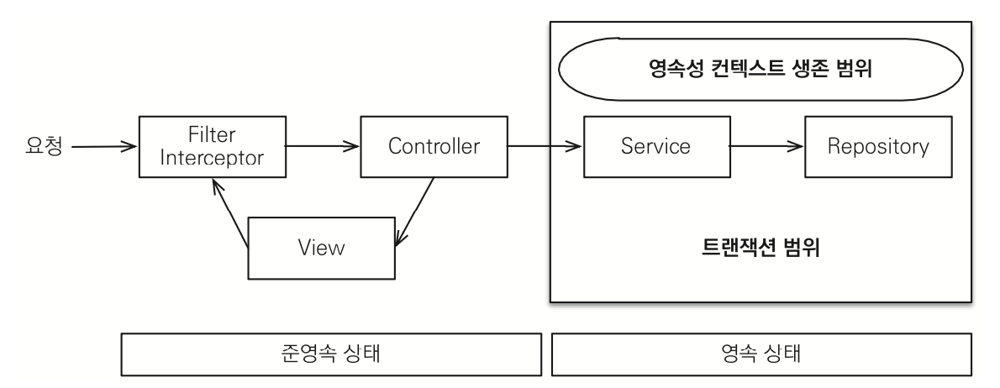
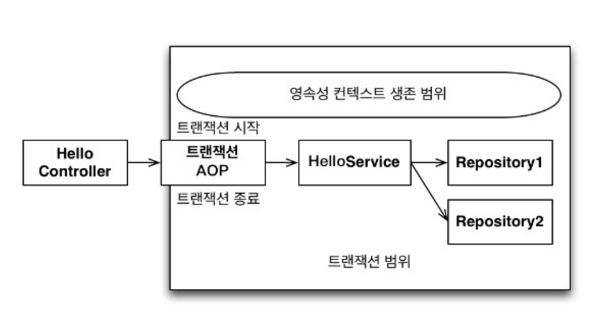
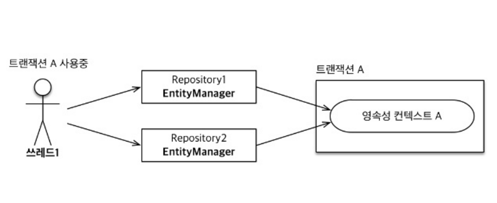
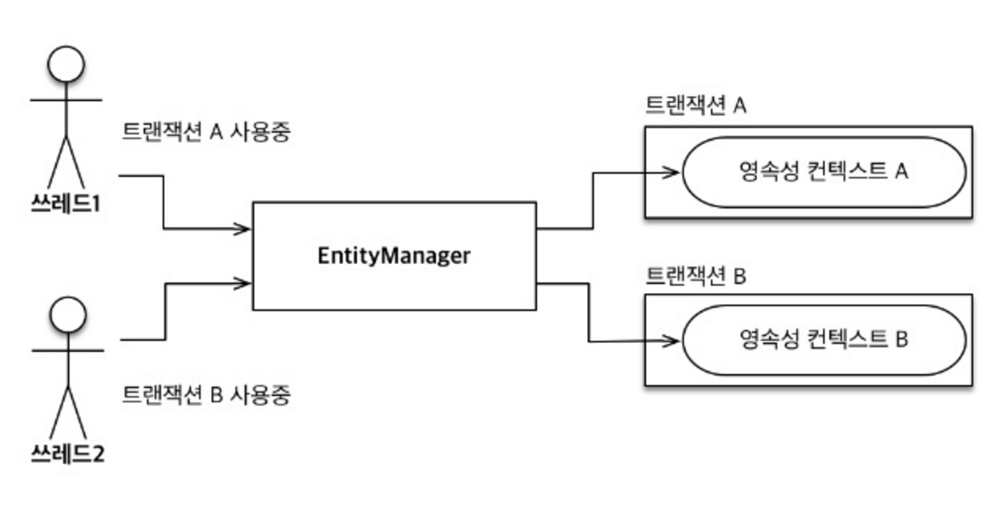
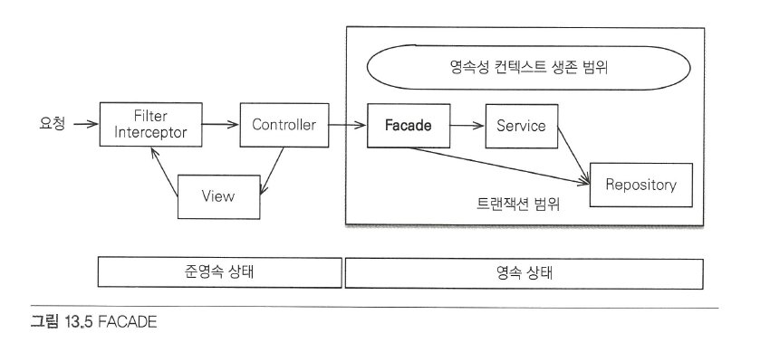
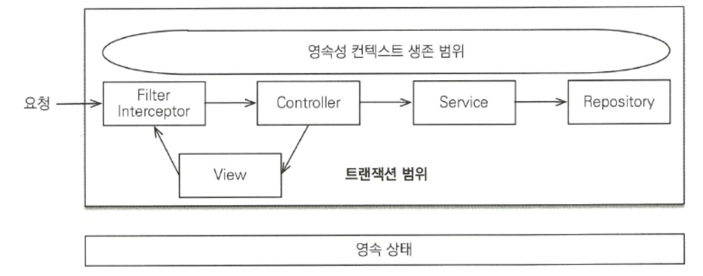
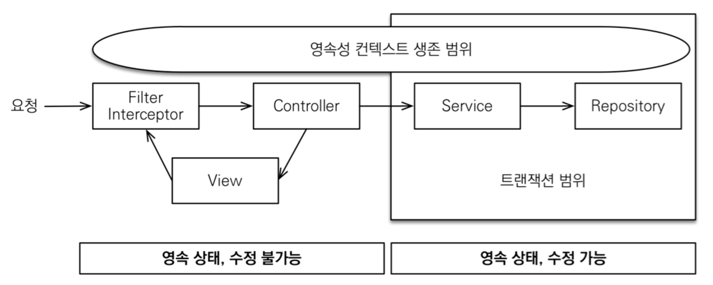
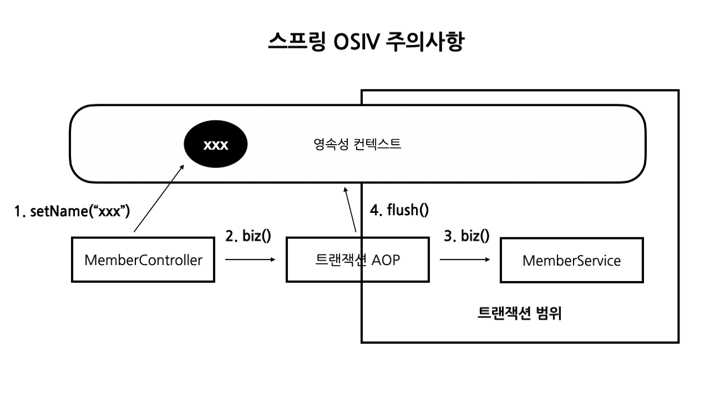

# 웹 애플리케이션과 영속성 관리

## 트랜잭션 범위의 영속성 컨텍스트

- 순수 J2SE 환경에서 JPA를 사요하면 개발자가 직접 엔티티 매니저를 생성하고 트랜잭션도 관리해야 함
- 하지만 스프링 또는 J2EE 컨테이너 환경에서 JPA 사용 시 컨테이너가 제공하는 전략을 따라야 함

### 스프링 컨테이너의 기본 전략


- 스프링 컨테이너는 **트랜잭션 범위의 영속성 컨텍스트 전략**을 기본으로 사용 => 트랜잭션의 범위와 영속성 컨텍스트의 생존 범위가 같음
- 이 전략은 트랜잭션 시작 시 영속성 컨텍스트를 생성하고, 트랜잭션이 끝날 때 영속성 컨텍스트를 종료
- 그리고 같은 트랜잭션 안에서는 항상 같은 영속성 컨텍스트에 접근


- 스프링 프레임워크를 사요하면 보통 비즈니스 로직을 시작하는 서비스 계층에 `@Transactional` 어노테이션을 선언해서 트랜잭션을 시작
- 해당 어노테이션이 있으면 호출한 메서드를 실행하기 직전에 스프링의 트랜잭션 AOP가 먼저 동작
- AOP는 대상 메서드 호출 직전에 트랜잭션을 시작하고, 대상 메서드가 종료되면 트랜잭션을 커밋하면서 종료
- 이때 트랜잭션을 커밋하면 JPA는 먼저 영속성 컨텍스트를 플러시해서 변경 내용을 DB에 반여 후에 DB 트랜잭션을 커밋함 -> DB에 정상 반영
- 예외 발생 시 트랜잭션을 롤백하고 종료, 이때 플러시를 호출하지 않음

#### 예제
```java
@Controller
class Controller {
    
    @Autowired
    private Service service;
    
    public void hello() {
        Member member = service.logic();        // 트랜잭션 종료, 반환된 엔티티는 준영속 상태
    }
}

@Service
class Service {

    @Autowired
    private Repository1 repo1;
    
    @Autowired
    private Repository2 repo2;
    
    @Transactional                              // 어노테이션 선언을 통해 메서드 실행 전에 트랜잭션 시작
    public Member logic() {
        repo2.doSomething();                    // 트랜잭션 범위 안에 있으므로 영속성 컨텍스트의 관리를 받음 -> 영속 상태
        
        Member member = repo2.findByName();     // 영속 상태의 member
        return member;
    }
}
```

#### 트랜잭션이 같으면 같은 영속성 컨텍스트를 사용

- 트랜잭션 범위의 영속성 컨텍스트 전략은 다양한 위치에서 엔티티 매니저를 주입받아 사용해도, 트랜잭션이 같으면 항상 같은 영속성 컨텍스트를 사용
- 따라서 엔티티 매니저는 달라도 같은 영속성 컨텍스트를 사용함

#### 트랜잭션이 다르면 다른 영속성 컨텍스트를 사용

- 여러 스레드에서 동시 요청이 와서 같은 엔티티 매니저를 사용해도 트랜잭션에 따라 접근하는 영속성 컨텍스트가 다름
- 스프링 컨테이너는 스레드마다 각각 다른 트랜잭션을 할당
- 따라서 같은 엔티티 매니저를 호출해도 접근하는 영속성 컨텍스트가 다르므로 멀티스레드 상황에 안전

## 준영속 상태와 지연 로딩
- 스프링이나 J2EE 컨테이너는 트랜잭션 범위의 영속성 컨텍스트 전략을 기본으로 사용
- 그리고 트랜잭션은 보통 서비스 계층에서 시작하므로 서비스 계층이 끝나는 시점에 트랜잭션이 종료되면서 영속성 컨텍스트도 종료
- 따라서 조회한 엔티티가 서비스와 리포지토리 계층에서는 영속 상태가 유지되나 컨트롤러나 뷰 같은 프레젠테이션 계층에서는 준영속 상태가 됨

```java
@Entity
public class Entity {
    
    @ManyToOne(fetch = FetchType.LAZY)  // 지연 로딩 전략, 준영속 상태에서 조회 시 LazyInitializationException 발생
    private Member member;
}
```
- 준영속 상태와 변경 감지
  - 변경 감지 기능은 영속성 컨텍스트가 살아 있는 서비스 계층까지만 동작
  - 변경 감지 기능이 프레젠테이션 계층에서도 동작하면 애플리케이션 계층이 가지는 책임이 모호해지고, 데이터를 어디서 어떻게 변경했는지 프레젠테이션 계층까지 다 찾아야 함 -> 유지보수 어려움
  - 따라서 비즈니스 로직은 서비스 계층에서 끝내고 프레젠테이션 계층은 데이터를 보여주는데 집중해야 함
- 준영속 상태와 지연 로딩
  - 준영속 상태에선 지연 로딩이 동작하지 않음
  - 따라서 기본 전략 기반 하 프레젠테이션 계층에서 조회 시도 시 `LazyInitializationException` 발생
  - 이를 해결 하는 방법은 2가지
    1. 뷰가 필요한 엔티티를 미리 로딩
       - 글로벌 페치 전략 수정
       - JPQL 페치 조인
       - 강제 초기화
    2. `OSIV`를 사용해 엔티티를 항상 영속 상태로 유지
  
### 글로벌 페치 전략 수정
```java
@Entity
public class Entity {
    
    @ManyToOne(fetch = FetchType.EAGER)
    private Member member;
}

// 둘 다 모두 연관된 member 엔티티를 미리 로딩해서 가짐 => 준영속 상태에서도 사용 가능
Order order = em.find(Order.class, orderId);
List<Order> orders = em.createQuery("select o from Order o");
```
- 가장 간단한 방법
- 하지만 2가지 단점이 존재 

#### 사용하지 않는 엔티티 로딩
- 가령 위 `Entity`를 사용하는 비즈니스 로직에서 `member`가 필요한 경우도 있고 아닌 경우도 있음
- 이때 `member`를 불필요하게 조회되는 경우가 존재

#### N+1 문제 발생
- `em.find()` 메서드로 엔티티 조회 시 연관된 엔티티를 로딩하는 전략이 즉시 로딩이면 DB에 JOIN 쿼리를 사용해 한 번에 연관된 엔티티까지 조회함
  ```sql
  Order order = em.find(Order.class, 1L);
  
  select o.*, m.*
  from Order o
  left outer join Member m on o.MEMEBER_ID=m.MEMBER_ID
  where o.id = 1
  ```
- 위 예시까지만 보면 글로벌 즉시 로딩 전략이 좋아보이지만 문제는 JPQL을 사용할 때 발생
  ```sql
  List<Order> orders = em.crateQuery("select o from Order o", Order.class).getResultList(); /* 연관된 모든 엔티티 조회 */
  
  /* 실행 결과 */
  select * from Order                   /* JPQL로 실행된 SQL */
  select * from Member where id=?       /* EAGER로 실행된 SQL */
  select * from Member where id=?       /* EAGER로 실행된 SQL */
  select * from Member where id=?       /* EAGER로 실행된 SQL */
  select * from Member where id=?       /* EAGER로 실행된 SQL */
  select * from Member where id=?       /* EAGER로 실행된 SQL */
  /*
  실행 방식
  1. select o from Order o JPQL 분석해서 SQL 생성
  2. 결과를 받아 order 엔티티 인스턴스 생성
  3. Order.member의 글로벌 페치 전략이 즉시 로딩, 따라서 연관된 member도 로딩
  4. 연관된 member를 영속성 컨텍스트에서 찾음
  5. 만약 영속성 컨텍스트에 없으면 SELECT * FROM MEMBER WHERE id=? SQL을 조회한 order 엔티티 수만큼 실행
  */
  ```
- **JPQ가 JPQL을 분석해서 SQL을 생성할 때는 글로벌 페치 전략을 참고하지 않고 오직 JPQL 자체만 사용** -> 즉시, 지연 로딩 구분 없이 JPQL 쿼리 자체에 충실하게 SQL을 만듦
- 따라서 처음 조회한 데이터 수 만큼 다시 SQL을 사용해 조회함 => `N+1 문제`
- `N+1 문제`가 발생하면 SQL이 상당히 많이 호출되므로 조회 성능에 치명적
- 이런 문제는 JPQL 페치 조인으로 해결 가능

### JPQL 페치 조인
```sql
/* 페치 조인 사용 전 */
JPQL: select o from Ordero
SQL: select * from Order
     
/* 페치 조인 사용 후 */
JPQL:
    select o
    from Order o
    join fetch o.member

SQL:
    select o.*, m.*
    from Order o
    join Member m on o.MEMBER_ID=m.MEMBER_ID
```
- `join` 명령어 마지막에 `fetch`를 넣어주면 됨
- 페치 조인을 사용하면 SQL JOIN을 사용해서 페치 조인 대상까지 함께 조회 => N+1 문제 발생하지 않음

#### 단점
- 무분별하게 사용하면 화면에 맞춘 리포지토리 메서드가 증가할 수 있음 => 프레젠테이션 계층이 데이터 접근 계층을 침범
- 따라서 무분별한 최적화로 프레젠테이션 계층과 데이터 접근 계층 간에 의존 관계가 증가하는 것보단 적절한 선에서 타협점을 찾는 것이 합리적

### 강제로 초기화
```java
@Transactional
public Order findOrder(id) {
    Order order = repo.findOrder(id);
    order.getMember().getName();        // 프록시 객체 강제로 초기화
    return order;
}
```
- 영속성 컨텍스트가 살아있을 때 프레젠테이션 계층이 필요한 엔티티를 강제로 초기화해서 반환하는 방법
- 영속성 컨텍스트가 살아 있을 때 강제로 초기화해서 반환하면 준영속 상태에서도 사용 가능
- JPA 표준에는 프록시 초기화 메서드가 없고 초기화 여부만 확인 가능
  ```java
  PersistenceUnitUtil persistenceUnitUtil = em.getEntityManagerFactory().getPersistenceUnitUtil();
  boolean isLoaded = persistenceUtil.isLoaded(order.getMember());
  ```
- 하이버네이트를 사용하면 강제 초기화 가능
  ```java
  org.hibernate.Hibernate.initialize(order.getMember());
  ```
- 프록시를 초기화하는 역할을 서비스 계층이 담당하면 뷰가 필요한 엔티티에 따라 서비스 계층의 로직을 바꿔야함 => 프레젠테이션 계층이 서비스 계층을 침범
- 서비스 계층은 비즈니스 로직만 담당해야지 이렇게 프레젠테이션 계층을 위한 일까지 하는 것은 좋지 않음
- 따라서 비즈니스 로직을 담당하는 서비스 계층에서 프레젠테이션 계층을 위한 프록시 초기화 역할을 분리해야 함 => `FACADE` 계층

### FACADE 계층 추가

- 프레젠테이션 계층과 서비스 계층 사이에 FACADE 계층을 하나 둬, 뷰를 위한 프록시 초기화는 이곳에서 담당
- 덕분에 서비스 계층은 프레젠테이션 계층을 위한 로직을 따로 추가하지 않아도 되므로 논리적인 의존성 분리 가능
- 이 경우 프록시 초기화를 위해 FACADE에서 트랜잭션을 시작해야 함

#### 특징
- 프레젠테이션 계층과 도메인 모델 계층 간의 논리적 의존성을 줄여줌
- 프레젠테이션 계층에서 필요한 프록시 객체를 초기화
- 서비스 계층을 호출해서 비즈니스 로직을 실행
- 리포지토리를 직접 호출해서 뷰가 요구하는 엔티티를 찾음
- 리포지토리를 직접 호출해서 뷰가 요구하는 엔티티를 찾음

#### 예제
```java
@Component
public class Facade {
    @Autowired Service service;
    
    public Order findOrder(id) {
        Order order = service.findOrder(id);
        // 프레젠테이션 계층이 필요한 프록시 객체 강제 초기화
        order.getMember().getName();
        return order;
    }
}

@Service
public class Service {
    ...
    public Order findOrder(id) {
        return repo.findOrder(id);
    }
}
```

### 준영속 상태와 지연 로딩의 문제점
- 뷰를 개발할 때 필요한 엔티티를 미리 초기화하는 방법은 생각보다 오류 발생 가능성이 높음
- 보통 뷰를 개발할 때는 엔티티 클래스르 보고 개발하지 이것이 초기화되어 있는지 아닌지 확인하기 위해 FACADE나 서비스 클래스까지 열어보는 것은 상당히 번거롭고 놓치기 쉽기 때문
- 그리고 애플리케이션 로직과 뷰가 물리적으로 나눠져 있으나 논리적으로는 서로 의존하는 문제가 있음
- 결국 모든 문제는 엔티티가 프레젠테이션 계층에서 준영속 상태이기 때문에 발생
- 이를 위해 영속성 컨텍스트를 뷰까지 살아 있게 열어, 뷰에서도 지연 로딩을 사용할 수 있게 하는 것이 `OSIV`

## OSIV(Open Session In View)

- 영속성 컨텍스트를 뷰까지 열어둔다는 뜻 => 뷰에서도 지연 로딩 사용 가능

>💡OSIV는 하이버네이트 용어, JPA에서는 OEIV(Open EntityManger In View)라 하나 관례상 모두 OSIV라 함

### 과거 OSIV: 요청 당 트랜잭션

- 클라이언트 요청이 들어오자마자 서블릿 필터나 인터셉터에서 트랜잭션을 시작하고 요청이 끝날 때 트랜잭션을 끝내는 방식

#### 문제점
- 프레젠테이션 계층이 엔티티를 변경할 수 있음
- 요청 당 트랜잭션 방식의 OSIV는 뷰를 렌더링한 후에 트랜잭션을 커밋
- 이 경우 프레젠테이션 계층에서 데이터를 잠시 변경했다고 실제 DB까지 변경 내용이 반영되어 버려 유지보수하기 상당히 어려워짐
- 이를 방지하는 방법은 아래와 같음

##### 수정 방지: 1. 엔티티를 읽기 전용 인터페이스로 제공
```java
public interface View {
    public String getName();
    ...
}

@Entity
public class Entity implements View {
    public String getName() {
        ...
    }
    ...
}

public class Service {
    public View getEntity(id) {
        return repo.findById(id);
    }
}
```
- 읽기 전용 인터페이스만 제공해 엔티티 수정을 막음

##### 수정 방지: 2. 엔티티 래핑
```java
public class Wrapper {
    private Entity entity;
    
    public Wrapper(Entity entity) {
        this.entity = entity;
    }
    
    // 읽기 전용 메서드만 제공
    public String getName() {
        return this.entity.getName();
    }
}
```

##### 수정 방지: 3. DTO만 반환
```java
public class Dto {
    private String name;
    // Getter, Setter
}
...
Dto dto = new Dto();
dto.setName(entity.getName());
return dto;
```
- 엔티티와 유사한 `DTO`를 만들고 값을 채워 넣음

### 스프링 OSIV: 비즈니스 계층 트랜잭션
- 과거 OSIV는 결국 프레젠테이션 계층에서 데이터 변경 가능성으로 인해 사용하지 않음
- 어느정도 보완해서 비즈니스 계층에서만 트랜잭션을 유지하는 방식의 OSIV를 사용함 => 스프링 프레임워크가 제공하는 OSIV

#### 스프링 프레임워크가 제공하는 OSIV 라이브러리
- 스프링 프레임워크의 `spring-orm.jar`는 다양한 OSIV 클래스를 제공해줌
- OSIV를 서블릿 필터에서 적용할지 스프링 인터셉터에서 적용할지에 따라 원하는 클래스를 선택해서 사용하면 됨
  - 하이버네이트 OSIV 서블릿 필터: `org.springframework.orm.hibernate4.support.OpenSessionInViewFiter`
  - 하이버네이트 OSIV 스프링 인터셉터: `org.springframework.orm.hibernate4.support.OpenSessionInViewInterceptor`
  - JPA OEIV 서블릿 필터: `org.springframework.orm.jpa.support.OpenEntityManagerInViewFilter`
  - JPA OEIV 스프링 인터셉터: `org.springframework.orm.jpa.support.OpenEntityManagerInViewInterceptor`
- 예를 들면 JPA를 사용하면서 서블릿 필터에 OSIV를 적용하려면 `OpenEntityMangerViewFilter`를 서블릿 필터에 등록
- 또는 스프링 인터셉터에 OSIV를 적용하려면 `OpenEntityManagerInViewInterceptor`를 스프링 인터셉터에 등록하면 됨

#### 스프링 OSIV 분석

- 스프링 프레임워크가 제공하는 OSIV는 비즈니스 계층에서 트랜잭션을 사용하는 OSIV => OSIV를 사용하나 트랜잭션은 비즈니스 계층에서만 사용

##### 동작 원리
1. 클라이언트 요청이 들어오면 서블릿 필터 또는 스프링 인터셉터에서 영속성 컨텍스트를 생성, 이때 트랜잭션은 시작하지 않음
2. 서비스 계층에서 `@Transacitonal`로 트랜잭션을 시작할 때 1번에서 미리 생성해둔 영속성 컨텍스트를 찾아 트랜잭션을 시작
3. 서비스 계층이 끝나면 트랜잭션을 커밋하고 영속성 컨텍스트를 플러시, 이때 트랜잭션은 끝내지만 영속성 컨텍스트는 종료하지 않음
4. 컨트롤러와 뷰까지 영속성 컨텍스트가 유지되므로 조회한 엔티티는 영속 상태를 유지
5. 서블릿 필터나 스프링 인터셉터로 요청이 돌아오면 영속성 컨텍스트를 종료, 이때 플러시를 호출하지 않고 바로 종료

#### 트랜잭션 없이 읽기
- 영속성 컨텍스트를 통한 모든 변경은 트랜잭션 안에서 이뤄져야 함
- 만약 트랜잭션 없이 엔티티를 변경하고 영속성 컨텍스트를 플러시하면 `TransactionRequiredException` 예외가 발생
- 엔티티를 변경하지 않고 단순히 조회만 할 때는 트랜잭션이 없어도 됨 => 트랜잭션 없이 읽기
- 프록시를 초기화하는 지연 로딩도 조회 기능이므로 트랜잭션 없이 읽기 가능
- 스프링이 제공하는 OSIV를 사용하면 프레젠테이션 계층에서는 트랜잭션이 없으므로 엔티티 수정 불가 
  - 프레젠테이션 계층에서 엔티티를 수정할 수 있는 기존 OSIV 단점 보완
  - 그리고 트랜잭션 없이 읽기를 사용해서 프레젠테이션 계층에서 지연 로딩 기능을 사용할 수 있음
  - 설령 `@Transactional`이 아닌 곳에서 엔티티를 바꾸더라도 이미 플러시된 상태라 반영이 되지 않음
  - 강제로 `em.flush()`를 호출해도 트랜잭션 범위 밖이므로 데이터를 수정할 수 없다는 예외 발생 => `TransactionRequiredException`

#### 스프링 OSIV 주의사항
- 스프링 OSIV를 사용하면 프레젠테이션 계층에서 엔티티를 수정해도 수정 내용을 DB에 반영하지 않음
- 하지만 주의할 점이 있음
```java
@Controller
public class Controller {
    public String view(Long id) {
        // 보안상 이유로 이름 임시 변경
        Entity entity = service.getEntity(id);
        entity.setName("XXX");
        
        service.logic();
        return "view";
      
    }
}

@Service
public class Service {
    @Transactional
    public void logic() {
      ...
    }
}
```

1. 컨트롤러에서 엔티티를 조회하고 이름을 수정
2. `logic()` 메서드를 실행하면서 트랜잭션이 있는 비즈니스 로직 실행
3. 트랜잭션 AOP가 동작하면서 영속성 컨텍스트의 트랜잭션을 시작, 그리고 `logic()` 실행
4. `logic()`이 끝나면 트랜잭션 AOP는 트랜잭션을 커밋하고 영속성 컨텍스트를 플러시, **이때 변경 감지가 동작하면서 엔티티의 수정사항을 DB에 반영함**

- 같은 영속성 컨텍스트를 여러 트랜잭션이 공유할 수 있어 발생한 문제
- 그리고 OSIV는 오랜 시간 동안 DB 커넥션 리소스를 사용 => 실시간 트래픽이 중요한 경우 커넥션이 모자랄 수 있어 장애로 이어질 수 있음

#### 추천 전략
- OSIV를 끄고 CQRS 패턴을 사용해서 커맨드와 쿼리를 분리
  - 커맨드: Service에는 핵심 비즈니르 로직 사용
  - 쿼리: `@Transactional(readOnly=true)`로 읽기 전용 트랜잭션을 사용해 화면이나 API에 맞춘 서비스로 구현

> - Spring Boot는 OSIV가 기본 값으로 켜져 있음
> - JPA 옵션에 `open-in-view`를 `false`로 설정

- see: [[Spring] OSIV 정리](https://velog.io/@yun8565/Spring-JPA%EC%9D%98-OSIV#%EC%B6%94%EC%B2%9C-%EC%A0%84%EB%9E%B5)

## 너무 엄격한 계층
