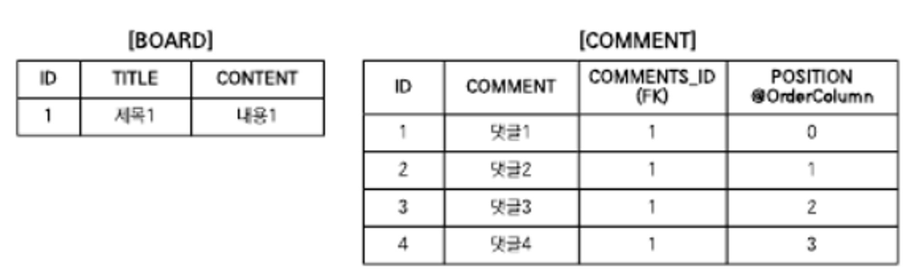
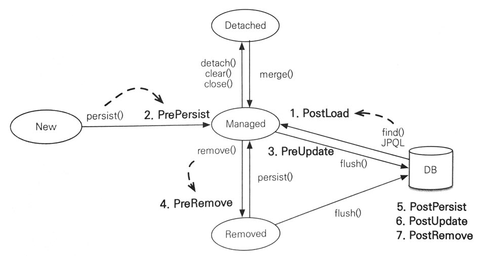

# 컬렉션과 부가 기능

## 컬렉션
- JPA는 Java에서 기본으로 제공하는 `Collection`, `List`, `Set`, `Map` 컬렉션을 지원하고 다음 경우에 컬렉션을 사용할 수 있음
  - `@OneToMany`, `@ManyToMany`를 사용해서 일대다나 다대다 엔티티 관계를 매핑할 때
  - `@ElementCollection`을 사용해서 값 타입을 하나 이상 보관할 때

>💡참고로 `Map`은 `@MapKey*` 어노테이션으로 매핑 가능, 복잡한 매핑에 비해 활용도가 떨어지고 다른 컬렉션을 사용해도 충분하기 때문에 생략

### JPA와 컬렉션
```java
@Entity
public class Team {
    @OneToMany
    private List<Member> members = new ArrayList<>();
}

Team team = new Team();

System.out.println(team.getMembers().class);        // java.util.ArrayList
em.persist(team);
System.out.println(team.getMembers().class);        // org.hibernate.collection.internal.PersistentBag
```
- 하이버네이트는 엔티티를 영속 상태로 만들 때 컬렉션 필드를 하이버네이트에서 준비한 컬렉션으로 감싸서 사용 => 래퍼 컬렉션
- 효율적으로 관리하기 위해 엔티티를 영속 상태로 만들 때 원본 컬렉션을 감싸고 있는 내장 컬렉션을 생성해서 이 내장 컬렉션을 사용하도록 참조를 변경
- 이런 특징 때문에 컬렉션 사용 시 즉시 초기화해서 사용하는 것을 권장
  ```java
  List<Member> members = new ArrayList<>();
  ```

| 컬렉션 인터페이스           | 내장 컬렉션         | 중복 허용 | 순서 보관 |
|:--------------------|:---------------|:------|:------|
| Collection, List    | PersistentBag  | O     | X     |
| Set                 | PersistentSet  | X     | X     |
| List + @OrderColumn | PersistentList | O     | O     |

### Collection, List
```java
@OneToMany
@JoinColun
private Collection<Entity> collections = new ArrayList<>();

@OneToMany
@JoinColun
private List<Entity> list = new ArrayList<>();

...
        
// true
boolean result = comments.add(data);
```
- `Collection`, `List` 인터페이스는 중복을 허용하는 컬렉션이고 PersistenceBag을 래퍼 컬랙션으로 사용
- `add()` 메서드는 내부에 비교 없이 항상 추가하고 `true`를 반환
- 같은 엔티티가 있는지 찾거나 삭제 시 `equals()` 메서드를 사용
- **`Collection`, `List`는 엔티티를 추가 시 중복 엔티티 비교를 하지 않고 단순히 저장하기 때문에, 엔티티를 추가(사용)해도 지연 로딩된 컬렉션을 초기화하지 않음**

### Set
```java
@OneToMany
@JoinColun
private Set<Entity> collections = new HashSet<>();

```
- `HashSet`은 중복을 헝요하지 않으므로 `add()` 메서드로 객체를 추가할 때마다 `equals()` 메서드로 같은 객체가 있는지 비교
- 같은 객체가 없으면 추가 후 `true`, 이미 있어서 추가에 실패하면 `false`를 반환
- **`Set`은 에티티를 추가할 때 중복된 엔티티가 있는지 비교해야 함, 따라서 엔티티 추가 시 지연 로딩된 컬렉션을 초기화함**

### List + @OrderColumn
```java
@Entity
public class Board {
    @Id @GeneratedValue
    private Long id;
    
    private String title;
    private String content;
    
    @OneToMany(mappedBy = "board")
    @OrderColumn(name = "POSITION")
    private List<Comment> comments = new ArrayList<>();
}

@Entity
public class Comment {
    @Id @GeneratedValue
    private Long id;
    
    private String comment;
    
    @ManyToOne
    @JoinColumn(name = "BOARD_ID")
    private Board board;
}
```
- `@OrderColumn`을 추가하면 순서가 있는 특수 컬렉션으로 인식 => DB에 순서 값을 저장해서 조회할 때 사용
- 순서가 있는 컬렉션은 DB에 순서 값도 함께 관리함
- 여기서는 `@OrderColumn`의 `name` 속성에 `POSITION`이라는 값을 주었음
- JPA는 `List`의 위치 값을 테이블의 `POSITION` 컬럼에 보관
- 그러나 `Board.comments` 컬렉션은 `Board` 엔티티에 있으나 테이블의 일대다 관계 특성상 위치 값은 다`N` 쪽에 저장해야 함
- 따라서 실제 `POSITION` 컬럼은 `COMMENT` 테이블에 매핑 됨


```java
Board board = new Board();

board.add(new Comment());   // POSITION 0
board.add(new Comment());   // POSITION 1
...
```

##### @OrderColumn 단점
1. `POSITION`의 값을 알 수 없음
   - 예제의 `Comment`를 `INSERT`할 때는 `POSITION` 값이 저장되지 않음
   - `POSITION`은 `Baord.comments`의 위치 값이므로, 이 값을 사용해 `POSITION`의 값을 `UPDATE` SQL이 추가로 발생
2. `List`를 변경하면 연관된 많은 위치 값을 변경해야 함
   - 예를 들어 위 그림의 `댓글2`를 삭제하면 `댓글3`, `댓글4`의 `POSITION` 값을 하나씩 줄이는 `UPDATE` SQL이 2번 발생
3. 중간에 `POSITION` 값이 없으면 조회한 `List`에는 `null`이 보관됨
   - 예를 들어 `댓글2`를 DB에서 강제로 삭제하고 다른 댓글들의 `POSITION` 값을 수정하지 않으면 `POSITION` 값은 [0,2,3]
   - 중간에 1이 없으므로 `List` 조회 시 1번 위치에 `null` 값이 보관됨 => NPE 발생

- 실무에서 사용하기에는 단점이 많음 => `@OrderColumn` 매핑 대신 개발자가 직접 POSITION 값을 관리하거나 `@OrderBy` 사용 권장

### @OrderBy
```java
@Entity
public class Entities {
    @Id @GeneratedValue
    private Long id;
    
    private String name;
    
    @OneToMany(mappedBy = "entity")
    @OrderBy("username desc, id asc")
    private Set<Entity> entities = new HashSet<>();
    
    ...
}

@Entity
public class Entity {
    @Id @GeneratedValue
    private Long id;
    
    @Column(name = "MEMBER_NAME")
    private String username;
    
    @ManyToOne
    private Entities entities;
    
    ...
}
```
- `@OrderBy`는 DB의 ORDER BY 절을 사용해서 컬렉션을 정렬
- 여기서 `@OrderBy`의 값은 JPQL의 order by 절처럼 **엔티티의 필드를 대상**으로 함

>💡하이버네이트는 `Set`에 `@OrderBy`를 적용해서 결과를 조회하면, 순서 유지를 위해 `LinkedHashSet`을 내부에서 사용함

## @Converter
- 컨버터를 사용하면 엔티티의 데이터를 변환해서 DB에 저장 가능

```java
@Entity 
public class Member {
    @Id
    private String id;
    private String username;
    
    @Convert(converter=BooleanToYNConverter.class)
    pirvate boolean vip;
    
    // Getter, Setter
}

@Converter
public class BooleanToYNConverter implements AttributeConverter<Boolean, String> {
    
    @Override
    public String convertToDatabaseColumn(Boolean attribute) {
        return (attribute != null && attribute) ? "Y" : "N";
    }
    
    @Override
    public Boolean convertToEntityAttribute(String dbData) {
        return "Y".equals(dbData);
    }
}

/**
 * 컨버터 클래스는 @Converter 어노테이션을 사용하고 AttributeConverter 인터페이스를 구현해야 함.
 * 위에선 <Boolean, String>을 지정해서 Boolean 타입을 String 타입으로 변환.
 */
public interface AttributeConverter<X, Y> {
    Y convertToDatabaseColumn(X attribute);     // 엔티티 데이터를 DB 컬럼에 저장할 데이터로 변환
    X convertToEntityAttribute(Y dbData);       // DB에서 조회한 컬럼 데이터를 엔티티의 데이터로 변환
}
```

- 컨버터는 클래스 레벨에도 설정 가능
- 이때는 `attributeName` 속성을 사용해 어떤 필드에 컨버터를 적용할지 명시해야 함

```java
@Entity
@Convert(converter=BooleanToYNConverter.class, attributeName = "vip")
public class Member {
    @Id
    private String id;
    private String username;
    
    pirvate boolean vip;
    
    // Getter, Setter
}
```

### 글로벌 설정

- 모든 `Boolean` 타입에 컨버터를 적용하려면 `@Converter(autoApply = true)`을 적용하면 됨

```java
@Converter(autoApply = true)
public class BooleanToYNConverter implements AttributeConverter<Boolean, String> {
    
    @Override
    public String convertToDatabaseColumn(Boolean attribute) {
        return (attribute != null && attribute) ? "Y" : "N";
    }
    
    @Override
    public Boolean convertToEntityAttribute(String dbData) {
        return "Y".equals(dbData);
    }
}
```

#### @Convert 속성 정리
| 속성                | 기능                           | 기본값   |
|:------------------|:-----------------------------|:------|
| converter         | 사용할 컨버터 지정                   |       |
| attributeName     | 컨버터 적용할 필드 명                 |       |
| disableConversion | 글로벌 컨버터나 상속 받은 컨버터를 사용하지 않는다 | false |

## 리스너

- JPA 리스너 기능을 사용하면 엔티티의 생명주기에 따른 이벤트를 처리할 수 있음
  1. `PostLoad`: 엔티티가 영속성 컨텍스트에 조회된 직후 또는 refresh를 호출한 후(2차 캐시에 저장되어 있어도 호출됨)
  2. `PrePersist`: `persist()` 메서드를 호출해서 엔티티를 영속성 컨텍스트에 관리하기 직전에 호출됨, 식별자 생성 전략을 사용한 경우 엔티티에 식별자는 아직 존재하지 않음, 새로운 인스턴스를 `merge`할 때도 수행
  3. `PreUpdate`: `flush`나 `commit`을 호출해서 엔티티를 DB에 수정하기 직전에 호출
  4. `PreRemove`: `remove()` 메서드를 호출해서 엔티티를 영속성 컨텍스트에서 삭제하기 직전에 호출됨, 또한 삭제 명령어로 영속성 전이가 일어날 떄도 호출됨, `orphanRemoval`에 대해선 `flush`나 `commit` 시에 호출됨
  5. `PostPersist`: `flush`나 `commit`을 호출해 엔티티를 DB에 저장한 직후에 호출됨, 식별자가 항상 존재함, 참고로 식별자 생성 전략이 `IDENTITY`면 식별자 생성을 위해 `persist()`를 호출하면서 DB에 해당 엔티티를 저장하므 이땐 `persist()` 호출 직후에 바로 `PostPersist`가 호출됨
  6. `PostUpdate`: `flush`나 `commit`을 호출해서 엔티티를 DB에 수정한 직후에 호출됨
  7. `PostRemove`: `flush`나 `commit`을 호출해서 엔티티를 DB에 삭제한 직후에 호출
  
### 이벤트 적용 위치
- 이벤트는 엔티티에서 직접 받거나 별도의 리스너를 등록해서 받을 수 있음

#### 엔티티에 직접 적용
```java
@Entity
public class Duck {
    @Id @GeneratedValue
    public Long id;
    
    private String name;
    
    @PrePersist
    public void prePersist() {
        System.out.println("Duck.prePersist id=" + id);     // id=null(아이디가 생성되기 전에 호출)
    }
    
    @PostPersist
    public void postPersist() {
        System.out.println("Duck.postPersist id=" + id);    //id=1(아이디가 생성된 후에 호출)
    }

    @PostLoad
    public void postPersist() {
        System.out.println("postPersist()");
    }

    @PreRemove
    public void preRemove() {
        System.out.println("preRemove()");
    }

    @PostRemove
    public void postRemove() {
        System.out.println("postRemove()");
    }
}
```

#### 별도의 리스너 등록
```java
@Entity
@EntityListener(DuckListenr.class)
public class Duck {
    ...
}

public class DuckListener {
    @PrePersist
    //특정 타입이 확실하면 특정 타입을 받을 수 있음
    private void prePersist(Object obj) {
        System.out.println("DuckListener.prePersist obj = [" + obj + "]");
    }

    @PostPersist
    //특정 타입이 확실하면 특정 타입을 받을 수 있음
    private void postPersist(Object obj) {
        System.out.println("DuckListener.postPersist obj = [" + obj + "]");
    }
}
```

#### 기본 리스너 사용
- `META-INF/orm.xml`에 기본 리스너로 등록해도 됨

```java
<?xml version"1.0" encoding="UTF-8" ?>
<entity-mappings ...>
    <persistence-unit-metadata>
        <persistence-unit-defaults>
            <entity-listeners>
                <entity-listener class="jpabook.jpashop.domain.listener.DefaultListner" />
            </entity-listeners>
        </persistence-unit-defaults>
    </persistence-unit-metadata>
</entity-mappings>
```

- 여러 리스너를 등록했을 때 이벤트 호출 순서는 아래와 같음
  1. 기본 리스너
  2. 부모 클래스 리스너
  3. 리스너
  4. 엔티티

#### 더 세밀한 설정
- 더 세밀한 설정의 어노테이션도 존재
  - `ExcludeDefaultListeners`: 기본 리스너 무시
  - `ExcludeSuperclassListeners`: 상위 클래스 이벤트 리스너 무시

```java
@Entity
@EntityListeners(DuckListener.class)
@ExcludeDefaultListeners
@ExcludeSuperclassListeners
public class Duck extends BaseEntity {
    ...
}
```
- 이벤트를 잘 활용하면 대부분의 엔티티에 공통으로 적용하는 등록 일자, 수정 일자 처리와 해당 엔티티를 누가 등록하고 수정했는지에 대한 기록을 리스너 하나로 처리 가능

## 엔티티 그래프
- 엔티티를 조회할 때 연관된 엔티티들을 함께 조회하려면 다음처럼 글로벌 fetch 옵션을 `FetchType.EAGER`로 설정함
  ```java
  @Entity
  class Order {
    @ManyToOne(fetch=FetchType.EAGER)
    Member member;
    ...
  }
  ```
- 또는 JPQL에서 페치 조인을 사용하면 됨
  ```sql
  select o from Order o join fetch o.member
  ```
- 글로벌 fetch 옵션은 애플리케이션 전체에 영향을 주고 변경할 수 없다는 단점이 존재
- 그래서 일반적으로 글로벌 fetch 옵션을 `FetchType.LAZY`로 사용하고, 엔티티 조회 시 연관된 엔티티를 함께 조회할 필요가 있으면 JPQL의 페치 조인을 사용
- 그러나 주문 조회하는 같은 JPQL에 함께 조회할 엔티티에 따라 다른 JPQL을 사용해야하는 경우가 있음 => JPQL 중복
- JPA 2.1에 추가된 **엔티티 그래프** 기능을 사용하면 엔티티를 조회하는 시점에 함께 조회할 연관된 엔티티를 선택할 수 있음
  - **엔티티 그래프**: 엔티티 조회시점에 연관된 엔티티들을 함께 조회하는 기능

### Named 엔티티 그래프
```java
@NamedEntityGraph(name = "Order.withMember", attributeNodes = {
    @NamedAttributeNode("member")
})
@Entity
@Table(name = "ORDERS")
public class Order {
    @Id @GeneratedValue
    @Column(name = "ORDER_ID")
    private Long id;

    @ManyToOne(fetch = FetchType.LAZY, optional = false)
    @JoinColumn(name = "MEMBER_ID")
    private Member member;

    ...
}
```
- `name`: 엔티티 그래프 이름 정의
- `attributeNodes`: 함께 조회할 속성 선택, 이때 `@NamedAttributeNode`를 사용하고 그 값으로 함께 조회할 속성을 선택하면 됨
- `Order.member`가 지연 로딩으로 설정되어 있지만 엔티티 그래프에서 함께 조회할 속성으로 `member`를 선택했으므로 Order 조회 시 연관된 `member`도 함께 조회할 수 있음
- 둘 이상 정의하려면 `@NamedEntityGraphs`를 사용하면 됨

### em.find()에서 엔티티 그래프 사용
```java
EntityGraph graph = em.getEntityGraph("Order.withMember");

Map<String, EntityGraph> hints = new HashMap();
hints.put("javax.persistence.fetchgraph", graph);

Order order = em.find(Order.class, orderId, hints);
```
- Named 엔티티 그래프를 사용하려면 정의한 엔티티 그래프를 `em.getEntityGraph("Order.withMember")`를 통해 찾아오면 됨
- 엔티티 그래프는 JPA의 힌트 기능을 사용해서 동작
  - Key: `"javax.persistence.fetchgraph"`
  - Value: 찾아온 엔티티 그래프
- JPQL 결과
  ```sql
  select o.*, m.*
  from
      ORDERS o
  inner join
      Member m
          on o.MEMBER_ID = m.MEMBER_ID
  where
      o.ORDER_select o.*, m.*
  from
      ORDERS o
      inner join
      Member m
  on o.MEMBER_ID = m.MEMBER_ID
  where
      o.ORDER_ID = ?ID = ?
  ```

### subgraph
- `Order -> OrderItem -> Item`까지 함께 조회한다 가정
- `Order -> OrderItem`는 `Order`가 관리하는 필드지만 `OretItem -> Item`은 `Order`가 관리하지 않음
- 아래의 예제처럼 사용하면 됨
```java
@NameEntityGraph(name = "Order.withAll", attributeNodes = {
        @NameAttributeNode("member"),
        @NameAttributeNode(value = "orderItems", subgraph = "orderItems")
},
        subgraphs = @NamedSubgraph(name = "orderItems", attributeNodes = {
                @NameAttributeNode("item")
        })
)
@Entity
@Table(name ="ORDERS")
public class Order {
    @Id @GeneratedValue
    @Column(name = "ORDER_ID")
    private Long id;

    @ManyToOne(fetch = FetchType.LAZY, optional = false)
    @JoinColumn(name = "MEMBER_ID")
    private Member member; //주문 회원

    @OneToMany(mappedBy = "order", cascade = CascadeType.ALL)
    private List<OrderItem> orderItems = new ArrayList<OrderItem>();

    ...
}

@Entity
@Table(name = "ORDER_ITEM")
public class OrderItem {
    @Id @GeneratedValue
    @Column(name = "ORDER_ITEM_ID")
    private Long id;

    @ManyToOne(fetch = FetchType.LAZY)
    @JoinColumn(name = "ITEM_ID")
    private Item item; //주문 상품

		...
}
```
- Order.withAll이라는 Named 엔티티 그래프를 정의
- 이 엔티티 그래프는 `Order -> Member`, `Order -> OrderItem`, `OrderItem -> Item`의 객체 그래프를 함꼐 조회
- 여기서 `OrderItem -> Item`은 `Order`의 객체 그래프가 아니므로 `subgraphs` 속성으로 정의해야 함
- 여기서는 `orderItems`라는 이름의 서브 그래프가 `item`을 함께 조회하도록 정의
- 실행 예제
  ```java
  Map<String, EntityGraph> hints = new HashMap();
  hints.put("javax.persistence.fetchgraph", em.getEntityGraph("Order.withAll"));
  
  Order order = em.find(Order.class, orderId, hints);
  ```
- SQL 결과
  ```sql
  select o.*, m.*, oi.*, i.*
  from
      ORDERS o
  inner join
      Member m
          on o.MEMBER_ID = m.MEMBER_ID
  left outer join
      ORDER_ITEM oi
          on o.ORDER_ID = oi.ORDER_ID
  left outer join
      Item i
          on oi.ITEM_ID = i.ITEM_ID
  where
      o.ORDER_ID = ?
  ```

### JPQL에서 엔티티 그래프 사용
```java
List<Order> resultList = 
    em.createQuery("select o from Order o where o.id = :orderId", Order.class)
        .setParameter("orderId", orderId)
        .setHint("javax.persistence.fetchgraph", em.getEntityGraph("Order.withAll"))
        .getResultList();
```
- `em.find()`와 동일하게 힌트만 추가하면 됨
- `em.find()`에서 필수 관계(`optional = false`)를 고려해서 내부 조인을 사용하나, **JPQL에서 엔티티 그래프를 상요할 때는 항상 SQL 외부 조인을 사용함**
- SQL 내부 조인을 사용하려면 명시할 필요가 있음
  ```sql
  select o from Order o join fetch o.member where o.id = :orderId
  ```

### 동적 엔티티 그래프
```java
EntityGraph<Order> graph = em.createEntityGraph(Order.class);
graph.addAttributeNodes("member");

Map hints = new HashMap()
hints.get("javax.persistence.fetchgraph", graph);

Order order = em.find(Order.class, orderId, hints);
```
- 엔티티 그래프를 동적으로 구성하려면 `createEntityGrapth()` 메서드를 사용하면 됨
- 그리고 `graph.addAttributeNodes("member")`를 사용해서 `Order.member` 속성을 엔티티 그래프에 포함할 수 있음
- 동적 엔티티 그래프 subgraph 예시
  ```java
  EntityGraph<Order> graph = em.createEntityGraph(Order.class);
  graph.addAttributeNodes("member");
  Subgraph<OrderItem> orderItems = graph.addSubgraph("orderItems");
  orderItems.addAttributeNodes("item");
  
  Map hints = new HashMap()
  hints.get("javax.persistence.fetchgraph", graph);
  
  Order order = em.find(Order.class, orderId, hints);
  ```
  - `graph.addSubgraph("orderItems")` 메서드를 사용해서 서브그래프 생성
  - 그리고 서브그래프는 item 속성을 포함하도록 함

### 엔티티 그래프 정리
#### ROOT에서 시작
- 엔티티 그래프는 항상 조회하는 엔티티의 ROOT에서 시작해야 함
- `Order` 엔티티를 조회하는데 `Member`부터 시작하는 엔티티 그래프를 사용하면 안됨

#### 이미 로딩된 엔티티
```java
Order order1 = em.find(Order.class, orderId); //이미 조회

hints.put("javax.persistence.fetchgraph", em.getEntityGraph("Order.withMember"));
Order order2 = em.find(Order.class, orderId, hints); //엔티티 그래프 적용 X
```
- 영속성 컨텍스트에 해당 엔티티가 로딩되어 있으면 엔티티 그래프가 적용되지 않음
- 아직 초기화되지 않은 프록시에는 엔티티 그래프가 적용됨

#### fetchgraph, loadgraph 차이
- `fetchgraph`: 엔티티 그래프에 선택한 속성만 함께 조회
- loadgraph: 엔티티 그래프에 선택한 속성 + 글로벌 fetch 모드가 `FetchType.EAGER`로 설정된 연관관계도 포함해서 함께 조회

>💡하이버네이트 `4.3.10.Final` 버전에서는 `laodgraph` 기능이 `em.find()`를 사용할 떄는 정상 동작하나, JPQL을 사용할 때는 정상 동작하지 않고 `fetchgraph`와 동일하게 동작