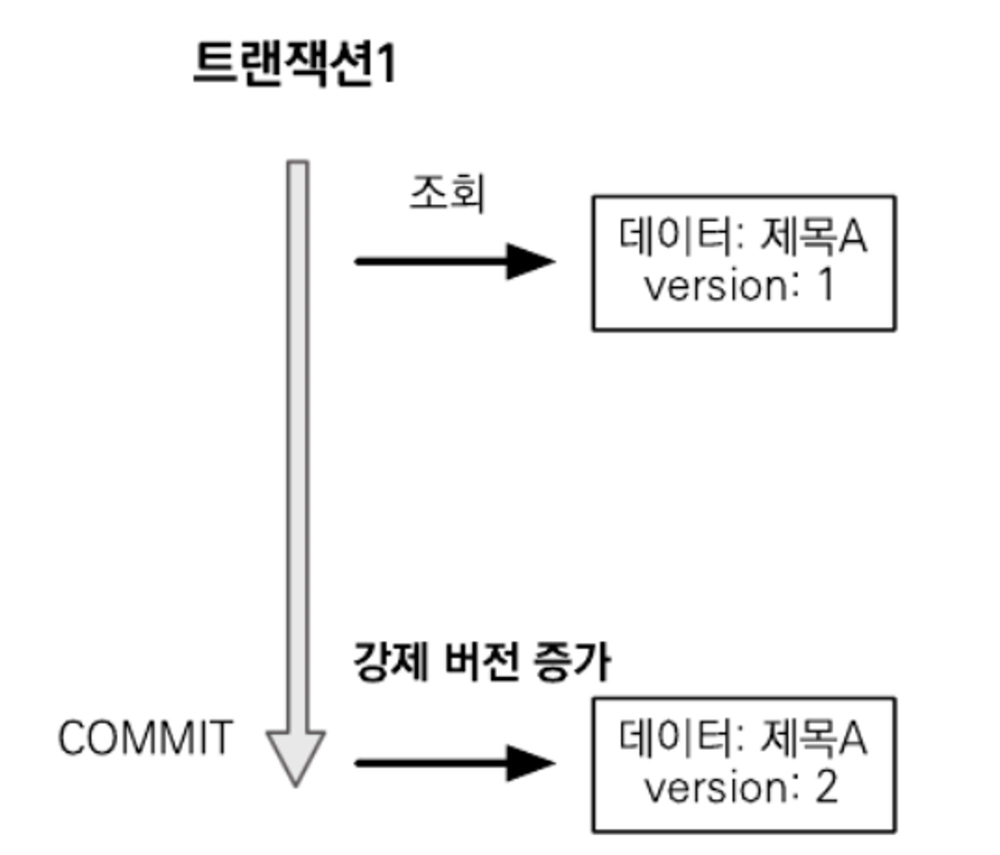

# 트랜잭션과 락, 2차 캐시

## 트랜잭션과 락
- 트랜잭션은 ACID라 하는 원자성`Atomicity`, 일관성`Consistency`, 격리성`Isolation`, 지속성`Durability`을 보장해야 함
  - `원자성`: 트랜잭션 내에서 실행한 작업들은 마치 하나의 작업인 것처럼 모두 성공 또는 실패를 보장해야 함
  - `일관성`: 모든 트랜잭션은 일관성있는 DB 상태를 유지해야 함 -> 무결성 제약 조건 항시 만족
  - `격리성`: 동시에 실행되는 트랜잭션들이 서로 영향을 주지 않도록 격리함, 동시에 같은 데이터 수정을 막아야 함
  - `지속성`: 트랜잭션이 성공적으로 끝나면 그 결과가 항상 기록되어야 함, 중간에 시스템에 문제가 발생해도 DB 로그 등을 사용해서 성공한 트랜잭션 내용을 복구해야 함
- 여기서 트랜잭션 간에 `격리성`을 완벽히 보장하려면 트랜잭션을 거의 차례대로 실행해야 함, 이러면 당연히 동시성 처리 성능이 매우 나빠짐
- 이를 해결하기 위해 ANSI 표준은 트랜잭션의 격리 수준`Isolation Level`을 4단계로 나누어 정의
  - `READ UNCOMMITED`: 커밋되지 않은 읽기
  - `READ COMMITED`: 커밋된 읽기
  - `REPEATABLE READ`: 반복 가능한 읽기
  - `SERIALIZABLE`: 직렬화 기능
- 순서대로 `READ UNCOMMITED`가 격리 수준이 가장 낮고 `SERIALIZABLE`이 격리 수준이 높음
- 격리 수준이 낮을 수록 동시성은 증가하나, 이에 따라 다양한 문제가 발생
 

### 격리 수준에 따른 문제점

| 격리 수준           | DIRTY READ | NON-REPEATABLE READ | PHANTOM READ |
|:----------------|:-----------|:--------------------|:-------------|
| READ UNCOMMITED | O          | O                   | O            |
| READ COMMITED   |            | O                   | O            |
| REPEATABLE READ |            |                     | 0            |
| SERIALIZABLE    |            |                     |              |

#### READ UNCOMMITED

- 커밋하지 않은 데이터를 읽을 수 있음
  - ex. 트랜잭션1이 수정 중인데, 커밋하지 않아도 트랜잭션2가 수정 중인 데이터 조회 가능
- 정합성에 문제가 많은 격리 수준 => `DIRTY READ` 현상 발생
  - 정합성`Consistency`: 어떤 데이터들이 값이 서로 일치하는 상태
  - Dirty Read: 트랜잭션 작업이 완료하지 않았는데도 다른 트랜잭션에서 볼 수 있게 되는 현상

#### READ COMMITED

- 커밋한 데이터만 읽음 => `DIRTY READ` X
- 실제 테이블 값을 가져오는 것이 아닌, Undo 영역에 백업된 레코드에서 값을 가져옴
- RDB에 기본적으로 사용되는 격리 수준
- 하지만 `NON-REPEATABLE READ` 발생할 수 있음
  
  - `Transaction 1`이 commit 이후 아직 끝나지 않는 `Transaction 2`가 다시 테이블 값을 읽으면 값이 변경됨을 알 수 있음
  - 하나의 트랜잭션 내에서 똑같은 `SELECT` 쿼리 실행 시 항상 같은 결과를 가져와야 하는 `REPEATABLE READ`의 정합성에 어긋남
  - 주로 입금, 출금 처리 같은 금전적인 처리에서 주로 발생 → 데이터 정합성은 깨지고 버그 찾기 어려움

#### REPEATABLE READ

- 한번 조회한 데이터를 반복해서 조회해도 같은 데이터가 조회됨
- MySQL의 경우 트랜잭션마다 ID를 부여해 ID보다 작은 트랜잭션 번호에서 변경한 것만 읽음
- Undo 공간에 백업해두고 실제 레코드 값을 변경
  - 백업된 데이터는 불필요하다고 판단하는 시점에 주기적으로 삭제
  - Undo에 백업된 레코드가 많아지면 DB 서버 처리 성능이 떨어질 수 있음
- 이러한 변경 방식을 MVCC`Multi Version Concurrency Control`라 함
- 하지만 `PHANTOM READ` 발생할 수 있음
  
  - 다른 트랜잭션에서 수행한 변경 작업에 의해 레코드가 보였다, 안보였다 하는 현상
  - 이를 방지하기 위해 쓰기 잠금을 걸어야 함

#### SERIALIZABLE
- 가장 엄격한 격리 수준이며 PHANTOM READ 현상도 없음
- 성능 측면에서는 동시 처리 성능이 가장 낮아 거의 사용되지 않음

#### 일반적으로 사용하는 격리 수준
- `READ COMMIED`를 일반적으로 사용
- 일부 중요한 비즈니스 로직에 높은 격리 수준이 필요하면 DB 트랜잭션이 제공하는 잠금 기능을 사용

### 낙관적 락과 비관적 락 기초
- JPA 영속성 컨텍스트`1차 캐시`를 잘 쓰면 DB 트랜잭션이 `READ COMMITED` 수준이어도 어플리케이션 레벨에서 `REPEATABLE READ`가 가능
  - 물론 엔티티가 아닌 스칼라 값을 직접 조회하면 영속성 컨텍스트 관리를 받지 못해 `REPEATABLE READ` 불가
- JPA는 DB 트랜잭션 격리 수준을 `READ COMMITED`로 가정하고 수행
- 일부 로직에 더 높은 격리 수준을 원한다면 **낙관적 락**과 **비관적 락** 중 하나를 사용

#### 낙관적 락
- 트랜잭션 대부분은 충돌이 발생하지 않는다고 가정하는 방법
- JPA가 제공하는 버전 관리 기능을 사용 => 어플리케이션이 제공하는 락
- 트랜잭션을 커밋하기 전까지는 트랜잭션의 충돌을 알 수 없다는 특징이 있음

#### 비관적 락
- 트랜잭션의 충돌이 발생한다고 가정하고 우선 락을 거는 방법
- DB에서 제공하는 락 기능을 사용

#### 추가 문제
- DB 트랜잭션 범위를 넘어서는 문제도 존재
- 예를 들면 사용자 `A`와 `B`가 동시에 제목이 같은 게시물을 수정
  - `A`가 먼저 수정 완료, 그다음에 `B`가 수정 완료
  - 이 경우 나중에 완료된 B의 수정사항만 남게 됨
  - 이러한 문제를 두번의 갱신 분실 문제`Second Lost Updates Problem`라 함
- 두번의 갱신 분실 문제는 DB 트랜잭션의 범위를 넘어섬, 이땐 3가지 선택 방법이 있음
  1. 마지막 커밋만 인정: `A` 내용 무시, `B` 내용 인정
  2. 최초 커밋만 인정: 'A'가 수정 완료했으므로 `B` 수정 완료 시 오류 발생
  3. 충돌하는 갱신 내용 병합: `A`, `B` 수정사항을 병합
- 기본은 `마지막 커밋만 인정`이 사용됨
- `최초 커밋만 인정`을 원하면 JPA가 제공하는 버전 관리 기능을 사용
- `충돌하는 갱신 내용 병합`은 어플리케이션 개발자가 직접 사용자를 위해 병합 방법을 제공

### @Version
- JPA가 제공하는 낙관적 락을 사용하려면 `@Version` 어노테이션을 사용해서 버전 관리 기능을 추가해야 함
- 적용 가능 타입
  - Long(long)
  - Integer(int)
  - Short(short)
  - Timestamp

```java
@Entity
public class Board {
    @Id
    private String id;
    
    private String title;
    
    @Version
    private Integer version;
}
```
- 이제부터 엔티티를 수정할 때마다 버전이 하나씩 자동으로 증가함
- 그리고 엔티티 수정 시 조회 시점의 버전과 수정 시점의 버전과 다르면 예외가 발생함

```java
// 트랜잭션1 조회, title="제목A", version=1
Board board = em.find(Board.class, id);

// 트랜잭션2에서 해당 게시물을 수정해서 title="제목C", version=2로 증가
        
board.setTitle("제목B"); // 트랜잭션1 데이터 수정

save(board);
tx.commit();            // 예외 발생, DB version=2, 엔티티 version=1
```

- `트랜잭션2`가 커밋을 반영하고 나면 버전이 증가
- 이때 `트랜잭션1`이 제목을 B로 바꾸고 커밋하는 순간 엔티티 조회할 때 버전과 DB의 현재 버전 정보가 달라 예외를 발생
- 이렇게 버전 정보를 사용해 `최초 커밋만 인정`하기가 적용됨

#### 버전 정보 비교 방법
```mysql-sql
UPDATE BOARD
SET
    TITLE=?
    VERSION=? (버전  + 1 증가)
WHERE
    ID=?
    AND VERSION=? (버전 비교)
```
- 엔티티를 수정하고 트랜잭션을 커밋하면 영속성 컨텍스트를 플러시하면서 UPDATE 쿼리 실행
- 이때 버전을 사용하는 엔티티면 검색 조건에 엔티티의 버전 정보를 추가함
- DB 버전과 엔티티 버전이 같으면 데이터를 수정하면서 동시에 버전도 하나를 증가시킴
- 만약 DB 버전이 이미 증가해서 수정 중인 엔티티 버전과 다르면 UPDATE 쿼리의 WHERE 문에서 VERSION 값이 다르므로 수정할 대상이 없음
- 이때 버전이 이미 증가한 것으로 판단, JPA가 예외를 발생시킴
- 버전은 엔티티의 값을 변경하면 증가함
- 단 연관관계 필드는 외래 키를 관리하는 연관관계의 주인 필드를 수정할 때만 버전 증가
- `@Version`으로 추가한 필드는 JPA가 직접 관리하므로 개발자가 임의로 수정하면 안됨(벌크 연산 제외)
  - 버전 값을 강제로 증가하려면 특별한 락 옵션을 선택하면 됨
  - 벌크 연산은 버전을 무시함, 벌크 연산에서 버전을 증가하려면 버전 필드를 강제로 증가시켜야 함
    ```mysql-sql
    update Member m set m.name = '변경', m.version = m.version + 1
    ```

### JPA 락 사용
> 💡JPA 사용 시 추천 전략은 `READ COMMITED` 격리 수준 + 낙관적 버전 관리(두번의 갱신 내역 분실 문제 예방)

- 락`Lock`은 다음 위치에 적용 가능
  - `EntityManger.lock()`, `EntityManger.find()`, `EntityManger.refresh()`
  - `Query.setLockMode()` (`TypeQuery` 포함)
  - `@NamedQuery`
- 조회하면서 즉시 락을 걸 수 있음
  ```java
  Board board = em.find(Board.class, id, LockModeType.OPTIMISTIC);
  ```
- 또는 필요할 때 락을 걸 수 있음
  ```java
  Board board = em.find(Board.class, id);
  ...
  em.lock(board, LockModeType.OPTIMISTIC);
  ```
  
#### LockModeType 속성
| 락 모드  | 타입                          | 설명                           |
|:------|:----------------------------|:-----------------------------|
| 낙관적 락 | OPTIMISITC                  | 낙관적 락을 사용                    |
| 낙관적 락 | OPTIMISTIC_FORCE_INCREMENT  | 낙관적 락 + 버전 정보를 강제로 증가        |
| 비관적 락 | PESSIMISTIC_READ            | 비관적 락, 읽기 락을 사용              |
| 비관적 락 | PESSIMISTIC_WRITE           | 비관적 락, 쓰기 락을 사용              |
| 비관적 락 | PESSIMISTIC_FORCE_INCREMENT | 비관적 락 + 버전 정보를 강제로 증가        |
| 기타    | NONE                        | 락을 걸지 않음                     |
| 기타    | READ                        | JPA1.0 호환 기능, OPTIMISTIC과 동일 |
| 기타    | WRITE                       | JPA1.0 호환 기능, OPTIMISTIC_FORCE_INCREMENT과 동일 |

### JPA 낙관적 락
- JPA가 제공하는 낙관적 락은 @Version을 사용
- 낙관적 락은 트랜잭션을 커밋하는 시점에 충돌을 알 수 있다는 특징이 있음
- 발생하는 예외
  - `javax.persistence.OptimisticLockException`(JPA 예외)
  - `org.hibernate.StaleObjectStateException`(하이버네이트 예외)
  - `org.springframework.orm.ObjectOptimisticLockingFailureExcpetion`(스프링 예외 추상화)

>💡일부 JPA 구현체 중에 `@Version` 컬럼 없이 낙관적 락을 허용하나 추천하지 않음

- 참고로 락 옵션 없이 `@Version`만 있어도 낙관적 락이 적용됨
- 락 옵션을 사용하면 락을 더 세밀하게 제어 가능

#### NONE
- 락 옵션을 적용하지 않아도 엔티티에 `@Version` 적용된 필드만 있으면 낙관적 락이 적용됨 

##### 용도
- 조회한 엔티티를 수정할 때 다른 트랜잭션에 의해 변경(삭제)되지 않아야 함, 조회 시점부터 수정 시점까지 보장

##### 동작
- 엔티티를 수정할 때 버전을 체크하면서 버전을 증가함(UPDATE 쿼리 사용), 이때 DB 버전 값이 현재 버전이 아니면 예외가 발생

##### 이점
- `두번의 갱신 분실 문제`를 예방

#### OPTIMISTIC
```java
// 트랜잭션1 조회, title="제목A", version=1
Board board = em.find(Board.class, id, LockModeType.OPTIMISTIC);

// 트랜잭션2에서 해당 게시물을 수정해서 title="제목C", version=2로 증가

// 트랜잭션1 커밋 시점에서 버전 정보 검증, 예외 발생 => 엔티티를 수정하지 않고 조회만 해도 버전을 확인해서 검증
// (데이터베이스 version=2, 엔티티 version=1)
tx.commit();
```


- `@Version`만 적용했을 때는 엔티티를 수정해야 버전을 체크하나, 해당 옵션 추가 시 엔티티 조회만 해도 버전을 체크함
- 한번 조회한 엔티티는 트랜잭션을 종료할 때까지 다른 트랜잭션에서 변경하지 않음을 보장

##### 용도
- 조회한 엔티티는 트랜잭션이 끝날 때까지 다른 트랜잭션에 의해 변경되지 않아야 함

##### 동작
- 트랜잭션 커밋 시 버전 정보를 조회해서(SELECT 쿼리 사용) 현재 엔티티의 버전과 같은지 검증
- 같지 않으면 예외 발생

##### 이점
- `DIRTY READ`와 `NON-REPEATABLE READ`를 방지

#### OPTIMISTIC_FORCE_INCREMENT
```java
// 트랜잭션1 조회, title="제목A", version=1
Board board = em.find(Board.class, id, LockModeType.OPTIMISTIC_FORCE_INCREMENT);

// 트랜잭션1 커밋 시점에 버전 강제 증가
tx.commit(); 
```

- 낙관적 락을 사용하면서 버전 정보를 강제로 증가

##### 용도
- 논리적 단위의 엔티티 묶음을 관리할 수 있음
  - 예를 들면 게시물과 첨부 파일이 일대다, 다대일의 양방향 연관관계, 첨부 파일이 연관관계의 주인
  - 게시물 수정 시 단순히 첨부 파일만 추가하면 게시물의 버전은 증가하지 않음
  - 해당 게시물은 물리적으로는 변경되지 않았으나 논리적으론 변경되었음
  - 이때 게시물의 버전도 강제로 증가하려면 `OPTIMISTIC_FORCE_INCREMENT`를 사용하면 됨

##### 동작
- 엔티티를 수정하지 않아도 트랜잭션을 커밋할 때 UPDATE 쿼리를 사용해서 버전 정보를 강제로 증가
- 이때 DB의 버전이 엔티티의 버전과 다르면 예외 발생
- 엔티티 수정 시 버전 UPDATE가 발생 => 총 2번의 버전 증가가 나타날 수 있음

##### 이점
- 강제 버전 증가로 인해 논리적 단위의 엔티티 묶음을 버전 관리할 수 있음

### JPA 비관적 락
- DB 트랜잭션 락 메커니즘에 의존하는 방법
- 주로 SQL 쿼리에 `select for update` 구문을 사용하면서 시작하고 버전 정보는 사용하지 않음
- 비관적 락은 주로 `PESSIMISTIC_WRITE` 모드를 사용
- 특징
  - 엔티티가 아닌 스칼라 타입을 조회할 때도 사용 가능
  - 데이터를 수정하는 즉시 트랜잭션 충돌을 감지
- 발생하는 예외
  - `javax.persistence.PessimisticLockException`(JPA 예외)
  - `org.springframework.dao.PessimisticLockingFailureExcpetion`(스프링 예외 추상화)

#### PESSIMISTIC_WRITE
- 일반적인 옵션
- DB에 쓰기 락을 걸 때 사용

##### 용도
- DB에 쓰기 락을 걺

##### 동작
- DB `select for update`를 사용해서 락을 걺

##### 이점
- `NON-REPEATABLE READ`를 방지
- 락이 걸린 로우는 다른 트랜잭션이 수정할 수 없음

#### PESSIMISTIC_READ
- 데이터를 반복 읽기만 하고 수정하지 않는 용도로 락을 걸 때 사용
- 잘 사용하진 않음, DB 대부분은 방언에 의해 `PESSIMISTIC_WRITE`로 동작
  - MySQL: `lock in share mode`
  - PostgreSQL: `for share`

#### PESSIMISTIC_FORCE_INCREMENT
- 비관적 락 중 유일하게 버전 정보를 사용
- 비관적 락이지만 버전 정보를 강제로 증가
- 하이버네이트는 `nowait`를 지원하는 DB에 대해서 `for update nowait` 옵션을 적용
  - 오라클: `for update nowait`
  - PostgreSQL: `for update nowait`
  - `nowait`를 지원하지 않으면 `for update`가 사용됨

### 비관적 락과 타입아웃
- 비관적 락을 사용하면 락을 획득할 때까지 트랜잭션이 대기함
- 무한정 기다릴 수 없기 때문에 타임아웃 시간을 줄 수 있음
  ```java
  Map<String, Object> properties = new HashMap<>();
  
  // 타입아웃 10초까지 대기 설정
  properties.put("javax.persistence.lock.timeout", 10000)
  
  // 10초간 대기, 응답이 없으면 javax.persistence.LockTimeoutExeption 예외 발생
  Board board = em.find(Board.class, "boardId", LockModeType.PESSIMISTIC_WRITE, properties);
  ```
- 타임아웃은 DB 특성에 따라 동작하지 않을 수도 있음

## 2차 캐시
### 1차 캐시와 2차 캐시
- 네트워크를 통해 DB에 접근하는 시간 비용 >>수만~수십만 배>>> 어플리케이션 서버에서 내부 메모리에 접근하는 시간 비용
- 따라서 조회한 데이터를 메모리에 캐시해서 DB 접근 횟수를 줄이면 어플리케이션 성능 개선 가능
- 영속성 컨텍스트 내부에는 엔티티를 보관하는 저장소가 있음 => `1차 캐시`
- 일반적인 웹 어플리케이션 환경은 트랜잭션을 시작하고 종료할 때까지만 1차 캐시가 유효 -> OSIV도 트랜잭션 시작과 종료까지만 유효
- 하이버네이트를 포함한 대부분의 JPA rㅜ현체들은 애플리케이션 범위의 캐시를 지원 => 공유 캐시 or `2차 캐시`

#### 1차 캐시
- `1차 캐시`는 영속성 컨텍스트 내부에 존재
- 엔티티 매니저로 조회하거나 변경하는 모든 엔티티는 `1차 캐시`에 저장됨
- 트랜잭션 커밋 또는 플러시 시 `1차 캐시`에 있는 엔티티 변경 내역을 DB에 동기화
- `1차 캐시`는 영속성 컨텍스트 자체이므로 끄고 켤 수 있는 옵션이 아님

##### 동작 방식

1. 최초 조회 시 `1차 캐시`에 엔티티가 없음
2. DB에서 엔티티를 조회
3. `1차 캐시`에 보관
4. `1차 캐시`에 보관한 결과를 반환
5. 이후 같은 엔티티를 조회하면 `1차 캐시`에 같은 엔티티가 있으므로 DB 조회하지 않고 `1차 캐시`의 엔티티를 그대로 반환

##### 특징
- 같은 엔티티가 있으면 해당 엔티티를 그대로 반환 => 동일성`a == b` 보장
- 기본적으로 영속성 컨텍스트 범위의 캐시

#### 2차 캐시(L2 Chache)
- 어플리케이션 범위에서 공유하는 캐시
- 어플리케이션에서 종료할 때까지 캐시가 유지됨
- 엔티티 매니저를 통해 데이터를 조회할 때 우선 `2차 캐시`에서 찾고 없으면 DB에서 찾음
- 적절히 사용하면 DB 조회 횟수를 효율적으로 줄일 수 있음

##### 동작 방식

1. 영속성 컨텍스트는 엔티티가 필요하면 2차 캐시를 조회
2. 2차 캐시에 엔티티가 없으면 DB 조회
3. 결과를 2차 캐시에 보관
4. 2차 캐시는 자신이 보관하고 있는 엔티티를 **복사**해서 반환
5. 2차 캐시에 저장되어 있는 엔티티를 조회하면 복사본을 만들어 반환

##### 특징
- `2차 캐시`는 동시성을 극대화하려고 캐시한 객체를 직접 반환하지 않고 복사본을 만들어 반환
- 만약 캐시한 객체 그대로 반환 시 여러 곳에서 같은 객체를 동시에 수정하는 문제가 발생
- 이를 해결하기 위해 객체에 락을 걸게 되면 동시성 문제가 발생
- 락에 비하면 객체를 복사하는 비용이 저렴하기 때문에 `2차 캐시`는 원본 대신에 복사본을 반환
- 특징을 정리하자면,
  - 영속성 유닛 범위의 캐시
  - 조회한 객체를 그대로 반환하는 것이 아닌, 복사본을 만들어서 반환
  - DB 기본 키를 기준으로 캐시하나, 영속성 컨텍스트가 다르면 동일성`a == b`을 보장하지 않음

### JPA 2차 캐시 기능
- JPA 구현체 대부분은 캐시 기능을 각자 지원했으나, 2.0부터 캐시 표준을 정의
- JPA 캐시 표준은 여러 구현체가 공통으로 사용하는 부분만 표준화함
- 세밀한 설정을 하려면 구현체에 의존적인 기능을 사용해야 함

#### JPA 표준 캐시 설정
```yaml
spring:
  jpa:
    properties:
      javax:
        persistence:
          sharedCache:
            mode: ENABLE_SELECTIVE
```
```java
@Cacheable                  // @Cacheable(true)가 Default
@Entity
public clas Member {
    @id @GeneratedValue
    private Long id;
    ...
}
```
- 캐시 모드는 `spring.jpa.properties.javax.persistence.sharedCacheMode`에 정의

##### 캐시 모드 설정
| 캐시 모드             | 설명                                              |
|:------------------|:------------------------------------------------|
| ALL               | 모든 엔티티를 캐시함                                     |
| NONE              | 캐시를 사용하지 않음                                     |
| ENABLE_SELECTIVE  | Cacheable(true) 설정된 엔티티만 캐시 적용                  |
| DISABLE_SELECTIVE | 모든 엔티티를 캐시하되, Cachable(false)로 명시된 엔티티는 캐시하지 않음 |
| UNSPECIFIED       | JPA 구현체가 정의한 설정을 따름|

##### 캐시 조회, 저장 방식 설정
- 캐시를 무시하고 DB를 직접 조회하거나 캐시 갱신하려면 캐시 조회 모드와 보관 모드를 사용하면 됨
  ```java
  em.setProperty("javax.persistence.cache.retrieveMode", CacheRetrieveMode.BYPASS);
  ```
- 캐시 조회 모드가 보관 모드에 따라 사용할 프로퍼티와 옵션이 다름
  - `javax.persistence.cache.retrieveMode`: 캐시 조회 모드 프로퍼티
  - `javax.persistence.cache.storeMode`: 캐시 저장 모드 프로퍼티
- 옵션은 다음과 같음
  - `javax.persistence.cache.CacheRetrieveMode`: 캐시 조회 모드 옵션
    ```java
    public enum CacheRetrieveMode {
        USE,        // 캐시에서 조회, Default
        BYPASS      // 캐시를 무시하고 DB에 직접 접근
    }
    ```
  - `javax.persistence.cache.CacheStoreMode`: 캐시 저장 모드 옵션
    ```java
    public enum CacheStoreMode {
        USE,            // 조회한 데이터를 캐시에 저장
                        // 조회 데이터가 이미 있으면 캐시 데이터를 최신 상태로 갱신하지 않음
                        // 트랜잭션을 커밋하면 등록 수정한 엔티티도 캐시에 저장(Default)
        BYPASS,         // 캐시에 저장하지 않음
        RETRIEVE        // USE 전략에 추가로 DB에서 조회한 엔티티를 최신 상태로 다시 캐시
    }
    ```

```java
// 엔티티 매니저 범위 단위로 지정
em.setProperty("javax.persistence.cache.retrieveMode", CacheRetrieveMode.BYPASS);
em.setProperty("javax.persistence.cache.storeMode", CacheRetrieveMode.BYPASS);

// find()만 설정
Map<String, Object> param = new HashMap<>();
param.put("javax.persistence.cache.retrieveMode", CacheRetrieveMode.BYPASS);
param.put("javax.persistence.cache.storeMode", CacheRetrieveMode.BYPASS);

em.find(TestEntity.class, id, param);

// JPQL만 설정
em.createQuery("select e from TestEntity e where e.id = :id",
        TestEntity.class)
        .setParameter("id", id)
        .setHint("javax.persistence.cache.retrieveMode", CacheRetrieveMode.BYPASS)
        .setHint("javax.persistence.cache.storeMode", CacheRetrieveMode.BYPASS)
        .getSingleResult();
```
- 캐시 모드는 위처럼 EntityManager.setProperty()로 엔티티 매니저 단위로 설정
- 또는 `EntityManager.find()`, `EntityManager.refresh()`, `EntityManager.setHint()`(`TypedQuery` 포함)에 세밀하게 설정 가능

##### JPA 캐시 관리 API
```java
Cache cache = emf.getCache();
boolean contains = cache.contains(TestEntity.class, testEntity.getId());
System.out.println("contains = " + contains);
```
- 캐시를 관리하기 위한 `javax.persistence.Cache` 인터페이스를 제공

### 하이버네이트와 EHCACHE 적용
- 하이버네이트와 `EHCACHE`를 사용해서 2차 캐시를 적용할 수 있음
- 지원하는 캐시는 크게 3가지
  1. `엔티티 캐시`: 엔티티 단위로 캐시, 식별자로 엔티티를 조회하거나 컬렉션이 아닌 연관된 엔티티를 로딩할 때 사용
  2. `컬렉션 캐시`: 엔티티와 연관된 컬렉션을 캐시, **컬렉션이 엔티티를 담고 있으면 식별자 값만 캐시**
  3. `쿼리 캐시`: 쿼리와 파라미터 정보를 키로 사용해서 캐시, **결과가 엔티티면 식별자 값만 캐시**

#### 환경 설정
```groovy
// Gradle
implementation 'org.springframework.boot:spring-boot-starter-cache'
implementation 'net.sf.ehcache:ehcache:2.10.3'
```
```yaml
# application.yml 
# Default로 classpath의 ehcache를 찾음
# 경로 명시
spring:
  cache:
    ehcache:
      config: classpath:ehcache.xml
# 캐시 정보
  jpa:
    properties:
      hibernate:
        cache:
          use_second_level_cache: true                                      # 2차 캐시 활성화
          region:
            factory_class: org.hibernate.cache.ehcache.EhCacheRegionFacotry # 2차 캐시를 처리할 클래스
                                                                            # EHCACHE를 사용하므로 해당 클래스 적용
        generate_statistics: true                                           # true 설정 시 하이버네이트가 여러 통계 정보 출력
                                                                            # 캐시 적용 여부 확인 가능(개발 환경에 주로 적용)
```
```xml
<!-- ehcache.xml -->
<ehcache>
  <defaultCache
    maxElementsInMemory="10000"             <!-- 메모리에 캐시될 수 있는 최대 항목 수 -->
    eternal="false"                         <!-- 저장된 캐시 제거 여부, true 시 timeTo* 옵션 무시 -->
    timeToIdleSeconds="1200"                <!-- 생성 후 해당 시간 동안 캐시가 사용되지 않으면 삭제, 0은 삭제되지 않음 -->
    timeToLiveSeconds="1200"                <!-- 생성 후 해당 시간이 지나면 캐시는 삭제, 0은 삭제되지 않음 -->
    diskExpiryThreadIntervalSeconds="1200"  <!-- 얼마나 자주 디스크 만료 스레드를 실행시킬 지 지정 -->
    memoryStoreEvictionPolicy="LRU"         <!-- maxElementsInMemory 한도 도달 시 제거 방식 -->
</ehcache>
```
see:
- [SpringBoot에서 Ehcache 사용해보기](https://velog.io/@qoxogus/SpringBoot%EC%97%90%EC%84%9C-Ehcache-%EC%82%AC%EC%9A%A9%ED%95%B4%EB%B3%B4%EA%B8%B0)
- [spring.jpa.properties.*](https://docs.spring.io/spring-boot/docs/2.6.x/reference/html/application-properties.html#application-properties.data.spring.jpa.properties)

#### 엔티티 캐시와 컬렉션 캐시
```java
@Cacheable                                                              // 2차 캐시 적용
@Cache(usage = CacheConcurrencyStrategy.READ_WRITE)                     // 하이버네이트 전용, 세밀한 설정 때 사용
@Entity
public class ParentMember {
    
    @Id @GeneratedValue
    private Long id;
    
    private String name;
    
    @Cache(usage = CacheConcurrencyStrategy.READ_WRITE)                 // 컬렉션 캐시 적용
    @OneToMany(mappedBy = "parentMember", cascade = CascadeType.ALL)
    private List<ChildMember> childMembers = new ArrayList<>();
    
    ...
}
```

#### @Cache
- 하이버네이트 전용으로 세밀한 캐시 설정 시 사용

##### @Cache 속성
| 속성      | 설명                                                        |
|:--------|:----------------------------------------------------------|
| usage   | CacheConcurrencyStrategy를 사용해서 캐시 동시성 전략 설정               |
| region  | 캐시 지역 설정                                                  |
| include | 연관 객체에 캐시에 포함할지를 선택, `all`, `non-lazy` 옵션 선택 가능(Default: `all`) |

##### CacheConcurrencyStrategy 속성
| 속성                   | 설명                                                                                   |
|:---------------------|:-------------------------------------------------------------------------------------|
| NONE                 | 캐시 설정하지 않음                                                                           |
| READ_ONLY            | 읽기 전용으로 설정, 등록/삭제는 가능하나 수정은 불가, 읽기 전용인 불변 객체는 수정되지 않으므로 2차 조회 시 객체를 복사본이 아닌 원본 객체 반환 |
| NONSTRICT_READ_WRITE | 엄격하지 않은 읽기/쓰기 전략, 동시에 같은 엔티티를 수정하면 데이터 정합성이 깨질 수 있음, EHCACHE는 데이터를 수정하면 캐시 데이터를 무효화함 |
| READ_WRITE           | 읽기/쓰기 둘다 가능, `READ COMMITED` 정도의 격리 수준을 보장, EHCACHE 데이터는 데이터를 수정하면 캐시 데이터도 같이 수정함    |
| TRANSACTIONAL        | 컨테이너 관리 환경에서 사용, 설정에 따라 `REPEATABLE READ` 정도의 격리 수준 보장 가능                              |

##### 캐시 동시성 전략 지원 여부
| Cache             | read-only | nonstrict-read-write | read-write | transactional |
|:------------------|:----------|:---------------------|:-----------|:--------------|
| ConcurrentHashMap | O         | O                    | O          |               |
| EhCache           | O         | O                    | O          | O             |
| Infinispan        | O         |                      |            | O             | 
- 여기서 `ConcurrentHashMap`은 개발 시에만 사용해야 함

#### 캐시 영역
- 엔티티 캐시 영역은 기본값으로 `[패키지 명 + 클래스 명]`을 사용하고, 컬렉션 캐시 영역은 `엔티티 캐시 영역 이름에 캐시한 컬렉션의 필드 명`
  - ex. 위 예시 기준
    - 엔티티 캐시 영역: `ParentMember`
    - 컬렉션 캐시 영역: `ParentMember.childMembers`
- 필요하다면 `@Cache(region = "customRegion", ...)` 처럼 `region` 속성을 사용해 캐시 영역을 직접 지정할 수 있음
- 캐시 영역을 위한 접두사를 설정하려면 `application.yml`에 `hibernate.cache.region_prefix`를 사용하면 됨
  - ex. `core`로 설정 => `core.{패키지 명}.{클래스 명}`으로 설정됨
- 캐시 영역이 정해져 있으므로 세부 설정도 가능
  ```xml
  <!-- ehcache.xml -->
  <cache>
    ...
    <cache
      name="package.ParentMember"
      maxElementsInMemory="10000"            
      eternal="false"                        
      timeToIdleSeconds="600"               
      timeToLiveSeconds="600"               
      overflowToDisk="false" />        
  </cache>
  ```

#### 쿼리 캐시
```java
// 쿼리 캐시 적용
em.createQuery("select i from Item i", Item.class)
        .setHint("org.hibernate.cacheable", true)
        .getResultList();
```
```java
// NamedQuery에 쿼리 캐시 적용
@Entity
@NamedQuery(
        hints = @QueryHint(name = "org.hibernate.cacheable", value = "true"),
        name = "Member.findByUsername",
        query = "select m.adress from Member m where m.name = :username"
)
public class Member {
  ...
}
```
- 쿼리와 파라미터 정보를 키로 사용해서 쿼리 결과를 캐시하는 방법
- 쿼리 캐시를 적용하려면 영속성 유닛을 설정에 `hibernate.cache.use_query_cache` 옵션을 `true`로 설정

#### 쿼리 캐시 영역
- `hibernate.cache.use_query_cache` 옵션을 `true`로 설정하면서 쿼리 캐싱을 활성화하면 두 캐시 영역이 추가됨
  - `org.hibernate.cache.internal.StandardQueryCache`
    - 쿼리 캐시를 저장하는 영역
    - 쿼리, 쿼리 결과 집합, 쿼리를 실행한 시점의 타임스탬프를 보관
  - `org.hibernate.cache.spi.UpdateTimestampsCache`
    - 쿼리 캐시가 유효한지 확인하기 위해 쿼리 대상 테이블의 가장 최근 변경(CUD) 시간을 저장하는 영역
    - 테이블 명과 해당 테이블의 최근 변경된 타임스탬프를 보관
- 쿼리 캐시는 캐시한 데이터 집합을 최신 데이터로 유지하려고 쿼리 캐시를 실행하는 시간과 쿼리 캐시가 사용하는 테이블들이 가장 최근에 변경된 시간을 비교
- 쿼리 캐시를 적용하고 난 후에 쿼리 캐시가 사용하는 테이블에 조금이라도 변경이 있으면 DB에서 데이터를 읽어와 쿼리 결과를 다시 캐시함
- 이제부터 엔티티를 변경하면 `org.hibernate.cache.spi.UpdateTimestampsCache` 캐시 영역에 해당 엔티티가 매핑한 테이블 이름으로 타임스탬프를 갱신함
- 쿼리 캐시를 잘 활용하면 극적인 성능 향상이 있으나 빈번하게 변경이 있는 테이블에 사용하면 오히려 성능이 더 저하됨 -> 수정이 적은 테이블에 사용해야 효과를 봄

#### 쿼리 캐시와 컬렉션 캐시 주의점
- 엔티티 캐시를 사용해 엔티티를 캐시하면 엔티티 정보를 모두 캐시함
- 하지만 **쿼리 캐시와 컬렉션 캐시는 결과 집합의 식별자 값만 캐시함** 
  - 캐시 히트해도 식별자 값만 존재
  - 그리고 이 식별자 값을 하나씩 엔티티 캐시에서 조회해서 실제 엔티티를 찾음
- 여기서 쿼리/컬렉션 캐시만 사용하고 대상 엔티티에 엔티티 캐시를 적용하지 않으면 문제 발생
  1. `select m from Member m` 쿼리 실행, 쿼리 캐시가 적용되었음, 결과 집합은 100건
  2. 결과 집합에만 식별자만 존재으므로 한 건씩 엔티티 캐시 영역에서 조회
  3. 여기서 `Member` 엔티티는 엔티티 캐시를 미사용, 한 건씩 DB에서 조회
  4. 100건의 SQL 문이 실행됨
- 따라서 **쿼리 캐시나 컬렉션 캐시를 사용하면 결과 대상 엔티티는 반드시 엔티티 캐시를 적용해야 함**